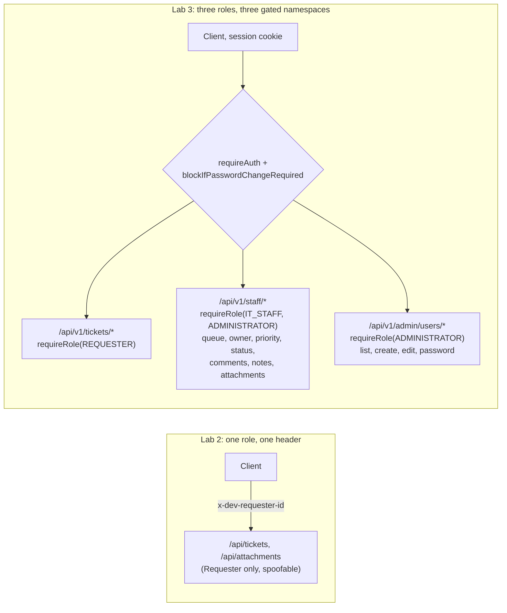
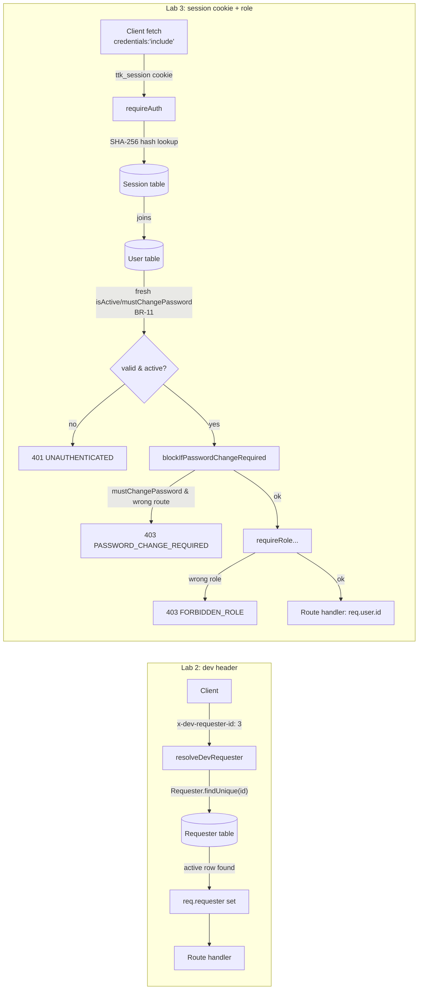
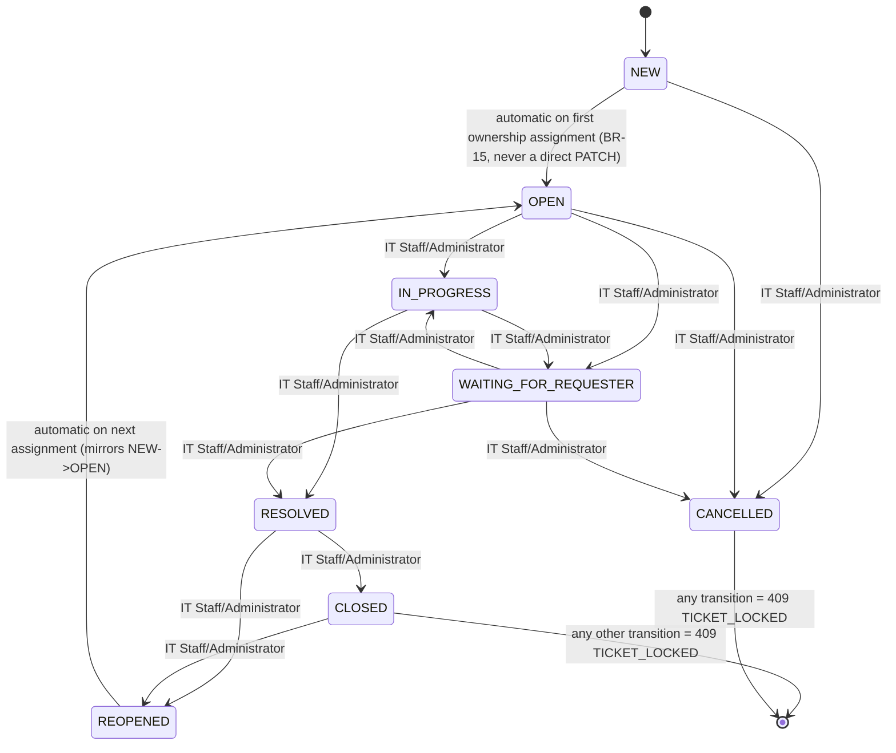

# Lab 3 TokTickIT Implementation Plan

> **For agentic workers:** REQUIRED SUB-SKILL: Use superpowers:subagent-driven-development (recommended) or superpowers:executing-plans to implement this plan task-by-task. Steps use checkbox (`- [ ] `) syntax for tracking.

## Read this first

**In one paragraph:** Lab 2 shipped a single-role app where "authentication" was a
dropdown that let anyone impersonate any Requester. Lab 3 replaces that with real
email/password sessions and three roles (Requester, IT Staff, Administrator), then builds
the two screens that only exist once real roles exist: an IT Staff Ticket Queue/Detail
workflow (claim, prioritize, transition status, talk to the Requester, keep private
notes) and a minimalist Administrator screen for managing user accounts. Every Lab 2
Requester capability keeps working, just under a real session instead of a spoofable
header.

**Key decisions and why:**
- **Opaque session cookies, not JWTs.** A `Session.tokenHash` row can be revoked
  server-side instantly (logout, deactivation) — a JWT would keep working until it
  expired even if the account were deactivated a second later. See BR-09/BR-11.
- **Three disjoint route namespaces** (`/api/v1/tickets/*`, `/api/v1/staff/*`,
  `/api/v1/admin/*`) sharing one `requireRole(...)` gate, instead of one router with a
  permissions matrix — mirrors the sheet's instruction that Staff and Admin
  responsibilities stay conceptually separate, and makes "which roles can hit this path"
  answerable by reading the mount line in `app.ts`, not by tracing a matrix.
- **Internal Notes are a separate Prisma model and route surface from Public Comments**,
  not a visibility flag on one shared table — a Requester-facing query structurally
  cannot leak a note by a forgotten `WHERE`, because there is no shared table to forget to
  filter.
- **The client's status-transition dropdown is UX guidance only.** The real security
  boundary is server-side (`isValidTransition`, Task 4/19) — the dropdown just avoids
  showing IT Staff an option the server would reject anyway.

**What's changing (file counts):** ~19 server files created/modified across Tasks 1–21
and 25–27, ~11 client files across Tasks 11–13, 15, 22–24, 28–29, and 4 new Playwright
specs (Tasks 30–33) — full list in **File Structure** below.

### Before/After: role and route topology



### Parallelization analysis (Tasks 19–34; Tasks 1–18 already sequential/complete)

The dependency-limiting shared files are `server/src/app.ts` (every new router's mount
line), `server/src/routes/staffTickets.ts`/`staffTicketMutationRequest.ts` (Tasks 17–19),
`server/src/routes/adminUsers.ts` (Tasks 25–26), and `client/src/App.tsx` (every new
screen's route). Batches below group tasks whose *substantive* new-file work is
independent; a shared file's final merge is a short serialization step, not a blocker to
drafting in parallel.

| Batch | Tasks | Why parallel-safe |
|---|---|---|
| A | 19, 20, 21, 22, 23, 25 | Each creates its own new file(s) (`staffComments.ts`, `staffNotes.ts`, `staffAttachments.ts`, `zen-green.css`/`badges.tsx`, `StaffTicketQueue.tsx`, `adminUserRequest.ts`+`adminUsers.ts`). Task 19 shares `staffTickets.ts` with Tasks 17/18 only (already merged). Task 23 depends only on already-complete Task 16, not on anything in this batch. |
| B | 24, 26 | Task 24 (`StaffTicketDetail.tsx`) depends on Batch A's routes (19/20/21) and badges (22), not on Task 26. Task 26 depends only on Task 25's `adminUsers.ts` (Batch A). Disjoint files from each other. |
| C | 27, 28 | Task 27 is test-only (`authorization.api.test.ts`), reads routes from Batches A/B, writes no production code. Task 28 (`UserManagement.tsx`) depends on Task 26. Disjoint files. |
| D | 29 | Depends on 22/23/24/28 (badges + all three new screens) all being merged — first fully-sequential point since Batch A. |
| E | 30, 31, 32, 33 | Four independent Playwright spec files; each only *reads* the running app built by Batches A–D. |
| F | 34 | Final integration — depends on every prior batch. |

**Critical path:** 18 → 25 → 26 → 28 → 29 → (30–33) → 34 — 6 sequential hops after Task
18, versus 16 hops if every task in Tasks 19–34 ran strictly in numeric order.

**Goal:** Replace the Lab 2 Development Requester header with real session-cookie
authentication and role-based authorization, ship the IT Staff Ticket Queue/Detail workflow
and a minimalist Administrator User Management screen, and keep every Lab 2 Requester
function working unchanged under the authenticated identity.

**Architecture:** Opaque server-side session tokens in an httpOnly `ttk_session` cookie
(`Session.tokenHash` stores only a SHA-256 hash). One `requireAuth` middleware resolves
`req.user` fresh from the database on every request (no caching, so `isActive`/
`mustChangePassword` changes take effect immediately per BR-11); `requireRole(...)` layers
role checks per route; `blockIfPasswordChangeRequired` gates every route except
`/auth/login`, `/auth/logout`, `/auth/change-password`, `/me`. Three route namespaces
(`/api/v1/tickets/*` Requester, `/api/v1/staff/*` IT Staff+Administrator,
`/api/v1/admin/*` Administrator) share this middleware stack. Client mirrors this with an
`AuthProvider`/`useAuth()` context replacing `DevRequesterProvider`, and `fetch(...,
{credentials: "include"})` everywhere instead of the `x-dev-requester-id` header.

**Tech Stack:** Express 5 + Prisma 6 + PostgreSQL (server), React 19 + React Router 7 +
Vite + Bootstrap 5 (client), Vitest + Supertest (server tests), Vitest + Testing Library
(client tests), Playwright (E2E). New dependencies this plan adds: `bcryptjs` (password
hashing — pure JS, no native build step, produces standard bcrypt hashes satisfying BR-07)
and `cookie-parser` (reads the `ttk_session` cookie server-side).

**Spec:** docs/lab-03/specification.md (FR-01..26, BR-01..30, §9 transition matrix),
docs/lab-03/api-spec.md (29-endpoint contract), docs/lab-03/ui-spec.md (5 screens),
docs/lab-03/tests.md (38 planned tests, authoritative test file paths).

## Global Constraints

- All new server routes live under `/api/v1/*` per api-spec.md; `/api/categories` and
  `/api/related-systems` stay unversioned and unauthenticated (unchanged from Lab 2 — not
  in api-spec.md's scope).
- BR-03: ownership on every Requester/IT Staff/Administrator write comes from
  `req.user.id` (the session), never from a client-supplied `requesterId`/`ownerId`/
  `authorId`.
- BR-07: passwords hashed with bcrypt cost factor 10, never logged or returned.
- BR-08: new/reset passwords need 8+ chars, upper, lower, digit, special char. Login is
  exempt.
- BR-09: session cookie `ttk_session`, httpOnly, SameSite=Lax, Secure in production only,
  fixed 12-hour lifetime, not renewed on activity.
- BR-11: `isActive`/`mustChangePassword` re-read from the live database on every request.
- BR-19: only the 8 `TicketStatus` values and the 14 transitions in specification.md §9
  are valid.
- BR-20: Comments and Internal Notes are append-only — no edit/delete endpoint for either.
- BR-21: comment/note body: reject empty/whitespace-only (422), cap 2000 characters.
- BR-24: 401 unauthenticated, 403 forbidden-by-role, 404 not-found/not-owned, 409
  conflict, 422 validation, 500 unexpected — no response body leaks stack traces or
  internal identifiers.
- BR-26: every Lab 2 Requester Ticket/Attachment business rule keeps holding.
- BR-27: the Lab 2 `x-dev-requester-id` header and its middleware are removed entirely.
- Every task follows Red-Green-Refactor: write the failing test first, confirm it fails,
  write minimal code to pass, confirm it passes, commit.
- Server tests run only against a database whose name ends in `_test`
  (`server/tests/setupEnv.ts` already enforces this — do not bypass it).

---

## File Structure

```
server/
  prisma/
    schema.prisma                          [modify] User/Session/Comment/InternalNote,
                                            TicketStatus values, Ticket.ownerId +
                                            resolvedIndicatedByRequester, drop Requester
    migrations/20260915090000_lab3_auth_and_staff/migration.sql   [create]
    seed.ts                                [modify] adds IT Staff/Administrator/onboarding
  src/
    types/auth.ts                          [create] Role, AuthenticatedUser, Express.Request
    middleware/
      auth.ts                              [create] requireAuth, requireRole,
                                            blockIfPasswordChangeRequired
      devRequester.ts                      [delete]
      errorEnvelope.ts                     [unchanged]
    services/
      password.ts                         [create] hash/verify/policy
      session.ts                          [create] createSession/verifySessionToken/revoke
      ticketStatusTransitions.ts          [create] isValidTransition/isTerminal
      ticketNumber.ts                     [unchanged]
      storage.ts                          [unchanged]
    validators/
      authRequest.ts                      [create] login/change-password validators
      commentRequest.ts                   [create] shared Comment/InternalNote body validator
      staffTicketQuery.ts                 [create] queue query parser
      staffTicketMutationRequest.ts       [create] owner/priority/status validators
      adminUserRequest.ts                 [create] create/edit/password-reset validators
      createTicketRequest.ts              [unchanged]
      ticketQuery.ts                      [unchanged]
    routes/
      auth.ts                             [create] login/logout/change-password
      me.ts                               [create] GET /me
      comments.ts                         [create] Requester Public Comments
      tickets.ts                          [modify] session auth + resolved-indication
      attachments.ts                      [modify] session auth
      attachmentActions.ts                [modify] session auth
      staffTickets.ts                     [create] queue/detail/owner/priority/status
      staffAssignableOwners.ts            [create]
      staffComments.ts                    [create]
      staffNotes.ts                       [create]
      staffAttachments.ts                 [create] read-only
      adminUsers.ts                       [create]
      devRequesters.ts                    [delete]
      categories.ts                       [unchanged]
      relatedSystems.ts                   [unchanged]
    app.ts                                [modify] mount /api/v1/*, cookie-parser, cors
                                           credentials, remove dev seam
  tests/lab-03/
    migration.test.ts  seed.test.ts  password.test.ts  session.test.ts
    ticketStatusTransitions.test.ts  auth.api.test.ts  changePassword.api.test.ts
    sessionLiveCheck.api.test.ts  devSeamRemoval.api.test.ts
    requesterRegression.api.test.ts  comments.api.test.ts
    commentsNotesValidation.api.test.ts  staffQueue.api.test.ts
    staffTicketOwner.api.test.ts  staffTicketPriority.api.test.ts
    staffTicketStatus.api.test.ts  notes.api.test.ts  staffAttachments.api.test.ts
    usersAdmin.api.test.ts  authorization.api.test.ts

client/
  src/
    api/
      apiClient.ts                        [modify] credentials:"include", drop requesterId
      authContext.tsx                     [create] replaces devRequesterContext.tsx
      devRequesterContext.tsx             [delete]
    screens/
      Login.tsx                           [create]
      ChangePassword.tsx                  [create]
      DevRequesterSelect.tsx              [delete]
      MyTickets.tsx                       [modify] drop requesterId prop
      CreateTicket.tsx                    [modify] drop requesterId/requesterName props
      TicketDetail.tsx                    [modify] drop requesterId prop, add Comments +
                                           Problem Appears Resolved
      StaffTicketQueue.tsx                [create]
      StaffTicketDetail.tsx               [create]
      UserManagement.tsx                  [create]
    components/badges.tsx                 [modify] RoleBadge, full STATUS_LABEL map
    theme/zen-green.css                   [modify] role badges, all status variants,
                                           comments/notes tinted panels
    App.tsx                               [modify] AuthProvider shell, role-scoped nav
  tests/lab-03/
    testHelpers.tsx                       [create] shared URL-keyed fetch mock + AuthProvider
    Login.test.tsx  ChangePassword.test.tsx  StaffTicketQueue.test.tsx
    StaffTicketDetail.test.tsx  UserManagement.test.tsx  zenGreenStyleLab3.test.tsx
  tests/lab-02/
    MyTickets.test.tsx  CreateTicket.test.tsx  TicketDetail.test.tsx  zenGreenStyle.test.tsx
                                           [modify, all four] drop requesterId, wrap in
                                           AuthProvider with a mocked /api/v1/me
    DevRequesterSelect.test.tsx           [delete]

e2e/lab-03/
  authentication.spec.ts  staff-ticket-flow.spec.ts  user-administration.spec.ts
  visual-states.spec.ts
```

---

## Before/After Diagrams

### Auth/request flow



### Ticket status state machine (specification.md §9, 8 states / 14 transitions)



---

## Tasks

### Subsystem A — Data model, migration, seed

### Task 1: Schema, migration, Requester→User cutover

**Files:**
- Modify: `server/prisma/schema.prisma`
- Create: `server/prisma/migrations/20260915090000_lab3_auth_and_staff/migration.sql`
- Test: `server/tests/lab-03/migration.test.ts`

**Interfaces:**
- Produces: `User` (id, email, passwordHash, displayName, role, isActive,
  mustChangePassword, createdAt), `Session` (id, userId, tokenHash, expiresAt, revokedAt),
  `Comment` (id, ticketId, authorId, authorRole, body, createdAt), `InternalNote` (id,
  ticketId, authorId, body, createdAt), `Ticket.ownerId: Int | null`,
  `Ticket.resolvedIndicatedByRequester: boolean`, `TicketStatus` with all 8 values,
  `Role` enum (`REQUESTER`/`IT_STAFF`/`ADMINISTRATOR`). Every later task depends on these
  exact field names/types.

**Decision this task locks in (specification.md §7/§12 leaves it to "Task 1"):** the
Requester→User data copy and the `Requester` table drop happen in **this one migration.sql**,
not in `seed.ts`. Both must be in the same transaction because the migration also repoints
`Ticket.requesterId`/`Attachment.uploadedById` foreign keys from `Requester` to `User` —
if the copy happened later in a separate `prisma db seed` step, this migration would have
already dropped `Requester` with no matching `User` rows yet, breaking those FKs. The bcrypt
hash for the shared local-dev password `DevPass123!` (cost factor 10) is computed offline and
embedded as a SQL literal, because raw migration SQL cannot call bcrypt at runtime:
`$2b$10$jPSKRRPNp2kdr.BrRFhgxeUl9poGg0TmRMqyEyoK8Qt5Bm5dnWhJK`.

- [ ] **Step 1: Write the failing test**

```typescript
// server/tests/lab-03/migration.test.ts
import { describe, it, expect } from "vitest";
import { prisma } from "../../src/prisma";

describe("Lab 3 migration", () => {
  it("TicketStatus has all 8 values and no data was lost", async () => {
    const rows = await prisma.$queryRaw<{ enumlabel: string }[]>`
      SELECT enumlabel FROM pg_enum
      JOIN pg_type ON pg_enum.enumtypid = pg_type.oid
      WHERE pg_type.typname = 'TicketStatus'
      ORDER BY enumlabel
    `;
    const values = rows.map((r) => r.enumlabel).sort();
    expect(values).toEqual(
      [
        "CANCELLED",
        "CLOSED",
        "IN_PROGRESS",
        "NEW",
        "OPEN",
        "REOPENED",
        "RESOLVED",
        "WAITING_FOR_REQUESTER",
      ].sort(),
    );
  });

  it("preserves every migrated Requester as a User with role=REQUESTER and the same id", async () => {
    const jennifer = await prisma.user.findUnique({
      where: { email: "jennifer.anderson@toktickit.dev" },
    });
    expect(jennifer).not.toBeNull();
    expect(jennifer?.role).toBe("REQUESTER");
    expect(jennifer?.isActive).toBe(true);
    expect(jennifer?.passwordHash).toMatch(/^\$2[aby]\$/);
  });

  it("Ticket.ownerId and resolvedIndicatedByRequester exist with correct defaults", async () => {
    const columns = await prisma.$queryRaw<{ column_name: string }[]>`
      SELECT column_name FROM information_schema.columns
      WHERE table_name = 'Ticket' AND column_name IN ('ownerId', 'resolvedIndicatedByRequester')
    `;
    expect(columns.map((c) => c.column_name).sort()).toEqual([
      "ownerId",
      "resolvedIndicatedByRequester",
    ]);
  });

  it("Comment and InternalNote tables exist and are queryable", async () => {
    await expect(prisma.comment.findMany()).resolves.toBeInstanceOf(Array);
    await expect(prisma.internalNote.findMany()).resolves.toBeInstanceOf(Array);
  });

  it("dropped the Requester table", async () => {
    const rows = await prisma.$queryRaw<{ table_name: string }[]>`
      SELECT table_name FROM information_schema.tables WHERE table_name = 'Requester'
    `;
    expect(rows).toHaveLength(0);
  });
});
```

- [ ] **Step 2: Run test to verify it fails**

Run: `cd server && npm test -- tests/lab-03/migration.test.ts`
Expected: FAIL — `prisma.user` does not exist yet on the Prisma Client (schema unchanged).

- [ ] **Step 3: Edit schema.prisma**

```prisma
// server/prisma/schema.prisma
generator client {
  provider = "prisma-client-js"
}

datasource db {
  provider = "postgresql"
  url      = env("DATABASE_URL")
}

enum Priority {
  LOW
  MEDIUM
  HIGH
}

enum TicketStatus {
  NEW
  OPEN
  IN_PROGRESS
  WAITING_FOR_REQUESTER
  RESOLVED
  CLOSED
  REOPENED
  CANCELLED
}

enum Role {
  REQUESTER
  IT_STAFF
  ADMINISTRATOR
}

model Category {
  id        Int      @id @default(autoincrement())
  name      String   @unique
  code      String?  @unique
  isActive  Boolean  @default(true)
  createdAt DateTime @default(now())
  tickets   Ticket[]
}

model RelatedSystem {
  id        Int      @id @default(autoincrement())
  name      String   @unique
  isActive  Boolean  @default(true)
  createdAt DateTime @default(now())
  tickets   Ticket[]
}

model User {
  id                 Int      @id @default(autoincrement())
  email              String   @unique
  passwordHash       String
  displayName        String
  role               Role
  isActive           Boolean  @default(true)
  mustChangePassword Boolean  @default(false)
  createdAt          DateTime @default(now())

  tickets       Ticket[]       @relation("TicketRequester")
  ownedTickets  Ticket[]       @relation("TicketOwner")
  attachments   Attachment[]
  sessions      Session[]
  comments      Comment[]
  internalNotes InternalNote[]
}

model Session {
  id        Int       @id @default(autoincrement())
  userId    Int
  user      User      @relation(fields: [userId], references: [id], onDelete: Cascade)
  tokenHash String    @unique
  expiresAt DateTime
  revokedAt DateTime?
  createdAt DateTime  @default(now())

  @@index([userId])
}

model Comment {
  id         Int      @id @default(autoincrement())
  ticketId   String
  ticket     Ticket   @relation(fields: [ticketId], references: [id], onDelete: Restrict)
  authorId   Int
  author     User     @relation(fields: [authorId], references: [id], onDelete: Restrict)
  authorRole Role
  body       String   @db.VarChar(2000)
  createdAt  DateTime @default(now())

  @@index([ticketId, createdAt])
}

model InternalNote {
  id        Int      @id @default(autoincrement())
  ticketId  String
  ticket    Ticket   @relation(fields: [ticketId], references: [id], onDelete: Restrict)
  authorId  Int
  author    User     @relation(fields: [authorId], references: [id], onDelete: Restrict)
  body      String   @db.VarChar(2000)
  createdAt DateTime @default(now())

  @@index([ticketId, createdAt])
}

model Ticket {
  id                           String       @id @default(uuid())
  ticketNumber                 String       @unique
  summary                      String
  description                  String
  status                       TicketStatus @default(NEW)
  requestedPriority            Priority
  itPriority                   Priority
  resolvedIndicatedByRequester Boolean      @default(false)
  createdAt                    DateTime     @default(now())
  updatedAt                    DateTime     @updatedAt

  requesterId     Int
  requester       User           @relation("TicketRequester", fields: [requesterId], references: [id], onDelete: Restrict)
  ownerId         Int?
  owner           User?          @relation("TicketOwner", fields: [ownerId], references: [id], onDelete: SetNull)
  categoryId      Int
  category        Category       @relation(fields: [categoryId], references: [id], onDelete: Restrict)
  relatedSystemId Int?
  relatedSystem   RelatedSystem? @relation(fields: [relatedSystemId], references: [id], onDelete: Restrict)

  attachments   Attachment[]
  comments      Comment[]
  internalNotes InternalNote[]

  @@index([requesterId, createdAt])
  @@index([ownerId])
  @@index([status])
  @@index([categoryId])
}

model Attachment {
  id            String    @id @default(uuid())
  ticketId      String
  ticket        Ticket    @relation(fields: [ticketId], references: [id], onDelete: Restrict)
  uploadedById  Int
  uploadedBy    User      @relation(fields: [uploadedById], references: [id], onDelete: Restrict)
  filename      String
  storedName    String    @unique
  mimeType      String
  sizeBytes     Int
  isRemoved     Boolean   @default(false)
  removedAt     DateTime?
  removedReason String?
  createdAt     DateTime  @default(now())

  @@index([ticketId, isRemoved])
}

model TicketCounter {
  year      Int      @id
  lastValue Int      @default(0)
  updatedAt DateTime @updatedAt
}
```

- [ ] **Step 4: Write the migration SQL by hand**

Prisma's schema diff alone won't produce the id-preserving data copy, so this migration is
written by hand (matching the existing repo convention of committing `migration.sql` files
directly) rather than via `prisma migrate dev`.

```sql
-- server/prisma/migrations/20260915090000_lab3_auth_and_staff/migration.sql

-- CreateEnum
CREATE TYPE "Role" AS ENUM ('REQUESTER', 'IT_STAFF', 'ADMINISTRATOR');

-- AlterEnum: TicketStatus only has NEW today; add the remaining 7 values fresh (nothing to
-- rename — specification.md §7/§12).
ALTER TYPE "TicketStatus" ADD VALUE 'OPEN';
ALTER TYPE "TicketStatus" ADD VALUE 'IN_PROGRESS';
ALTER TYPE "TicketStatus" ADD VALUE 'WAITING_FOR_REQUESTER';
ALTER TYPE "TicketStatus" ADD VALUE 'RESOLVED';
ALTER TYPE "TicketStatus" ADD VALUE 'CLOSED';
ALTER TYPE "TicketStatus" ADD VALUE 'REOPENED';
ALTER TYPE "TicketStatus" ADD VALUE 'CANCELLED';

-- CreateTable
CREATE TABLE "User" (
    "id" SERIAL NOT NULL,
    "email" TEXT NOT NULL,
    "passwordHash" TEXT NOT NULL,
    "displayName" TEXT NOT NULL,
    "role" "Role" NOT NULL,
    "isActive" BOOLEAN NOT NULL DEFAULT true,
    "mustChangePassword" BOOLEAN NOT NULL DEFAULT false,
    "createdAt" TIMESTAMP(3) NOT NULL DEFAULT CURRENT_TIMESTAMP,

    CONSTRAINT "User_pkey" PRIMARY KEY ("id")
);

-- CreateTable
CREATE TABLE "Session" (
    "id" SERIAL NOT NULL,
    "userId" INTEGER NOT NULL,
    "tokenHash" TEXT NOT NULL,
    "expiresAt" TIMESTAMP(3) NOT NULL,
    "revokedAt" TIMESTAMP(3),
    "createdAt" TIMESTAMP(3) NOT NULL DEFAULT CURRENT_TIMESTAMP,

    CONSTRAINT "Session_pkey" PRIMARY KEY ("id")
);

-- CreateTable
CREATE TABLE "Comment" (
    "id" SERIAL NOT NULL,
    "ticketId" TEXT NOT NULL,
    "authorId" INTEGER NOT NULL,
    "authorRole" "Role" NOT NULL,
    "body" VARCHAR(2000) NOT NULL,
    "createdAt" TIMESTAMP(3) NOT NULL DEFAULT CURRENT_TIMESTAMP,

    CONSTRAINT "Comment_pkey" PRIMARY KEY ("id")
);

-- CreateTable
CREATE TABLE "InternalNote" (
    "id" SERIAL NOT NULL,
    "ticketId" TEXT NOT NULL,
    "authorId" INTEGER NOT NULL,
    "body" VARCHAR(2000) NOT NULL,
    "createdAt" TIMESTAMP(3) NOT NULL DEFAULT CURRENT_TIMESTAMP,

    CONSTRAINT "InternalNote_pkey" PRIMARY KEY ("id")
);

-- AlterTable: new Ticket columns
ALTER TABLE "Ticket" ADD COLUMN "ownerId" INTEGER;
ALTER TABLE "Ticket" ADD COLUMN "resolvedIndicatedByRequester" BOOLEAN NOT NULL DEFAULT false;

-- Data migration: copy every Requester row into User with role=REQUESTER, preserving ids,
-- so Ticket.requesterId/Attachment.uploadedById FK values never change. The bcrypt hash below
-- is `DevPass123!` at cost factor 10 (specification.md §12's shared local-dev password),
-- computed offline since raw SQL cannot call bcrypt.
INSERT INTO "User" (id, email, "passwordHash", "displayName", role, "isActive", "mustChangePassword", "createdAt")
SELECT id, email, '$2b$10$jPSKRRPNp2kdr.BrRFhgxeUl9poGg0TmRMqyEyoK8Qt5Bm5dnWhJK', name, 'REQUESTER', "isActive", false, "createdAt"
FROM "Requester";

-- Advance the User id sequence past every copied Requester id so future inserts (seed.ts,
-- POST /api/v1/admin/users) never collide with a migrated id.
SELECT setval(pg_get_serial_sequence('"User"', 'id'), COALESCE((SELECT MAX(id) FROM "User"), 1));

-- Drop the old Requester-referencing FKs before dropping Requester.
ALTER TABLE "Ticket" DROP CONSTRAINT "Ticket_requesterId_fkey";
ALTER TABLE "Attachment" DROP CONSTRAINT "Attachment_uploadedById_fkey";

-- Drop Requester now that every row has a matching User row with the same id.
DROP TABLE "Requester";

-- Re-point the FKs at User.
ALTER TABLE "Ticket" ADD CONSTRAINT "Ticket_requesterId_fkey" FOREIGN KEY ("requesterId") REFERENCES "User"("id") ON DELETE RESTRICT ON UPDATE CASCADE;
ALTER TABLE "Ticket" ADD CONSTRAINT "Ticket_ownerId_fkey" FOREIGN KEY ("ownerId") REFERENCES "User"("id") ON DELETE SET NULL ON UPDATE CASCADE;
ALTER TABLE "Attachment" ADD CONSTRAINT "Attachment_uploadedById_fkey" FOREIGN KEY ("uploadedById") REFERENCES "User"("id") ON DELETE RESTRICT ON UPDATE CASCADE;

-- New FKs for Session/Comment/InternalNote.
ALTER TABLE "Session" ADD CONSTRAINT "Session_userId_fkey" FOREIGN KEY ("userId") REFERENCES "User"("id") ON DELETE CASCADE ON UPDATE CASCADE;
ALTER TABLE "Comment" ADD CONSTRAINT "Comment_ticketId_fkey" FOREIGN KEY ("ticketId") REFERENCES "Ticket"("id") ON DELETE RESTRICT ON UPDATE CASCADE;
ALTER TABLE "Comment" ADD CONSTRAINT "Comment_authorId_fkey" FOREIGN KEY ("authorId") REFERENCES "User"("id") ON DELETE RESTRICT ON UPDATE CASCADE;
ALTER TABLE "InternalNote" ADD CONSTRAINT "InternalNote_ticketId_fkey" FOREIGN KEY ("ticketId") REFERENCES "Ticket"("id") ON DELETE RESTRICT ON UPDATE CASCADE;
ALTER TABLE "InternalNote" ADD CONSTRAINT "InternalNote_authorId_fkey" FOREIGN KEY ("authorId") REFERENCES "User"("id") ON DELETE RESTRICT ON UPDATE CASCADE;

-- CreateIndex
CREATE UNIQUE INDEX "User_email_key" ON "User"("email");
CREATE UNIQUE INDEX "Session_tokenHash_key" ON "Session"("tokenHash");
CREATE INDEX "Session_userId_idx" ON "Session"("userId");
CREATE INDEX "Comment_ticketId_createdAt_idx" ON "Comment"("ticketId", "createdAt");
CREATE INDEX "InternalNote_ticketId_createdAt_idx" ON "InternalNote"("ticketId", "createdAt");
CREATE INDEX "Ticket_ownerId_idx" ON "Ticket"("ownerId");
```

- [ ] **Step 5: Apply the migration and regenerate the client**

Run: `cd server && npm run prisma:migrate:deploy && npm run prisma:generate`
Expected: migration applies cleanly against the dev database; `@prisma/client` now exposes
`prisma.user`, `prisma.session`, `prisma.comment`, `prisma.internalNote`.

Run the same against the test database: `DATABASE_URL="$(grep DATABASE_URL server/.env.test | cut -d= -f2-)" npx prisma migrate deploy --schema prisma/schema.prisma` (from `server/`).

- [ ] **Step 6: Run test to verify it passes**

Run: `cd server && npm test -- tests/lab-03/migration.test.ts`
Expected: PASS (5/5)

- [ ] **Step 7: Commit**

```bash
git add server/prisma/schema.prisma server/prisma/migrations server/tests/lab-03/migration.test.ts
git commit -m "feat: migrate Requester to User, add Session/Comment/InternalNote, extend TicketStatus"
```

**Satisfies:** FR-01 (schema groundwork), data model changes in specification.md §7,
MIG-01.

---

### Task 2: Password hashing + policy service

**Files:**
- Create: `server/src/services/password.ts`
- Test: `server/tests/lab-03/password.test.ts`

**Interfaces:**
- Produces: `hashPassword(plain: string): Promise<string>`,
  `verifyPassword(plain: string, hash: string): Promise<boolean>`,
  `validatePasswordPolicy(password: string, field?: string): FieldError[]` (imported by
  Task 6's auth validators, Task 25's admin user validators).
- Consumes: `FieldError` from `server/src/middleware/errorEnvelope.ts` (existing).

- [ ] **Step 1: Write the failing test**

```typescript
// server/tests/lab-03/password.test.ts
import { describe, it, expect } from "vitest";
import { hashPassword, verifyPassword, validatePasswordPolicy } from "../../src/services/password";

describe("password service", () => {
  it("hashes a password and verifies the correct plaintext against it", async () => {
    const hash = await hashPassword("DevPass123!");
    expect(hash).toMatch(/^\$2[aby]\$10\$/);
    await expect(verifyPassword("DevPass123!", hash)).resolves.toBe(true);
  });

  it("rejects the wrong plaintext against a hash", async () => {
    const hash = await hashPassword("DevPass123!");
    await expect(verifyPassword("WrongPass123!", hash)).resolves.toBe(false);
  });

  it("rejects a password under 8 characters", () => {
    const errors = validatePasswordPolicy("Ab1!");
    expect(errors.length).toBeGreaterThan(0);
  });

  it("rejects a password missing an uppercase, lowercase, digit, or special character", () => {
    expect(validatePasswordPolicy("alllowercase1!").length).toBeGreaterThan(0);
    expect(validatePasswordPolicy("ALLUPPERCASE1!").length).toBeGreaterThan(0);
    expect(validatePasswordPolicy("NoDigitsHere!").length).toBeGreaterThan(0);
    expect(validatePasswordPolicy("NoSpecial123").length).toBeGreaterThan(0);
  });

  it("accepts a password satisfying every policy rule", () => {
    expect(validatePasswordPolicy("DevPass123!")).toEqual([]);
  });
});
```

- [ ] **Step 2: Run test to verify it fails**

Run: `cd server && npm test -- tests/lab-03/password.test.ts`
Expected: FAIL — cannot find module `../../src/services/password`.

- [ ] **Step 3: Install bcryptjs and write the service**

Run: `cd server && npm install bcryptjs && npm install --save-dev @types/bcryptjs`

```typescript
// server/src/services/password.ts
import bcrypt from "bcryptjs";
import { FieldError } from "../middleware/errorEnvelope";

const BCRYPT_COST_FACTOR = 10;

export async function hashPassword(plain: string): Promise<string> {
  return bcrypt.hash(plain, BCRYPT_COST_FACTOR);
}

export async function verifyPassword(plain: string, hash: string): Promise<boolean> {
  return bcrypt.compare(plain, hash);
}

// BR-08: minimum 8 characters, at least one uppercase, one lowercase, one digit, one
// special character. Login itself is exempt — it only verifies an existing hash.
export function validatePasswordPolicy(password: string, field = "password"): FieldError[] {
  const errors: FieldError[] = [];
  if (password.length < 8) {
    errors.push({ field, message: "Password must be at least 8 characters." });
  }
  if (!/[A-Z]/.test(password)) {
    errors.push({ field, message: "Password must include an uppercase letter." });
  }
  if (!/[a-z]/.test(password)) {
    errors.push({ field, message: "Password must include a lowercase letter." });
  }
  if (!/[0-9]/.test(password)) {
    errors.push({ field, message: "Password must include a digit." });
  }
  if (!/[^A-Za-z0-9]/.test(password)) {
    errors.push({ field, message: "Password must include a special character." });
  }
  return errors;
}
```

- [ ] **Step 4: Run test to verify it passes**

Run: `cd server && npm test -- tests/lab-03/password.test.ts`
Expected: PASS (5/5)

- [ ] **Step 5: Commit**

```bash
git add server/package.json server/package-lock.json server/src/services/password.ts server/tests/lab-03/password.test.ts
git commit -m "feat: add password hashing and policy validation service"
```

**Satisfies:** BR-07, BR-08, UNIT-01.

---

### Task 3: Session service

**Files:**
- Create: `server/src/types/auth.ts`
- Create: `server/src/services/session.ts`
- Test: `server/tests/lab-03/session.test.ts`

**Interfaces:**
- Produces: `Role = "REQUESTER" | "IT_STAFF" | "ADMINISTRATOR"`, `AuthenticatedUser {id,
  email, displayName, role, isActive, mustChangePassword}`, `SESSION_TTL_MS: number`,
  `createSession(userId: number): Promise<{token: string; expiresAt: Date}>`,
  `verifySessionToken(token: string): Promise<AuthenticatedUser | null>`,
  `revokeSessionByToken(token: string): Promise<void>`. Task 6's `requireAuth` middleware
  consumes `verifySessionToken`; Task 6's `authRouter` consumes `createSession`/
  `revokeSessionByToken`.
- Consumes: `prisma` from `server/src/prisma.ts` (existing), the `Session`/`User` models
  from Task 1.

- [ ] **Step 1: Write the failing test**

```typescript
// server/tests/lab-03/session.test.ts
import { describe, it, expect, beforeAll } from "vitest";
import { prisma } from "../../src/prisma";
import { createSession, verifySessionToken, revokeSessionByToken, SESSION_TTL_MS } from "../../src/services/session";

let userId: number;

beforeAll(async () => {
  const user = await prisma.user.findFirst({ where: { role: "REQUESTER", isActive: true } });
  userId = user!.id;
});

describe("session service", () => {
  it("creates a session and resolves it back to the user", async () => {
    const { token, expiresAt } = await createSession(userId);
    expect(token).toBeTruthy();
    expect(expiresAt.getTime()).toBeGreaterThan(Date.now());

    const resolved = await verifySessionToken(token);
    expect(resolved?.id).toBe(userId);
    expect(resolved?.role).toBe("REQUESTER");
  });

  it("SESSION_TTL_MS is a fixed 12 hours", () => {
    expect(SESSION_TTL_MS).toBe(12 * 60 * 60 * 1000);
  });

  it("returns null for an unknown token", async () => {
    await expect(verifySessionToken("not-a-real-token")).resolves.toBeNull();
  });

  it("returns null for a revoked token", async () => {
    const { token } = await createSession(userId);
    await revokeSessionByToken(token);
    await expect(verifySessionToken(token)).resolves.toBeNull();
  });

  it("returns null for an expired token", async () => {
    const { token } = await createSession(userId);
    const hashed = await prisma.session.findFirstOrThrow({ where: { userId }, orderBy: { id: "desc" } });
    await prisma.session.update({ where: { id: hashed.id }, data: { expiresAt: new Date(Date.now() - 1000) } });
    await expect(verifySessionToken(token)).resolves.toBeNull();
  });

  it("never stores the raw token — only its SHA-256 hash", async () => {
    const { token } = await createSession(userId);
    const rows = await prisma.session.findMany({ where: { userId }, orderBy: { id: "desc" }, take: 1 });
    expect(rows[0].tokenHash).not.toBe(token);
    expect(rows[0].tokenHash).toHaveLength(64);
  });
});
```

- [ ] **Step 2: Run test to verify it fails**

Run: `cd server && npm test -- tests/lab-03/session.test.ts`
Expected: FAIL — cannot find module `../../src/services/session`.

- [ ] **Step 3: Write the shared auth types, then the service**

```typescript
// server/src/types/auth.ts
export type Role = "REQUESTER" | "IT_STAFF" | "ADMINISTRATOR";

export interface AuthenticatedUser {
  id: number;
  email: string;
  displayName: string;
  role: Role;
  isActive: boolean;
  mustChangePassword: boolean;
}

declare global {
  // eslint-disable-next-line @typescript-eslint/no-namespace
  namespace Express {
    interface Request {
      user?: AuthenticatedUser;
    }
  }
}

export {};
```

```typescript
// server/src/services/session.ts
import { randomBytes, createHash } from "crypto";
import { prisma } from "../prisma";
import type { AuthenticatedUser, Role } from "../types/auth";

// BR-09: fixed 12-hour lifetime, not renewed on activity.
export const SESSION_TTL_MS = 12 * 60 * 60 * 1000;

function hashToken(token: string): string {
  return createHash("sha256").update(token).digest("hex");
}

export async function createSession(userId: number): Promise<{ token: string; expiresAt: Date }> {
  const token = randomBytes(32).toString("base64url");
  const expiresAt = new Date(Date.now() + SESSION_TTL_MS);
  await prisma.session.create({
    data: { userId, tokenHash: hashToken(token), expiresAt },
  });
  return { token, expiresAt };
}

// BR-11: reads isActive/mustChangePassword fresh from the User row on every call — nothing
// here is cached on the Session row, so a deactivation takes effect on the caller's very
// next request.
export async function verifySessionToken(token: string): Promise<AuthenticatedUser | null> {
  const session = await prisma.session.findUnique({
    where: { tokenHash: hashToken(token) },
    include: { user: true },
  });

  if (!session || session.revokedAt || session.expiresAt.getTime() <= Date.now()) {
    return null;
  }

  const { user } = session;
  return {
    id: user.id,
    email: user.email,
    displayName: user.displayName,
    role: user.role as Role,
    isActive: user.isActive,
    mustChangePassword: user.mustChangePassword,
  };
}

export async function revokeSessionByToken(token: string): Promise<void> {
  await prisma.session.updateMany({
    where: { tokenHash: hashToken(token), revokedAt: null },
    data: { revokedAt: new Date() },
  });
}
```

- [ ] **Step 4: Run test to verify it passes**

Run: `cd server && npm test -- tests/lab-03/session.test.ts`
Expected: PASS (6/6)

- [ ] **Step 5: Commit**

```bash
git add server/src/types/auth.ts server/src/services/session.ts server/tests/lab-03/session.test.ts
git commit -m "feat: add opaque session token service"
```

**Satisfies:** BR-09, BR-10, BR-11, UNIT-02.

---

### Task 4: Ticket status transition matrix

**Files:**
- Create: `server/src/services/ticketStatusTransitions.ts`
- Test: `server/tests/lab-03/ticketStatusTransitions.test.ts`

**Interfaces:**
- Produces: `TicketStatus` type (8 values), `isValidTransition(from, to): boolean`,
  `isTerminal(status): boolean`, `TERMINAL_STATUSES: TicketStatus[]`. Consumed directly by
  Task 19 (`PATCH /staff/tickets/:id/status`), Tasks 17/18 (locked-ticket checks on owner/
  priority mutations).

- [ ] **Step 1: Write the failing test**

```typescript
// server/tests/lab-03/ticketStatusTransitions.test.ts
import { describe, it, expect } from "vitest";
import { isValidTransition, isTerminal, TicketStatus } from "../../src/services/ticketStatusTransitions";

// specification.md §9 — 14 rows total. NEW->OPEN and REOPENED->OPEN are automatic (triggered
// by ownership assignment, BR-15) and are NEVER a direct PATCH target, so they are asserted
// false here even though they are valid transitions of the state machine as a whole.
const CLIENT_REQUESTABLE_VALID: [TicketStatus, TicketStatus][] = [
  ["NEW", "CANCELLED"],
  ["OPEN", "IN_PROGRESS"],
  ["OPEN", "WAITING_FOR_REQUESTER"],
  ["OPEN", "CANCELLED"],
  ["IN_PROGRESS", "WAITING_FOR_REQUESTER"],
  ["IN_PROGRESS", "RESOLVED"],
  ["WAITING_FOR_REQUESTER", "IN_PROGRESS"],
  ["WAITING_FOR_REQUESTER", "RESOLVED"],
  ["WAITING_FOR_REQUESTER", "CANCELLED"],
  ["RESOLVED", "CLOSED"],
  ["RESOLVED", "REOPENED"],
  ["CLOSED", "REOPENED"],
];

const AUTOMATIC_ONLY: [TicketStatus, TicketStatus][] = [
  ["NEW", "OPEN"],
  ["REOPENED", "OPEN"],
];

const INVALID_SAMPLES: [TicketStatus, TicketStatus][] = [
  ["NEW", "RESOLVED"],
  ["OPEN", "CLOSED"],
  ["CLOSED", "OPEN"],
  ["CLOSED", "IN_PROGRESS"],
  ["CANCELLED", "OPEN"],
  ["CANCELLED", "REOPENED"],
];

describe("ticket status transition matrix", () => {
  it.each(CLIENT_REQUESTABLE_VALID)("allows %s -> %s via direct PATCH", (from, to) => {
    expect(isValidTransition(from, to)).toBe(true);
  });

  it.each(AUTOMATIC_ONLY)("rejects %s -> %s as a direct PATCH (automatic-only)", (from, to) => {
    expect(isValidTransition(from, to)).toBe(false);
  });

  it.each(INVALID_SAMPLES)("rejects %s -> %s", (from, to) => {
    expect(isValidTransition(from, to)).toBe(false);
  });

  it("CLOSED and CANCELLED are terminal; every other status is not", () => {
    expect(isTerminal("CLOSED")).toBe(true);
    expect(isTerminal("CANCELLED")).toBe(true);
    expect(isTerminal("OPEN")).toBe(false);
    expect(isTerminal("REOPENED")).toBe(false);
  });
});
```

- [ ] **Step 2: Run test to verify it fails**

Run: `cd server && npm test -- tests/lab-03/ticketStatusTransitions.test.ts`
Expected: FAIL — cannot find module `../../src/services/ticketStatusTransitions`.

- [ ] **Step 3: Write the service**

```typescript
// server/src/services/ticketStatusTransitions.ts
export type TicketStatus =
  | "NEW"
  | "OPEN"
  | "IN_PROGRESS"
  | "WAITING_FOR_REQUESTER"
  | "RESOLVED"
  | "CLOSED"
  | "REOPENED"
  | "CANCELLED";

// specification.md §9. NEW->OPEN and REOPENED->OPEN are automatic (triggered by ownership
// assignment) and are deliberately NOT listed as a target here — isValidTransition() only
// backs the client-requestable PATCH .../status transitions.
const STATUS_TRANSITIONS: Record<TicketStatus, TicketStatus[]> = {
  NEW: ["CANCELLED"],
  OPEN: ["IN_PROGRESS", "WAITING_FOR_REQUESTER", "CANCELLED"],
  IN_PROGRESS: ["WAITING_FOR_REQUESTER", "RESOLVED"],
  WAITING_FOR_REQUESTER: ["IN_PROGRESS", "RESOLVED", "CANCELLED"],
  RESOLVED: ["CLOSED", "REOPENED"],
  CLOSED: ["REOPENED"],
  REOPENED: [],
  CANCELLED: [],
};

export const TERMINAL_STATUSES: TicketStatus[] = ["CLOSED", "CANCELLED"];

export function isValidTransition(from: TicketStatus, to: TicketStatus): boolean {
  return STATUS_TRANSITIONS[from]?.includes(to) ?? false;
}

// BR-18: a ticket locked in CLOSED/CANCELLED rejects every mutation except CLOSED->REOPENED.
// isTerminal() combined with isValidTransition() (which already allows CLOSED->REOPENED and
// nothing else from either terminal status) is enough for callers to pick the right error
// code: !isValidTransition && isTerminal => 409 TICKET_LOCKED, else 409 INVALID_STATUS_TRANSITION.
export function isTerminal(status: TicketStatus): boolean {
  return TERMINAL_STATUSES.includes(status);
}
```

- [ ] **Step 4: Run test to verify it passes**

Run: `cd server && npm test -- tests/lab-03/ticketStatusTransitions.test.ts`
Expected: PASS (20/20 — 12 + 2 + 6 parameterized + 1)

- [ ] **Step 5: Commit**

```bash
git add server/src/services/ticketStatusTransitions.ts server/tests/lab-03/ticketStatusTransitions.test.ts
git commit -m "feat: add ticket status transition matrix"
```

**Satisfies:** BR-15, BR-18, BR-19, UNIT-03.

---

### Task 5: Seed script — IT Staff, Administrator, onboarding fixture

**Files:**
- Modify: `server/prisma/seed.ts`
- Test: `server/tests/lab-03/seed.test.ts`

**Interfaces:**
- Consumes: `hashPassword` from Task 2's `server/src/services/password.ts` is NOT used here
  (seed.ts uses `bcryptjs` directly at the top level for a one-time shared hash, matching
  Lab 2 seed's style of no cross-layer service imports); Prisma `user.upsert`.

**Decision:** the 5 Lab 2 Requester identities are already materialized as `User` rows by
Task 1's migration.sql data copy (with the shared `DevPass123!` hash already set). This
seed only adds the Lab 3 fixtures that have no Lab 2 Requester equivalent — it does not
re-touch the 5 migrated rows, avoiding duplicate logic between migration.sql and seed.ts.

- [ ] **Step 1: Write the failing test**

```typescript
// server/tests/lab-03/seed.test.ts
import { describe, it, expect } from "vitest";
import { prisma } from "../../src/prisma";

describe("Lab 3 seed", () => {
  it("seeds at least 3 active IT Staff and at least 1 inactive IT Staff", async () => {
    const active = await prisma.user.count({ where: { role: "IT_STAFF", isActive: true } });
    const inactive = await prisma.user.count({ where: { role: "IT_STAFF", isActive: false } });
    expect(active).toBeGreaterThanOrEqual(3);
    expect(inactive).toBeGreaterThanOrEqual(1);
  });

  it("seeds at least 1 active Administrator", async () => {
    const active = await prisma.user.count({ where: { role: "ADMINISTRATOR", isActive: true } });
    expect(active).toBeGreaterThanOrEqual(1);
  });

  it("seeds at least 4 active Requesters and at least 1 inactive Requester", async () => {
    const active = await prisma.user.count({ where: { role: "REQUESTER", isActive: true } });
    const inactive = await prisma.user.count({ where: { role: "REQUESTER", isActive: false } });
    expect(active).toBeGreaterThanOrEqual(4);
    expect(inactive).toBeGreaterThanOrEqual(1);
  });

  it("seeds exactly one user with mustChangePassword=true, the onboarding fixture", async () => {
    const count = await prisma.user.count({ where: { mustChangePassword: true } });
    expect(count).toBe(1);

    const onboarding = await prisma.user.findUnique({ where: { email: "onboarding@toktickit.local" } });
    expect(onboarding?.mustChangePassword).toBe(true);
  });

  it("seeding is idempotent — exactly one row per seeded email", async () => {
    const admins = await prisma.user.findMany({ where: { email: "admin@toktickit.dev" } });
    expect(admins).toHaveLength(1);
  });
});
```

- [ ] **Step 2: Run test to verify it fails**

Run: `cd server && npm run prisma:seed && npm test -- tests/lab-03/seed.test.ts`
Expected: FAIL — no IT_STAFF/ADMINISTRATOR users exist yet, `onboarding@toktickit.local` not found.

- [ ] **Step 3: Rewrite seed.ts**

```typescript
// server/prisma/seed.ts
import { PrismaClient } from "@prisma/client";
import bcrypt from "bcryptjs";

const prisma = new PrismaClient();

const CATEGORIES: { name: string; code: string }[] = [
  { name: "Account and Access", code: "ACCESS" },
  { name: "Hardware", code: "HARDWARE" },
  { name: "Software", code: "SOFTWARE" },
  { name: "Network", code: "NETWORK" },
];

const RELATED_SYSTEMS: { name: string; isActive: boolean }[] = [
  { name: "Email", isActive: true },
  { name: "Campus Wi-Fi", isActive: true },
  { name: "VPN", isActive: true },
  { name: "LEB2 App", isActive: true },
  { name: "Grade Submission App", isActive: true },
  { name: "Printer", isActive: true },
  { name: "Corporate Laptop", isActive: true },
  { name: "Legacy File Server", isActive: false },
];

// The 5 Lab 2 Requester identities are already materialized as User rows by
// migrations/20260915090000_lab3_auth_and_staff/migration.sql's id-preserving data copy —
// this seed adds only the Lab 3 fixtures with no Lab 2 Requester equivalent.
const SEED_PASSWORD = "DevPass123!";

const NEW_USERS: {
  email: string;
  displayName: string;
  role: "IT_STAFF" | "ADMINISTRATOR";
  isActive: boolean;
  mustChangePassword: boolean;
}[] = [
  { email: "amy.tran@toktickit.dev", displayName: "Amy Tran", role: "IT_STAFF", isActive: true, mustChangePassword: false },
  { email: "carlos.mendez@toktickit.dev", displayName: "Carlos Mendez", role: "IT_STAFF", isActive: true, mustChangePassword: false },
  { email: "priya.natarajan@toktickit.dev", displayName: "Priya Natarajan", role: "IT_STAFF", isActive: true, mustChangePassword: false },
  { email: "former.tech@toktickit.dev", displayName: "Former Technician", role: "IT_STAFF", isActive: false, mustChangePassword: false },
  { email: "admin@toktickit.dev", displayName: "System Administrator", role: "ADMINISTRATOR", isActive: true, mustChangePassword: false },
  // FR-05/AC-02's mandatory first-login fixture — the only seeded user requiring a
  // password change. Role is IT_STAFF (a newly onboarded technician), documented as an
  // assumption since specification.md §12 doesn't pin a role for this fixture.
  { email: "onboarding@toktickit.local", displayName: "New IT Staff Onboarding", role: "IT_STAFF", isActive: true, mustChangePassword: true },
];

async function main() {
  for (const category of CATEGORIES) {
    await prisma.category.upsert({
      where: { name: category.name },
      update: { code: category.code, isActive: true },
      create: { name: category.name, code: category.code, isActive: true },
    });
  }

  for (const system of RELATED_SYSTEMS) {
    await prisma.relatedSystem.upsert({
      where: { name: system.name },
      update: { isActive: system.isActive },
      create: system,
    });
  }

  const passwordHash = await bcrypt.hash(SEED_PASSWORD, 10);
  for (const user of NEW_USERS) {
    await prisma.user.upsert({
      where: { email: user.email },
      update: {
        displayName: user.displayName,
        role: user.role,
        isActive: user.isActive,
        mustChangePassword: user.mustChangePassword,
      },
      create: { ...user, passwordHash },
    });
  }

  console.log(
    `Seeded ${CATEGORIES.length} categories, ${RELATED_SYSTEMS.length} related systems, ${NEW_USERS.length} new Lab 3 users.`,
  );
}

main()
  .catch(async (error) => {
    console.error(error);
    await prisma.$disconnect();
    process.exit(1);
  })
  .finally(async () => {
    await prisma.$disconnect();
  });
```

- [ ] **Step 4: Run the seed against the test database and verify the test passes**

Run: `cd server && npm run prisma:seed && npm test -- tests/lab-03/seed.test.ts`
Expected: PASS (5/5)

- [ ] **Step 5: Commit**

```bash
git add server/prisma/seed.ts server/tests/lab-03/seed.test.ts
git commit -m "feat: seed IT Staff, Administrator, and mandatory first-login fixture"
```

**Satisfies:** specification.md §12 seed minimums, FR-05, SEED-01.

---

### Subsystem B — Auth foundation

### Task 6: Auth middleware + login/logout/me

**Files:**
- Create: `server/src/middleware/auth.ts`
- Create: `server/src/validators/authRequest.ts`
- Create: `server/src/routes/auth.ts`
- Create: `server/src/routes/me.ts`
- Modify: `server/src/app.ts` (mount `cookie-parser`, `/api/v1/auth`, `/api/v1/me`; CORS
  credentials — dev seam removal is Task 9, not here)
- Test: `server/tests/lab-03/auth.api.test.ts`

**Interfaces:**
- Produces: `requireAuth` (Express middleware, sets `req.user: AuthenticatedUser`),
  `requireRole(...roles: Role[])` (middleware factory), `blockIfPasswordChangeRequired`
  (middleware). `COOKIE_NAME = "ttk_session"`. All consumed by every later route task.
- Consumes: `verifySessionToken`, `createSession`, `revokeSessionByToken` (Task 3),
  `verifyPassword` (Task 2), `HttpError` (existing `errorEnvelope.ts`).

- [ ] **Step 1: Write the failing test**

```typescript
// server/tests/lab-03/auth.api.test.ts
import { describe, it, expect } from "vitest";
import request from "supertest";
import { app } from "../../src/app";

describe("POST /api/v1/auth/login", () => {
  it("issues a session cookie and returns the user identity on valid credentials", async () => {
    const response = await request(app)
      .post("/api/v1/auth/login")
      .send({ email: "jennifer.anderson@toktickit.dev", password: "DevPass123!" });

    expect(response.status).toBe(200);
    expect(response.body.user).toMatchObject({
      email: "jennifer.anderson@toktickit.dev",
      role: "REQUESTER",
    });
    expect(response.body.user.passwordHash).toBeUndefined();
    const cookie = response.headers["set-cookie"]?.[0] ?? "";
    expect(cookie).toContain("ttk_session=");
    expect(cookie.toLowerCase()).toContain("httponly");
  });

  it("returns 401 INVALID_CREDENTIALS with an identical message for unknown email or wrong password", async () => {
    const unknown = await request(app)
      .post("/api/v1/auth/login")
      .send({ email: "nobody@toktickit.dev", password: "DevPass123!" });
    const wrongPassword = await request(app)
      .post("/api/v1/auth/login")
      .send({ email: "jennifer.anderson@toktickit.dev", password: "WrongPass123!" });

    expect(unknown.status).toBe(401);
    expect(unknown.body.error.code).toBe("INVALID_CREDENTIALS");
    expect(wrongPassword.status).toBe(401);
    expect(wrongPassword.body.error.message).toBe(unknown.body.error.message);
  });

  it("returns 403 ACCOUNT_DEACTIVATED and sets no cookie for an inactive user's valid password", async () => {
    const response = await request(app)
      .post("/api/v1/auth/login")
      .send({ email: "retired.alumnus@toktickit.dev", password: "DevPass123!" });

    expect(response.status).toBe(403);
    expect(response.body.error.code).toBe("ACCOUNT_DEACTIVATED");
    expect(response.headers["set-cookie"]).toBeUndefined();
  });
});

describe("GET /api/v1/me", () => {
  it("returns 401 without a session cookie", async () => {
    const response = await request(app).get("/api/v1/me");
    expect(response.status).toBe(401);
  });

  it("returns the current identity for a valid session cookie", async () => {
    const login = await request(app)
      .post("/api/v1/auth/login")
      .send({ email: "jennifer.anderson@toktickit.dev", password: "DevPass123!" });
    const cookie = login.headers["set-cookie"];

    const response = await request(app).get("/api/v1/me").set("Cookie", cookie);
    expect(response.status).toBe(200);
    expect(response.body.email).toBe("jennifer.anderson@toktickit.dev");
  });
});

describe("POST /api/v1/auth/logout", () => {
  it("revokes the session so the same cookie is rejected on the next request", async () => {
    const login = await request(app)
      .post("/api/v1/auth/login")
      .send({ email: "jennifer.anderson@toktickit.dev", password: "DevPass123!" });
    const cookie = login.headers["set-cookie"];

    const logout = await request(app).post("/api/v1/auth/logout").set("Cookie", cookie);
    expect(logout.status).toBe(200);

    const after = await request(app).get("/api/v1/me").set("Cookie", cookie);
    expect(after.status).toBe(401);
  });
});
```

- [ ] **Step 2: Run test to verify it fails**

Run: `cd server && npm test -- tests/lab-03/auth.api.test.ts`
Expected: FAIL — 404s, no `/api/v1/auth/*` routes registered yet.

- [ ] **Step 3: Install cookie-parser and write the middleware, validators, and routes**

Run: `cd server && npm install cookie-parser && npm install --save-dev @types/cookie-parser`

```typescript
// server/src/middleware/auth.ts
import { Response, NextFunction } from "express";
import { Request, ParamsDictionary } from "express-serve-static-core";
import { HttpError } from "./errorEnvelope";
import { verifySessionToken } from "../services/session";
import type { Role } from "../types/auth";

export type { Role } from "../types/auth";

export const COOKIE_NAME = "ttk_session";

export async function requireAuth<P = ParamsDictionary>(
  req: Request<P>,
  _res: Response,
  next: NextFunction,
) {
  try {
    const token = req.cookies?.[COOKIE_NAME] as string | undefined;
    if (!token) {
      throw new HttpError(401, "UNAUTHENTICATED", "Missing or invalid session");
    }

    const user = await verifySessionToken(token);
    if (!user || !user.isActive) {
      throw new HttpError(401, "UNAUTHENTICATED", "Missing or invalid session");
    }

    req.user = user;
    next();
  } catch (error) {
    next(error);
  }
}

export function requireRole(...roles: Role[]) {
  return (req: Request, _res: Response, next: NextFunction) => {
    if (!req.user) {
      next(new HttpError(401, "UNAUTHENTICATED", "Missing or invalid session"));
      return;
    }
    if (!roles.includes(req.user.role)) {
      next(new HttpError(403, "FORBIDDEN_ROLE", "You do not have access to this resource"));
      return;
    }
    next();
  };
}

// api-spec.md header note: mustChangePassword=true is allowed through only
// /auth/change-password, /auth/logout, and /me — every other authenticated route is blocked.
export function blockIfPasswordChangeRequired(req: Request, _res: Response, next: NextFunction) {
  if (req.user?.mustChangePassword) {
    next(new HttpError(403, "PASSWORD_CHANGE_REQUIRED", "Password change is required before continuing"));
    return;
  }
  next();
}
```

```typescript
// server/src/validators/authRequest.ts
import { FieldError } from "../middleware/errorEnvelope";
import { validatePasswordPolicy } from "../services/password";

export interface LoginInput {
  email: string;
  password: string;
}
export type LoginValidationResult = { ok: true; value: LoginInput } | { ok: false; errors: FieldError[] };

export function validateLoginRequest(body: unknown): LoginValidationResult {
  const b = (body ?? {}) as Record<string, unknown>;
  const errors: FieldError[] = [];
  const email = typeof b.email === "string" ? b.email.trim() : "";
  if (!email) errors.push({ field: "email", message: "Email is required." });
  const password = typeof b.password === "string" ? b.password : "";
  if (!password) errors.push({ field: "password", message: "Password is required." });
  if (errors.length > 0) return { ok: false, errors };
  return { ok: true, value: { email, password } };
}

export interface ChangePasswordInput {
  currentPassword: string;
  newPassword: string;
}
export type ChangePasswordValidationResult =
  | { ok: true; value: ChangePasswordInput }
  | { ok: false; errors: FieldError[] };

export function validateChangePasswordRequest(body: unknown): ChangePasswordValidationResult {
  const b = (body ?? {}) as Record<string, unknown>;
  const errors: FieldError[] = [];
  const currentPassword = typeof b.currentPassword === "string" ? b.currentPassword : "";
  if (!currentPassword) errors.push({ field: "currentPassword", message: "Current password is required." });
  const newPassword = typeof b.newPassword === "string" ? b.newPassword : "";
  errors.push(...validatePasswordPolicy(newPassword, "newPassword"));
  if (errors.length > 0) return { ok: false, errors };
  return { ok: true, value: { currentPassword, newPassword } };
}
```

```typescript
// server/src/routes/auth.ts
import { Router } from "express";
import { prisma } from "../prisma";
import { HttpError } from "../middleware/errorEnvelope";
import { verifyPassword, hashPassword } from "../services/password";
import { createSession, revokeSessionByToken } from "../services/session";
import { requireAuth, COOKIE_NAME } from "../middleware/auth";
import { validateLoginRequest, validateChangePasswordRequest } from "../validators/authRequest";

export const authRouter = Router();

const cookieOptions = {
  httpOnly: true,
  sameSite: "lax" as const,
  secure: process.env.NODE_ENV === "production",
  path: "/",
};

function toMeDto(u: { id: number; email: string; displayName: string; role: string; mustChangePassword: boolean }) {
  return { id: u.id, email: u.email, displayName: u.displayName, role: u.role, mustChangePassword: u.mustChangePassword };
}

authRouter.post("/login", async (req, res, next) => {
  try {
    const validation = validateLoginRequest(req.body);
    if (!validation.ok) {
      throw new HttpError(422, "VALIDATION_FAILED", "One or more fields are invalid", validation.errors);
    }

    // BR-06: identical generic message whether the email is unknown or the password is wrong.
    const user = await prisma.user.findFirst({
      where: { email: { equals: validation.value.email, mode: "insensitive" } },
    });
    const passwordMatches = user ? await verifyPassword(validation.value.password, user.passwordHash) : false;
    if (!user || !passwordMatches) {
      throw new HttpError(401, "INVALID_CREDENTIALS", "Invalid email or password.");
    }
    if (!user.isActive) {
      throw new HttpError(403, "ACCOUNT_DEACTIVATED", "This account cannot sign in right now.");
    }

    const { token, expiresAt } = await createSession(user.id);
    res.cookie(COOKIE_NAME, token, { ...cookieOptions, expires: expiresAt });
    res.status(200).json({ user: toMeDto(user) });
  } catch (error) {
    next(error);
  }
});

authRouter.post("/logout", requireAuth, async (req, res, next) => {
  try {
    const token = req.cookies?.[COOKIE_NAME] as string | undefined;
    if (token) await revokeSessionByToken(token);
    res.clearCookie(COOKIE_NAME, cookieOptions);
    res.status(200).json({});
  } catch (error) {
    next(error);
  }
});

authRouter.post("/change-password", requireAuth, async (req, res, next) => {
  try {
    const validation = validateChangePasswordRequest(req.body);
    if (!validation.ok) {
      throw new HttpError(422, "VALIDATION_FAILED", "One or more fields are invalid", validation.errors);
    }

    const user = await prisma.user.findUniqueOrThrow({ where: { id: req.user!.id } });
    const currentMatches = await verifyPassword(validation.value.currentPassword, user.passwordHash);
    if (!currentMatches) {
      throw new HttpError(422, "VALIDATION_FAILED", "Current password is incorrect", [
        { field: "currentPassword", message: "INVALID_CURRENT_PASSWORD" },
      ]);
    }

    const newHash = await hashPassword(validation.value.newPassword);
    const updated = await prisma.user.update({
      where: { id: user.id },
      data: { passwordHash: newHash, mustChangePassword: false },
    });
    res.status(200).json(toMeDto(updated));
  } catch (error) {
    next(error);
  }
});
```

```typescript
// server/src/routes/me.ts
import { Router } from "express";
import { requireAuth } from "../middleware/auth";

export const meRouter = Router();

meRouter.get("/", requireAuth, async (req, res) => {
  // BR-13: never returns passwordHash or any other credential material — req.user only
  // ever carries the fields session.ts's verifySessionToken() maps onto AuthenticatedUser.
  res.status(200).json({
    id: req.user!.id,
    email: req.user!.email,
    displayName: req.user!.displayName,
    role: req.user!.role,
    mustChangePassword: req.user!.mustChangePassword,
  });
});
```

Wire into `app.ts` (cookie-parser + the two new routers; leave the Lab 2 `/api/*` mounts and
dev seam untouched — Task 9 handles that cutover):

```typescript
// server/src/app.ts — additions only, rest of file unchanged from Lab 2
import cookieParser from "cookie-parser";
import { authRouter } from "./routes/auth";
import { meRouter } from "./routes/me";

// after app.use(express.json());
app.use(cookieParser());

// alongside the existing app.use("/api/...) lines
app.use("/api/v1/auth", authRouter);
app.use("/api/v1/me", meRouter);
```

- [ ] **Step 4: Run test to verify it passes**

Run: `cd server && npm test -- tests/lab-03/auth.api.test.ts`
Expected: PASS (5/5)

- [ ] **Step 5: Commit**

```bash
git add server/package.json server/package-lock.json server/src/types/auth.ts server/src/middleware/auth.ts server/src/validators/authRequest.ts server/src/routes/auth.ts server/src/routes/me.ts server/src/app.ts server/tests/lab-03/auth.api.test.ts
git commit -m "feat: add session-based login, logout, and current-user endpoints"
```

**Satisfies:** FR-01, FR-02, FR-03, FR-04, BR-01, BR-06, BR-13, AC-01, AC-05, AC-06,
AC-07, API-01, API-02, API-03, API-04.

---

### Task 7: Migrate Requester Tickets/Attachments to session auth under /api/v1

**Files:**
- Modify: `server/src/routes/tickets.ts`
- Modify: `server/src/routes/attachments.ts`
- Modify: `server/src/routes/attachmentActions.ts`
- Modify: `server/src/app.ts` (mount these three under `/api/v1/*` instead of `/api/*`)
- Test: `server/tests/lab-03/requesterRegression.api.test.ts`

**Interfaces:**
- Consumes: `requireAuth`, `requireRole`, `blockIfPasswordChangeRequired` (Task 6).
- Produces: same `TicketDetailDto`/`AttachmentDto` response shapes as Lab 2 (FR-08 — no DTO
  field changes), now reachable only at `/api/v1/tickets*` and `/api/v1/attachments*`, and
  ownership resolved from `req.user!.id` instead of `req.requester!.id`.

This task gives Task 8/Task 9 a real session-authenticated route to test
`blockIfPasswordChangeRequired` and the BR-11 live re-check against, and is also the plan's
main Requester-regression checkpoint (BR-26): every Lab 2 ticket/attachment behavior must
keep working, just under a different auth mechanism.

- [ ] **Step 1: Write the failing test**

```typescript
// server/tests/lab-03/requesterRegression.api.test.ts
import { describe, it, expect, beforeAll } from "vitest";
import request from "supertest";
import { app } from "../../src/app";
import { prisma } from "../../src/prisma";

let cookieA: string[];
let cookieB: string[];
let categoryId: number;

async function loginAs(email: string): Promise<string[]> {
  const response = await request(app).post("/api/v1/auth/login").send({ email, password: "DevPass123!" });
  return response.headers["set-cookie"];
}

beforeAll(async () => {
  cookieA = await loginAs("jennifer.anderson@toktickit.dev");
  cookieB = await loginAs("michael.brown@toktickit.dev");
  categoryId = (await prisma.category.findFirst({ where: { isActive: true } }))!.id;
});

describe("Requester ticket/attachment regression under session auth", () => {
  it("AC-03/BR-03: an authenticated Requester's supplied requesterId is ignored — ownership comes from the session", async () => {
    const otherRequester = await prisma.user.findFirst({ where: { role: "REQUESTER", isActive: true, email: { not: "jennifer.anderson@toktickit.dev" } } });

    const response = await request(app)
      .post("/api/v1/tickets")
      .set("Cookie", cookieA)
      .send({
        summary: "Regression: requesterId spoof attempt",
        description: "Body includes a foreign requesterId that must be ignored.",
        categoryId,
        requestedPriority: "LOW",
        requesterId: otherRequester!.id,
      });

    expect(response.status).toBe(201);
    expect(response.body.requesterId).not.toBe(otherRequester!.id);

    const asOwner = await request(app).get(`/api/v1/tickets/${response.body.id}`).set("Cookie", cookieA);
    expect(asOwner.status).toBe(200);
  });

  it("AC-09 (Lab 2 BR-18 carried forward): a Requester requesting another Requester's ticket gets 404, not 403", async () => {
    const created = await request(app)
      .post("/api/v1/tickets")
      .set("Cookie", cookieA)
      .send({ summary: "Regression: cross-owner access", description: "Only A should be able to read this.", categoryId, requestedPriority: "LOW" });

    const asOther = await request(app).get(`/api/v1/tickets/${created.body.id}`).set("Cookie", cookieB);
    expect(asOther.status).toBe(404);
  });

  it("still requires authentication — no cookie is rejected", async () => {
    const response = await request(app).get("/api/v1/tickets");
    expect(response.status).toBe(401);
  });

  it("uploads and downloads an attachment through the session-authenticated route", async () => {
    const ticket = await request(app)
      .post("/api/v1/tickets")
      .set("Cookie", cookieA)
      .send({ summary: "Regression: attachment round trip", description: "Upload then download.", categoryId, requestedPriority: "LOW" });

    const upload = await request(app)
      .post(`/api/v1/tickets/${ticket.body.id}/attachments`)
      .set("Cookie", cookieA)
      .attach("file", Buffer.from("hello"), { filename: "note.png", contentType: "image/png" });
    expect(upload.status).toBe(201);

    const download = await request(app).get(`/api/v1/attachments/${upload.body.id}/download`).set("Cookie", cookieA);
    expect(download.status).toBe(200);
    expect(download.body.toString()).toBe("hello");
  });
});
```

- [ ] **Step 2: Run test to verify it fails**

Run: `cd server && npm test -- tests/lab-03/requesterRegression.api.test.ts`
Expected: FAIL — 404s, `/api/v1/tickets` doesn't exist yet (still mounted at `/api/tickets`
with `resolveDevRequester`).

- [ ] **Step 3: Update the three route files**

`tickets.ts` — swap the middleware chain and identity source; DTO shape (`toTicketDto`)
is untouched:

```typescript
// server/src/routes/tickets.ts — full replacement
import { Router } from "express";
import { prisma } from "../prisma";
import { requireAuth, requireRole, blockIfPasswordChangeRequired } from "../middleware/auth";
import { validateCreateTicketRequest } from "../validators/createTicketRequest";
import { parseTicketQuery } from "../validators/ticketQuery";
import { generateTicketNumber } from "../services/ticketNumber";
import { HttpError } from "../middleware/errorEnvelope";

export const ticketsRouter = Router();

const requesterGate = [requireAuth, blockIfPasswordChangeRequired, requireRole("REQUESTER")];

function toTicketDto(ticket: {
  id: string;
  ticketNumber: string;
  summary: string;
  description: string;
  categoryId: number;
  category: { name: string };
  relatedSystemId: number | null;
  relatedSystem: { name: string } | null;
  requestedPriority: string;
  itPriority: string;
  status: string;
  requesterId: number;
  createdAt: Date;
  updatedAt: Date;
}) {
  return {
    id: ticket.id,
    ticketNumber: ticket.ticketNumber,
    summary: ticket.summary,
    description: ticket.description,
    categoryId: ticket.categoryId,
    categoryName: ticket.category.name,
    relatedSystemId: ticket.relatedSystemId,
    relatedSystemName: ticket.relatedSystem?.name ?? null,
    requestedPriority: ticket.requestedPriority,
    itPriority: ticket.itPriority,
    status: ticket.status,
    requesterId: ticket.requesterId,
    createdAt: ticket.createdAt,
    updatedAt: ticket.updatedAt,
  };
}

ticketsRouter.post("/", ...requesterGate, async (req, res, next) => {
  try {
    const validation = validateCreateTicketRequest(req.body);
    if (!validation.ok) {
      throw new HttpError(422, "VALIDATION_FAILED", "One or more fields are invalid", validation.errors);
    }

    const input = validation.value;
    const requesterId = req.user!.id;
    const year = new Date().getFullYear();

    const category = await prisma.category.findUnique({ where: { id: input.categoryId } });
    if (!category || !category.isActive) {
      throw new HttpError(422, "VALIDATION_FAILED", "One or more fields are invalid", [
        { field: "categoryId", message: "Category is not available." },
      ]);
    }
    if (input.relatedSystemId !== undefined) {
      const relatedSystem = await prisma.relatedSystem.findUnique({ where: { id: input.relatedSystemId } });
      if (!relatedSystem || !relatedSystem.isActive) {
        throw new HttpError(422, "VALIDATION_FAILED", "One or more fields are invalid", [
          { field: "relatedSystemId", message: "Related System is not available." },
        ]);
      }
    }

    const ticket = await prisma.$transaction(async (tx) => {
      const ticketNumber = await generateTicketNumber(tx, year);
      return tx.ticket.create({
        data: {
          ticketNumber,
          summary: input.summary,
          description: input.description,
          categoryId: input.categoryId,
          relatedSystemId: input.relatedSystemId,
          requestedPriority: input.requestedPriority,
          itPriority: input.requestedPriority,
          requesterId,
        },
        include: { category: true, relatedSystem: true },
      });
    });

    res.status(201).json(toTicketDto(ticket));
  } catch (error) {
    next(error);
  }
});

ticketsRouter.get("/", ...requesterGate, async (req, res, next) => {
  try {
    const query = parseTicketQuery(req.query as Record<string, unknown>);
    const requesterId = req.user!.id;

    const where = {
      requesterId,
      ...(query.categoryId ? { categoryId: query.categoryId } : {}),
      ...(query.requestedPriority ? { requestedPriority: query.requestedPriority } : {}),
      ...(query.itPriority ? { itPriority: query.itPriority } : {}),
      ...(query.status ? { status: query.status } : {}),
      ...(query.search
        ? {
            OR: [
              { summary: { contains: query.search, mode: "insensitive" as const } },
              { ticketNumber: { contains: query.search, mode: "insensitive" as const } },
            ],
          }
        : {}),
    };

    const [totalItems, tickets] = await Promise.all([
      prisma.ticket.count({ where }),
      prisma.ticket.findMany({
        where,
        include: { category: true, relatedSystem: true },
        orderBy: [{ [query.sort]: query.order }, { id: "asc" }],
        skip: (query.page - 1) * query.pageSize,
        take: query.pageSize,
      }),
    ]);

    res.status(200).json({
      items: tickets.map(toTicketDto),
      page: query.page,
      pageSize: query.pageSize,
      totalItems,
      totalPages: Math.max(1, Math.ceil(totalItems / query.pageSize)),
    });
  } catch (error) {
    next(error);
  }
});

ticketsRouter.get("/:id", ...requesterGate, async (req, res, next) => {
  try {
    const ticket = await prisma.ticket.findUnique({
      where: { id: req.params.id },
      include: { category: true, relatedSystem: true },
    });

    if (!ticket || ticket.requesterId !== req.user!.id) {
      throw new HttpError(404, "NOT_FOUND", "Ticket not found");
    }

    res.status(200).json(toTicketDto(ticket));
  } catch (error) {
    next(error);
  }
});

export { toTicketDto, requesterGate };
```

`attachments.ts` and `attachmentActions.ts` need the identical substitution
(`resolveDevRequester` → `...requesterGate`, `req.requester!.id` → `req.user!.id`,
`Requester` type references removed). Apply this diff to both files:

```typescript
// server/src/routes/attachments.ts — changed lines only (rest of file unchanged from Lab 2)
import { requireAuth, requireRole, blockIfPasswordChangeRequired } from "../middleware/auth";
// (remove: import { resolveDevRequester } from "../middleware/devRequester";)

const requesterGate = [requireAuth, blockIfPasswordChangeRequired, requireRole("REQUESTER")];

async function loadOwnedTicket(ticketId: string, requesterId: number) {
  const ticket = await prisma.ticket.findUnique({ where: { id: ticketId } });
  if (!ticket || ticket.requesterId !== requesterId) {
    throw new HttpError(404, "NOT_FOUND", "Ticket not found");
  }
  return ticket;
}

// every route handler: replace `resolveDevRequester` with `...requesterGate` and
// `req.requester!.id` with `req.user!.id` — e.g.:
attachmentsRouter.post("/", ...requesterGate, handleUpload, async (req, res, next) => {
  try {
    const ticket = await loadOwnedTicket(String(req.params.ticketId), req.user!.id);
    // ... rest of the Lab 2 handler body is unchanged, with req.user!.id in place of
    // req.requester!.id at the uploadedById field too.
  } catch (error) {
    next(error);
  }
});

attachmentsRouter.get("/", ...requesterGate, async (req, res, next) => {
  try {
    const ticketId = (req.params as Record<string, string>).ticketId;
    const ticket = await loadOwnedTicket(String(ticketId), req.user!.id);
    // ... unchanged body
  } catch (error) {
    next(error);
  }
});
```

```typescript
// server/src/routes/attachmentActions.ts — changed lines only
import { requireAuth, requireRole, blockIfPasswordChangeRequired } from "../middleware/auth";

const requesterGate = [requireAuth, blockIfPasswordChangeRequired, requireRole("REQUESTER")];

async function loadOwnedAttachment(id: string, requesterId: number) {
  const attachment = await prisma.attachment.findUnique({ where: { id }, include: { ticket: true } });
  if (!attachment || attachment.ticket.requesterId !== requesterId) {
    throw new HttpError(404, "NOT_FOUND", "Attachment not found");
  }
  return attachment;
}

attachmentActionsRouter.get("/:id/download", ...requesterGate, async (req, res, next) => {
  try {
    const attachment = await loadOwnedAttachment(req.params.id, req.user!.id);
    // ... unchanged body
  } catch (error) {
    next(error);
  }
});

attachmentActionsRouter.delete("/:id", ...requesterGate, async (req, res, next) => {
  try {
    const attachment = await loadOwnedAttachment(req.params.id, req.user!.id);
    // ... unchanged body
  } catch (error) {
    next(error);
  }
});
```

Re-mount under `/api/v1` in `app.ts` (replace the three existing Lab 2 lines):

```typescript
// server/src/app.ts — replace these three lines
app.use("/api/v1/tickets/:ticketId/attachments", attachmentsRouter);
app.use("/api/v1/attachments", attachmentActionsRouter);
app.use("/api/v1/tickets", ticketsRouter);
```

- [ ] **Step 4: Run test to verify it passes**

Run: `cd server && npm test -- tests/lab-03/requesterRegression.api.test.ts`
Expected: PASS (4/4)

- [ ] **Step 5: Run the full Lab 1/Lab 2 server suite and confirm nothing else broke**

Run: `cd server && npm test`
Expected: Lab 1/Lab 2 tests that hit `/api/tickets*` (the old unversioned path) now FAIL —
this is expected and is fixed by Task 10's `devSeamRemoval` task, which also retires those
Lab 2 test files' now-obsolete direct-path assertions. Confirm only the *routing path*
assertions fail, not new 500s/crashes.

- [ ] **Step 6: Commit**

```bash
git add server/src/routes/tickets.ts server/src/routes/attachments.ts server/src/routes/attachmentActions.ts server/src/app.ts server/tests/lab-03/requesterRegression.api.test.ts
git commit -m "feat: migrate Requester ticket/attachment routes to session auth under /api/v1"
```

**Satisfies:** FR-07, FR-08, BR-03, BR-26, AC-03, AC-09, API-07, API-09.

---

### Task 8: mustChangePassword gate proof

**Files:**
- Test: `server/tests/lab-03/changePassword.api.test.ts`

No production code changes — `blockIfPasswordChangeRequired` (Task 6) and the
session-authenticated `/api/v1/tickets` route (Task 7) already implement this behavior.
This task is a characterization test proving the gate actually blocks a real protected
route, using the seeded `onboarding@toktickit.local` fixture (Task 5, the only user with
`mustChangePassword: true`).

**Interfaces:**
- Consumes: `POST /api/v1/auth/login`, `GET /api/v1/tickets` (Task 7), `POST /api/v1/auth/change-password`, `GET /api/v1/me` (Task 6).

- [ ] **Step 1: Write the failing test**

```typescript
// server/tests/lab-03/changePassword.api.test.ts
import { describe, it, expect } from "vitest";
import request from "supertest";
import { app } from "../../src/app";

async function loginOnboarding() {
  const response = await request(app)
    .post("/api/v1/auth/login")
    .send({ email: "onboarding@toktickit.local", password: "DevPass123!" });
  return response.headers["set-cookie"];
}

describe("mustChangePassword gate", () => {
  it("blocks a protected route other than /me, /auth/logout, /auth/change-password", async () => {
    const cookie = await loginOnboarding();
    const response = await request(app).get("/api/v1/tickets").set("Cookie", cookie);
    expect(response.status).toBe(403);
    expect(response.body.error.code).toBe("PASSWORD_CHANGE_REQUIRED");
  });

  it("still allows /me and /auth/logout while mustChangePassword is true", async () => {
    const cookie = await loginOnboarding();
    const me = await request(app).get("/api/v1/me").set("Cookie", cookie);
    expect(me.status).toBe(200);
    expect(me.body.mustChangePassword).toBe(true);
  });

  it("clears mustChangePassword on a valid change-password call, unblocking other routes", async () => {
    const cookie = await loginOnboarding();
    const change = await request(app)
      .post("/api/v1/auth/change-password")
      .set("Cookie", cookie)
      .send({ currentPassword: "DevPass123!", newPassword: "NewOnboard456!" });
    expect(change.status).toBe(200);
    expect(change.body.mustChangePassword).toBe(false);

    const afterChange = await request(app).get("/api/v1/tickets").set("Cookie", cookie);
    expect(afterChange.status).toBe(200);

    // Restore the fixture's password and flag so this test is re-runnable against the
    // shared test database.
    await request(app)
      .post("/api/v1/auth/change-password")
      .set("Cookie", cookie)
      .send({ currentPassword: "NewOnboard456!", newPassword: "DevPass123!" });
    const { prisma } = await import("../../src/prisma");
    await prisma.user.update({ where: { email: "onboarding@toktickit.local" }, data: { mustChangePassword: true } });
  });

  it("rejects a wrong current password with 422 INVALID_CURRENT_PASSWORD", async () => {
    const cookie = await loginOnboarding();
    const response = await request(app)
      .post("/api/v1/auth/change-password")
      .set("Cookie", cookie)
      .send({ currentPassword: "WrongOne123!", newPassword: "NewOnboard456!" });
    expect(response.status).toBe(422);
  });
});
```

- [ ] **Step 2: Run test to verify it fails**

Run: `cd server && npm test -- tests/lab-03/changePassword.api.test.ts`
Expected: at this point it should actually already PASS, since Tasks 6/7 already implement
every piece — if it fails, the failure is real (a genuine gap in Task 6/7's wiring, most
likely `blockIfPasswordChangeRequired` missing from the `requesterGate` array in Task 7's
`tickets.ts`) and must be fixed before continuing, not the test relaxed.

- [ ] **Step 3: N/A — no new implementation code; if Step 2 failed, fix the gap identified there**

- [ ] **Step 4: Run test to verify it passes**

Run: `cd server && npm test -- tests/lab-03/changePassword.api.test.ts`
Expected: PASS (4/4)

- [ ] **Step 5: Commit**

```bash
git add server/tests/lab-03/changePassword.api.test.ts
git commit -m "test: prove mustChangePassword gate blocks protected routes until password change"
```

**Satisfies:** FR-05, BR-02, AC-02, API-05.

---

### Task 9: Live isActive re-check proof

**Files:**
- Test: `server/tests/lab-03/sessionLiveCheck.api.test.ts`

No production code changes — `requireAuth` (Task 6) already re-queries `prisma.user` via
`verifySessionToken` on every call, with no caching. This task is a characterization test
that would fail if a future change introduced caching.

**Interfaces:**
- Consumes: `POST /api/v1/auth/login`, `GET /api/v1/tickets` (Task 7), Prisma `user.update`.

- [ ] **Step 1: Write the failing test**

```typescript
// server/tests/lab-03/sessionLiveCheck.api.test.ts
import { describe, it, expect } from "vitest";
import request from "supertest";
import { app } from "../../src/app";
import { prisma } from "../../src/prisma";

describe("BR-11: isActive is re-checked live on every request", () => {
  it("a session issued while active is rejected the moment the user is deactivated mid-session", async () => {
    const email = "david.lee@toktickit.dev";
    const login = await request(app).post("/api/v1/auth/login").send({ email, password: "DevPass123!" });
    const cookie = login.headers["set-cookie"];

    const before = await request(app).get("/api/v1/tickets").set("Cookie", cookie);
    expect(before.status).toBe(200);

    await prisma.user.update({ where: { email }, data: { isActive: false } });

    const after = await request(app).get("/api/v1/tickets").set("Cookie", cookie);
    expect(after.status).toBe(401);

    // Restore for other tests sharing this seeded user.
    await prisma.user.update({ where: { email }, data: { isActive: true } });
  });
});
```

- [ ] **Step 2: Run test to verify it fails**

Run: `cd server && npm test -- tests/lab-03/sessionLiveCheck.api.test.ts`
Expected: PASS immediately if Task 6's `requireAuth` was implemented as specified (no
caching layer was added) — same characterization-test caveat as Task 8: a failure here is a
real regression to fix, not a reason to weaken the assertion.

- [ ] **Step 3: N/A — no new implementation code**

- [ ] **Step 4: Run test to verify it passes**

Run: `cd server && npm test -- tests/lab-03/sessionLiveCheck.api.test.ts`
Expected: PASS (1/1)

- [ ] **Step 5: Commit**

```bash
git add server/tests/lab-03/sessionLiveCheck.api.test.ts
git commit -m "test: prove isActive is re-checked live on every authenticated request"
```

**Satisfies:** FR-06, BR-11, API-06.

---

### Task 10: Remove the dev seam entirely (BR-27) and update Lab 2 server tests

**Files:**
- Delete: `server/src/middleware/devRequester.ts`
- Delete: `server/src/routes/devRequesters.ts`
- Modify: `server/src/app.ts` (drop the `devRequestersRouter` import/mount)
- Modify: `server/tests/lab-02/tickets.create.api.test.ts`,
  `tickets.list.api.test.ts`, `tickets.detail.api.test.ts`,
  `attachments.upload.api.test.ts`, `attachments.download.api.test.ts`,
  `attachments.remove.api.test.ts` — path `/api/tickets` → `/api/v1/tickets` (and
  `/api/attachments` → `/api/v1/attachments`), `x-dev-requester-id` header → session cookie
  from `POST /api/v1/auth/login`. Every existing assertion (status codes, DTO fields,
  ownership behavior) is preserved unchanged — this is a plumbing-only swap, not a
  behavior change, resolving the tension between BR-27 (dev header removed entirely) and
  the Definition of Done's "Lab 2 tests still pass": the *behavior* those tests assert
  keeps passing; the *auth plumbing* they use to reach it is updated to match.
- Delete: `server/tests/lab-02/devRequesters.api.test.ts` (the endpoint it tests, `GET
  /api/dev-requesters`, no longer exists — FR-09/BR-27; not silently dropped, recorded here)
- Test: `server/tests/lab-03/devSeamRemoval.api.test.ts`

- [ ] **Step 1: Write the failing test**

```typescript
// server/tests/lab-03/devSeamRemoval.api.test.ts
import { describe, it, expect } from "vitest";
import request from "supertest";
import { app } from "../../src/app";
import { prisma } from "../../src/prisma";

describe("BR-27: the Lab 2 dev seam is fully removed", () => {
  it("x-dev-requester-id has no effect on a protected route — still 401 without a session", async () => {
    const requester = await prisma.user.findFirst({ where: { role: "REQUESTER", isActive: true } });
    const response = await request(app)
      .get("/api/v1/tickets")
      .set("x-dev-requester-id", String(requester!.id));
    expect(response.status).toBe(401);
  });

  it("GET /api/dev-requesters no longer exists", async () => {
    const response = await request(app).get("/api/dev-requesters");
    expect(response.status).toBe(404);
  });

  it("the old unversioned /api/tickets path no longer exists", async () => {
    const response = await request(app).get("/api/tickets");
    expect(response.status).toBe(404);
  });
});
```

- [ ] **Step 2: Run test to verify it fails**

Run: `cd server && npm test -- tests/lab-03/devSeamRemoval.api.test.ts`
Expected: FAIL — `GET /api/dev-requesters` still returns 200 (route not yet deleted).

- [ ] **Step 3: Delete the dev seam files and update app.ts**

Run: `cd server && rm src/middleware/devRequester.ts src/routes/devRequesters.ts`

```typescript
// server/src/app.ts — remove this import and this mount line, nothing else changes
// import { devRequestersRouter } from "./routes/devRequesters";
// app.use("/api/dev-requesters", devRequestersRouter);
```

- [ ] **Step 4: Update the six Lab 2 API test files**

Apply this exact transformation to each of the six files listed above (mechanical, no
behavioral change): replace every
`.set("x-dev-requester-id", String(requesterId))` with `.set("Cookie", cookieFor(requesterId))`,
add a `cookieFor` helper that logs in via `/api/v1/auth/login` and caches the cookie per
requester id for the file's test run, and replace every literal `/api/tickets` /
`/api/attachments` path with `/api/v1/tickets` / `/api/v1/attachments`. Worked example for
`tickets.create.api.test.ts` (the shortest of the six — apply the identical pattern to the
other five, whose existing assertions are otherwise untouched):

```typescript
// server/tests/lab-02/tickets.create.api.test.ts — full replacement
import { describe, it, expect, beforeAll } from "vitest";
import request from "supertest";
import { app } from "../../src/app";
import { prisma } from "../../src/prisma";

let requesterId: number;
let requesterEmail: string;
let cookie: string[];
let categoryId: number;

beforeAll(async () => {
  const requester = await prisma.user.findFirst({ where: { role: "REQUESTER", isActive: true } });
  requesterId = requester!.id;
  requesterEmail = requester!.email;
  categoryId = (await prisma.category.findFirst({ where: { isActive: true } }))!.id;

  const login = await request(app).post("/api/v1/auth/login").send({ email: requesterEmail, password: "DevPass123!" });
  cookie = login.headers["set-cookie"];
});

describe("POST /api/v1/tickets", () => {
  it("creates a ticket owned by the authenticated requester", async () => {
    const response = await request(app)
      .post("/api/v1/tickets")
      .set("Cookie", cookie)
      .send({ summary: "Lab 2 regression: create", description: "Still works under session auth.", categoryId, requestedPriority: "LOW" });

    expect(response.status).toBe(201);
    expect(response.body.requesterId).toBe(requesterId);
    expect(response.body.status).toBe("NEW");
  });

  it("returns 422 for an invalid payload", async () => {
    const response = await request(app)
      .post("/api/v1/tickets")
      .set("Cookie", cookie)
      .send({ summary: "hi", description: "short", categoryId, requestedPriority: "LOW" });

    expect(response.status).toBe(422);
    expect(response.body.error.fieldErrors.length).toBeGreaterThan(0);
  });
});
```

Apply the same `beforeAll` login pattern and `/api/v1/...` path swap to
`tickets.list.api.test.ts`, `tickets.detail.api.test.ts`,
`attachments.upload.api.test.ts`, `attachments.download.api.test.ts`, and
`attachments.remove.api.test.ts`, keeping every existing `it(...)` block's assertions
exactly as they are today — only the request setup (path + auth) changes.

- [ ] **Step 5: Delete the obsolete dev-requesters test file**

Run: `cd server && rm tests/lab-02/devRequesters.api.test.ts`

- [ ] **Step 6: Run test to verify it passes, then the full server suite**

Run: `cd server && npm test`
Expected: `devSeamRemoval.api.test.ts` PASS (3/3); every Lab 1/Lab 2/Lab 3 server test file
PASS; zero references to `x-dev-requester-id` or `/api/dev-requesters` remain
(`grep -rl "x-dev-requester-id\|dev-requesters" server/src server/tests` returns nothing).

- [ ] **Step 7: Commit**

```bash
git add -A server/src server/tests
git commit -m "feat: remove the Lab 2 dev-requester seam entirely (BR-27)"
```

**Satisfies:** FR-09, BR-27, API-24, and completes REG-01 for the server suite.

---

### Task 11: Client auth plumbing (apiClient, authContext) + Login screen

**Files:**
- Modify: `client/src/api/apiClient.ts`
- Create: `client/src/api/authContext.tsx`
- Delete: `client/src/api/devRequesterContext.tsx`
- Create: `client/src/screens/Login.tsx`
- Create: `client/tests/lab-03/testHelpers.tsx`
- Test: `client/tests/lab-03/Login.test.tsx`

**Interfaces:**
- Produces: `apiGet<T>(path)`, `apiPost<T>(path, body)`, `apiPatch<T>(path, body)` (all
  `credentials: "include"`, no `requesterId` param — consumed by every screen task from
  here on), `ApiRequestError` (has `.message` and `.fieldErrors`), `AuthProvider`,
  `useAuth(): {user, loading, error, login, logout, refresh, setUser}`, `AuthUser {id,
  email, displayName, role, mustChangePassword}`. Test helpers `mockFetchByUrl(responses)`
  and `meResponse(user)` (consumed by every remaining client test task).

- [ ] **Step 1: Write the failing test**

```typescript
// client/tests/lab-03/testHelpers.tsx
import { vi } from "vitest";

export interface MockUser {
  id: number;
  email: string;
  displayName: string;
  role: "REQUESTER" | "IT_STAFF" | "ADMINISTRATOR";
  mustChangePassword: boolean;
}

// URL-substring-keyed mock, not positional sequencing: every screen now sits under
// AuthProvider, whose own /api/v1/me fetch fires alongside each screen's own effects, so a
// strict call-order assumption (Lab 2's mockFetchSequence pattern) would be fragile here.
export function mockFetchByUrl(responses: Record<string, unknown>) {
  vi.stubGlobal(
    "fetch",
    vi.fn().mockImplementation((url: string) => {
      const key = Object.keys(responses).find((candidate) => url.includes(candidate));
      if (!key) return Promise.resolve({ ok: true, json: async () => [] });
      return Promise.resolve(responses[key]);
    }),
  );
}

export function meResponse(user: MockUser) {
  return { ok: true, json: async () => user };
}

export function loggedOutMeResponse() {
  return { ok: false, status: 401, json: async () => ({ error: { message: "Missing or invalid session" } }) };
}
```

```typescript
// client/tests/lab-03/Login.test.tsx
import { render, screen, waitFor } from "@testing-library/react";
import userEvent from "@testing-library/user-event";
import { afterEach, describe, expect, it } from "vitest";
import { AuthProvider } from "../../src/api/authContext";
import { Login } from "../../src/screens/Login";
import { mockFetchByUrl, loggedOutMeResponse, meResponse } from "./testHelpers";

function renderLogin() {
  return render(
    <AuthProvider>
      <Login />
    </AuthProvider>,
  );
}

describe("Login", () => {
  afterEach(() => {
    vi.unstubAllGlobals();
  });

  it("shows a generic invalid-credentials message on 401, and never shows a busy Sign In button forever", async () => {
    mockFetchByUrl({
      "/api/v1/me": loggedOutMeResponse(),
      "/api/v1/auth/login": {
        ok: false,
        status: 401,
        json: async () => ({ error: { code: "INVALID_CREDENTIALS", message: "Invalid email or password.", fieldErrors: [] } }),
      },
    });
    const user = userEvent.setup();

    renderLogin();
    await user.type(screen.getByLabelText(/email/i), "nobody@toktickit.dev");
    await user.type(screen.getByLabelText(/password/i), "WrongPass123!");
    await user.click(screen.getByRole("button", { name: /sign in/i }));

    expect(await screen.findByText(/invalid email or password/i)).toBeInTheDocument();
    expect(screen.getByRole("button", { name: /sign in/i })).not.toBeDisabled();
  });

  it("logs in successfully and lets AuthProvider pick up the returned user", async () => {
    mockFetchByUrl({
      "/api/v1/me": loggedOutMeResponse(),
      "/api/v1/auth/login": {
        ok: true,
        json: async () => ({ user: { id: 1, email: "jennifer.anderson@toktickit.dev", displayName: "Jennifer Anderson", role: "REQUESTER", mustChangePassword: false } }),
      },
    });
    const user = userEvent.setup();

    renderLogin();
    await user.type(screen.getByLabelText(/email/i), "jennifer.anderson@toktickit.dev");
    await user.type(screen.getByLabelText(/password/i), "DevPass123!");
    await user.click(screen.getByRole("button", { name: /sign in/i }));

    await waitFor(() => expect(screen.queryByText(/invalid email or password/i)).not.toBeInTheDocument());
  });
});
```

- [ ] **Step 2: Run test to verify it fails**

Run: `cd client && npm test -- tests/lab-03/Login.test.tsx`
Expected: FAIL — cannot find module `../../src/api/authContext` / `../../src/screens/Login`.

- [ ] **Step 3: Write apiClient.ts, authContext.tsx, Login.tsx**

```typescript
// client/src/api/apiClient.ts — full replacement
const apiBaseUrl = (import.meta.env.VITE_API_BASE_URL ?? "http://localhost:3000").replace(
  /\/$/,
  "",
);

export interface FieldError {
  field: string;
  message: string;
}

interface ApiErrorPayload {
  error?: { message?: string; fieldErrors?: FieldError[] };
}

export class ApiRequestError extends Error {
  fieldErrors: FieldError[];
  constructor(message: string, fieldErrors: FieldError[] = []) {
    super(message);
    this.fieldErrors = fieldErrors;
  }
}

async function throwFromErrorResponse(response: Response): Promise<never> {
  const body = (await response.json().catch(() => null)) as ApiErrorPayload | null;
  throw new ApiRequestError(
    body?.error?.message ?? `Request failed with ${response.status}`,
    body?.error?.fieldErrors ?? [],
  );
}

export async function apiGet<T>(path: string): Promise<T> {
  const response = await fetch(`${apiBaseUrl}${path}`, { credentials: "include" });
  if (!response.ok) return throwFromErrorResponse(response);
  return response.json() as Promise<T>;
}

export async function apiPost<T>(path: string, body: unknown): Promise<T> {
  const response = await fetch(`${apiBaseUrl}${path}`, {
    method: "POST",
    credentials: "include",
    headers: { "Content-Type": "application/json" },
    body: JSON.stringify(body),
  });
  if (!response.ok) return throwFromErrorResponse(response);
  return response.json() as Promise<T>;
}

export async function apiPatch<T>(path: string, body: unknown): Promise<T> {
  const response = await fetch(`${apiBaseUrl}${path}`, {
    method: "PATCH",
    credentials: "include",
    headers: { "Content-Type": "application/json" },
    body: JSON.stringify(body),
  });
  if (!response.ok) return throwFromErrorResponse(response);
  return response.json() as Promise<T>;
}

export { apiBaseUrl };
```

```tsx
// client/src/api/authContext.tsx
import { createContext, useCallback, useContext, useEffect, useState, type ReactNode } from "react";
import { apiGet, apiPost } from "./apiClient";

export type Role = "REQUESTER" | "IT_STAFF" | "ADMINISTRATOR";

export interface AuthUser {
  id: number;
  email: string;
  displayName: string;
  role: Role;
  mustChangePassword: boolean;
}

interface AuthContextValue {
  user: AuthUser | null;
  loading: boolean;
  error: string | null;
  login: (email: string, password: string) => Promise<void>;
  logout: () => Promise<void>;
  refresh: () => Promise<void>;
  setUser: (user: AuthUser | null) => void;
}

const AuthCtx = createContext<AuthContextValue | null>(null);

export function AuthProvider({ children }: { children: ReactNode }) {
  const [user, setUser] = useState<AuthUser | null>(null);
  const [loading, setLoading] = useState(true);
  const [error, setError] = useState<string | null>(null);

  const refresh = useCallback(async () => {
    setLoading(true);
    try {
      const me = await apiGet<AuthUser>("/api/v1/me");
      setUser(me);
    } catch {
      setUser(null);
    } finally {
      setLoading(false);
    }
  }, []);

  useEffect(() => {
    refresh();
  }, [refresh]);

  const login = useCallback(async (email: string, password: string) => {
    setError(null);
    try {
      const response = await apiPost<{ user: AuthUser }>("/api/v1/auth/login", { email, password });
      setUser(response.user);
    } catch (err) {
      setError(err instanceof Error ? err.message : "Unable to sign in.");
      throw err;
    }
  }, []);

  const logout = useCallback(async () => {
    await apiPost("/api/v1/auth/logout", {});
    setUser(null);
  }, []);

  return (
    <AuthCtx.Provider value={{ user, loading, error, login, logout, refresh, setUser }}>
      {children}
    </AuthCtx.Provider>
  );
}

export function useAuth(): AuthContextValue {
  const ctx = useContext(AuthCtx);
  if (!ctx) throw new Error("useAuth must be used within an AuthProvider");
  return ctx;
}
```

```tsx
// client/src/screens/Login.tsx
import { useState, type FormEvent } from "react";
import { useAuth } from "../api/authContext";

export function Login() {
  const { login } = useAuth();
  const [email, setEmail] = useState("");
  const [password, setPassword] = useState("");
  const [showPassword, setShowPassword] = useState(false);
  const [submitting, setSubmitting] = useState(false);
  const [formError, setFormError] = useState<string | null>(null);

  async function handleSubmit(event: FormEvent) {
    event.preventDefault();
    setFormError(null);

    if (!email.trim() || !password) {
      setFormError("Invalid email or password.");
      return;
    }

    setSubmitting(true);
    try {
      await login(email.trim(), password);
    } catch (error) {
      const message = error instanceof Error ? error.message : "";
      // BR-06: identical wording for unknown-email vs. wrong-password; ACCOUNT_DEACTIVATED
      // (403) is the one case that gets its own distinct, non-enumerating message.
      setFormError(
        message === "This account cannot sign in right now."
          ? message
          : "Invalid email or password.",
      );
    } finally {
      setSubmitting(false);
    }
  }

  return (
    <main className="container py-5">
      <section className="card border-0 shadow-sm mx-auto" style={{ maxWidth: 420 }}>
        <div className="card-body p-4">
          <h1 className="h4 mb-3">Sign In</h1>
          {formError && (
            <p role="alert" className="zg-error-callout text-danger">
              {formError}
            </p>
          )}
          <form className="zg-card" onSubmit={handleSubmit} noValidate>
            <div className="mb-3">
              <label htmlFor="login-email" className="form-label">
                Email *
              </label>
              <input
                id="login-email"
                type="email"
                className="form-control"
                value={email}
                onChange={(e) => setEmail(e.target.value)}
              />
            </div>
            <div className="mb-3">
              <label htmlFor="login-password" className="form-label">
                Password *
              </label>
              <div className="d-flex">
                <input
                  id="login-password"
                  type={showPassword ? "text" : "password"}
                  className="form-control"
                  value={password}
                  onChange={(e) => setPassword(e.target.value)}
                />
                <button
                  type="button"
                  className="btn btn-outline-secondary ms-2"
                  onClick={() => setShowPassword((s) => !s)}
                >
                  {showPassword ? "Hide" : "Show"}
                </button>
              </div>
            </div>
            <a
              href="#"
              aria-disabled="true"
              className="d-block mb-3 text-muted"
              onClick={(e) => e.preventDefault()}
            >
              Forgot your password?
            </a>
            <button type="submit" className="btn btn-primary" disabled={submitting}>
              {submitting ? "Signing in…" : "Sign In"}
            </button>
          </form>
        </div>
      </section>
    </main>
  );
}
```

- [ ] **Step 4: Run test to verify it passes**

Run: `cd client && npm test -- tests/lab-03/Login.test.tsx`
Expected: PASS (2/2)

- [ ] **Step 5: Commit**

```bash
git add client/src/api/apiClient.ts client/src/api/authContext.tsx client/src/screens/Login.tsx client/tests/lab-03/testHelpers.tsx client/tests/lab-03/Login.test.tsx
git rm client/src/api/devRequesterContext.tsx
git commit -m "feat: add cookie-based auth context and Login screen"
```

**Satisfies:** FR-09, AC-01, AC-06, AC-05, UI-01.

---

### Task 12: Change Password screen + App shell mandatory gate

**Files:**
- Create: `client/src/screens/ChangePassword.tsx`
- Modify: `client/src/App.tsx` (full replacement — `AuthProvider` shell, role-scoped nav,
  mandatory Change Password gate, `DevRequesterSelect`/`DevRequesterProvider` removed)
- Modify: `client/src/components/badges.tsx` (add `RoleBadge`)
- Delete: `client/src/screens/DevRequesterSelect.tsx`
- Delete: `client/tests/lab-02/DevRequesterSelect.test.tsx`
- Test: `client/tests/lab-03/ChangePassword.test.tsx`

**Interfaces:**
- Produces: `<ChangePassword />` (no props, reads/writes via `useAuth()`), `<RoleBadge
  value={role} />` (consumed by `App.tsx` here and by Task 27's `UserManagement.tsx`).
- Consumes: `apiPost` (Task 11), `useAuth` (Task 11).

- [ ] **Step 1: Write the failing test**

```typescript
// client/tests/lab-03/ChangePassword.test.tsx
import { render, screen, waitFor } from "@testing-library/react";
import userEvent from "@testing-library/user-event";
import { afterEach, describe, expect, it, vi } from "vitest";
import { AuthProvider } from "../../src/api/authContext";
import { ChangePassword } from "../../src/screens/ChangePassword";
import { mockFetchByUrl, meResponse } from "./testHelpers";

const onboarding = { id: 9, email: "onboarding@toktickit.local", displayName: "New IT Staff Onboarding", role: "IT_STAFF" as const, mustChangePassword: true };

function renderChangePassword() {
  return render(
    <AuthProvider>
      <ChangePassword />
    </AuthProvider>,
  );
}

describe("ChangePassword", () => {
  afterEach(() => {
    vi.unstubAllGlobals();
  });

  it("the policy checklist ticks live as the new password is typed", async () => {
    mockFetchByUrl({ "/api/v1/me": meResponse(onboarding) });
    const user = userEvent.setup();

    renderChangePassword();
    await user.type(screen.getByLabelText(/new password/i), "Nn1!aaaa");

    expect(screen.queryAllByTestId("policy-check-unmet")).toHaveLength(0);
  });

  it("blocks submission when the confirmation does not match", async () => {
    mockFetchByUrl({ "/api/v1/me": meResponse(onboarding) });
    const user = userEvent.setup();

    renderChangePassword();
    await user.type(screen.getByLabelText(/current password/i), "DevPass123!");
    await user.type(screen.getByLabelText(/^new password/i), "NewOnboard456!");
    await user.type(screen.getByLabelText(/confirm new password/i), "Mismatch789!");
    await user.click(screen.getByRole("button", { name: /continue/i }));

    expect(await screen.findByText(/do not match/i)).toBeInTheDocument();
  });

  it("submits successfully and the field-level 422 on a wrong current password is shown", async () => {
    mockFetchByUrl({
      "/api/v1/me": meResponse(onboarding),
      "/api/v1/auth/change-password": {
        ok: false,
        status: 422,
        json: async () => ({ error: { code: "VALIDATION_FAILED", message: "Current password is incorrect", fieldErrors: [{ field: "currentPassword", message: "INVALID_CURRENT_PASSWORD" }] } }),
      },
    });
    const user = userEvent.setup();

    renderChangePassword();
    await user.type(screen.getByLabelText(/current password/i), "WrongOne123!");
    await user.type(screen.getByLabelText(/^new password/i), "NewOnboard456!");
    await user.type(screen.getByLabelText(/confirm new password/i), "NewOnboard456!");
    await user.click(screen.getByRole("button", { name: /continue/i }));

    await waitFor(() => expect(screen.getByText(/current password is incorrect/i)).toBeInTheDocument());
  });
});
```

- [ ] **Step 2: Run test to verify it fails**

Run: `cd client && npm test -- tests/lab-03/ChangePassword.test.tsx`
Expected: FAIL — cannot find module `../../src/screens/ChangePassword`.

- [ ] **Step 3: Write ChangePassword.tsx, update App.tsx and badges.tsx**

```tsx
// client/src/screens/ChangePassword.tsx
import { useMemo, useState, type FormEvent } from "react";
import { useAuth, type AuthUser } from "../api/authContext";
import { apiPost, ApiRequestError } from "../api/apiClient";

interface PolicyCheck {
  label: string;
  test: (value: string) => boolean;
}

const POLICY_CHECKS: PolicyCheck[] = [
  { label: "At least 8 characters", test: (v) => v.length >= 8 },
  { label: "Upper and lower case letters", test: (v) => /[A-Z]/.test(v) && /[a-z]/.test(v) },
  { label: "A digit and a special character", test: (v) => /[0-9]/.test(v) && /[^A-Za-z0-9]/.test(v) },
];

export function ChangePassword() {
  const { setUser } = useAuth();
  const [currentPassword, setCurrentPassword] = useState("");
  const [newPassword, setNewPassword] = useState("");
  const [confirmPassword, setConfirmPassword] = useState("");
  const [submitting, setSubmitting] = useState(false);
  const [formError, setFormError] = useState<string | null>(null);

  const checklist = useMemo(
    () => POLICY_CHECKS.map((check) => ({ ...check, satisfied: check.test(newPassword) })),
    [newPassword],
  );

  async function handleSubmit(event: FormEvent) {
    event.preventDefault();
    setFormError(null);

    if (newPassword !== confirmPassword) {
      setFormError("New password and confirmation do not match.");
      return;
    }
    if (!checklist.every((c) => c.satisfied)) {
      setFormError("New password does not meet the policy requirements.");
      return;
    }

    setSubmitting(true);
    try {
      const me = await apiPost<AuthUser>("/api/v1/auth/change-password", { currentPassword, newPassword });
      setUser(me);
    } catch (error) {
      if (error instanceof ApiRequestError && error.fieldErrors.some((f) => f.field === "currentPassword")) {
        setFormError("Current password is incorrect.");
      } else {
        setFormError(error instanceof Error ? error.message : "Unable to change your password right now.");
      }
    } finally {
      setSubmitting(false);
    }
  }

  return (
    <main className="container py-5">
      <section className="card border-0 shadow-sm mx-auto" style={{ maxWidth: 420 }}>
        <div className="card-body p-4">
          <h1 className="h4 mb-3">Change Password</h1>
          <p className="text-muted">You must set a new password before continuing.</p>
          {formError && (
            <p role="alert" className="zg-error-callout text-danger">
              {formError}
            </p>
          )}
          <form className="zg-card" onSubmit={handleSubmit} noValidate>
            <div className="mb-3">
              <label htmlFor="change-password-current" className="form-label">
                Current Password *
              </label>
              <input
                id="change-password-current"
                type="password"
                className="form-control"
                value={currentPassword}
                onChange={(e) => setCurrentPassword(e.target.value)}
              />
            </div>
            <div className="mb-3">
              <label htmlFor="change-password-new" className="form-label">
                New Password *
              </label>
              <input
                id="change-password-new"
                type="password"
                className="form-control"
                value={newPassword}
                onChange={(e) => setNewPassword(e.target.value)}
              />
              <ul className="list-unstyled mt-2">
                {checklist.map((c) => (
                  <li key={c.label} data-testid={`policy-check-${c.satisfied ? "met" : "unmet"}`}>
                    {c.satisfied ? "✓" : "○"} {c.label}
                  </li>
                ))}
              </ul>
            </div>
            <div className="mb-3">
              <label htmlFor="change-password-confirm" className="form-label">
                Confirm New Password *
              </label>
              <input
                id="change-password-confirm"
                type="password"
                className="form-control"
                value={confirmPassword}
                onChange={(e) => setConfirmPassword(e.target.value)}
              />
            </div>
            <button type="submit" className="btn btn-primary" disabled={submitting}>
              {submitting ? "Saving…" : "Continue"}
            </button>
          </form>
        </div>
      </section>
    </main>
  );
}
```

Add `RoleBadge` to `badges.tsx` (append to the existing file, matching the established
"class referenced here, CSS lands in Task 28" pattern):

```tsx
// client/src/components/badges.tsx — append this export
const ROLE_LABEL: Record<string, string> = {
  REQUESTER: "Requester",
  IT_STAFF: "IT Staff",
  ADMINISTRATOR: "Administrator",
};

export function RoleBadge({ value }: { value: string }) {
  return (
    <span
      data-testid="role-badge"
      className={`badge zg-badge zg-role-badge-${value.toLowerCase().replace("_", "-")}`}
    >
      {ROLE_LABEL[value] ?? value}
    </span>
  );
}
```

```tsx
// client/src/App.tsx — full replacement
import "bootstrap/dist/css/bootstrap.min.css";
import "./theme/zen-green.css";

import { BrowserRouter, Link, Navigate, Route, Routes, useNavigate, useParams } from "react-router-dom";
import { AuthProvider, useAuth } from "./api/authContext";
import { RoleBadge } from "./components/badges";
import { Login } from "./screens/Login";
import { ChangePassword } from "./screens/ChangePassword";
import { CreateTicket } from "./screens/CreateTicket";
import { MyTickets } from "./screens/MyTickets";
import { TicketDetail } from "./screens/TicketDetail";

function TicketDetailRoute() {
  const { id } = useParams();
  return <TicketDetail ticketId={id ?? ""} />;
}

function CreateTicketRoute() {
  const navigate = useNavigate();
  return <CreateTicket onCreated={(ticket) => navigate(`/tickets/${ticket.id}`)} />;
}

function homeFor(role: string): string {
  if (role === "IT_STAFF") return "/staff/tickets";
  if (role === "ADMINISTRATOR") return "/admin/users";
  return "/tickets";
}

function Shell() {
  const { user, loading, logout } = useAuth();

  if (loading) {
    return (
      <main className="container py-5">
        <p>Loading…</p>
      </main>
    );
  }

  if (!user) return <Login />;
  if (user.mustChangePassword) return <ChangePassword />;

  return (
    <div>
      <header className="zg-app-header">
        <span className="navbar-brand">TokTickIT</span>
        <nav>
          {user.role === "REQUESTER" && (
            <>
              <Link to="/tickets">My Tickets</Link>
              <Link to="/tickets/new">Create Ticket</Link>
            </>
          )}
          {user.role === "IT_STAFF" && (
            <>
              <Link to="/staff/tickets">My Queue</Link>
              <Link to="/tickets/new">Create Ticket</Link>
            </>
          )}
          {user.role === "ADMINISTRATOR" && <Link to="/admin/users">Admin</Link>}
        </nav>
        <div className="d-flex align-items-center">
          <span className="me-3">
            {user.displayName} <RoleBadge value={user.role} />
          </span>
          <button type="button" className="btn btn-outline-secondary btn-sm" onClick={logout}>
            Logout
          </button>
        </div>
      </header>
      <Routes>
        {user.role === "REQUESTER" && (
          <>
            <Route path="/tickets" element={<MyTickets />} />
            <Route path="/tickets/new" element={<CreateTicketRoute />} />
            <Route path="/tickets/:id" element={<TicketDetailRoute />} />
          </>
        )}
        {user.role === "IT_STAFF" && (
          <>
            <Route path="/tickets/new" element={<CreateTicketRoute />} />
            <Route path="/tickets/:id" element={<TicketDetailRoute />} />
          </>
        )}
        <Route path="/" element={<Navigate to={homeFor(user.role)} replace />} />
        <Route path="*" element={<p role="alert">You don't have access to this page.</p>} />
      </Routes>
    </div>
  );
}

export function App() {
  return (
    <BrowserRouter>
      <AuthProvider>
        <Shell />
      </AuthProvider>
    </BrowserRouter>
  );
}
```

Routes for `/staff/tickets`, `/staff/tickets/:id`, and `/admin/users` are added by Tasks
23, 24, and 28 respectively (each task appends its `<Route>` next to the matching nav
`<Link>`, which is already wired above) — this task only wires the nav links and gate.

- [ ] **Step 4: Run test to verify it passes**

Run: `cd client && npm test -- tests/lab-03/ChangePassword.test.tsx`
Expected: PASS (3/3)

- [ ] **Step 5: Commit**

```bash
git add client/src/screens/ChangePassword.tsx client/src/App.tsx client/src/components/badges.tsx client/tests/lab-03/ChangePassword.test.tsx
git rm client/src/screens/DevRequesterSelect.tsx client/tests/lab-02/DevRequesterSelect.test.tsx
git commit -m "feat: add mandatory Change Password screen and role-scoped app shell"
```

**Satisfies:** FR-05, FR-09, BR-02, AC-02, AC-17, UI-02.

---

### Subsystem C — Requester regression client UI, Public Comments, resolved-indication

### Task 13: Client Requester regression — drop requesterId props

**Files:**
- Modify: `client/src/screens/MyTickets.tsx` (drop `requesterId` prop, `apiGet` calls lose
  the second argument)
- Modify: `client/src/screens/CreateTicket.tsx` (drop `requesterId`/`requesterName` props,
  read the current user from `useAuth()`)
- Modify: `client/tests/lab-02/MyTickets.test.tsx`, `client/tests/lab-02/CreateTicket.test.tsx`,
  `client/tests/lab-02/zenGreenStyle.test.tsx` — wrap renders in `<AuthProvider>`, mock
  `/api/v1/me`, drop `requesterId`/`requesterName` props from render calls. Every existing
  assertion is preserved (same reasoning as Task 10's server-side equivalent).

**Interfaces:**
- Consumes: `apiGet`, `apiPost` (Task 11, now without `requesterId`), `useAuth` (Task 11).

- [ ] **Step 1: Update the three Lab 2 test files (still red against the old component signatures)**

```tsx
// client/tests/lab-02/MyTickets.test.tsx — full replacement
import { render, screen, waitFor, within } from "@testing-library/react";
import { MemoryRouter } from "react-router-dom";
import { afterEach, describe, expect, it, vi } from "vitest";
import { AuthProvider } from "../../src/api/authContext";
import { MyTickets } from "../../src/screens/MyTickets";
import { mockFetchByUrl, meResponse } from "../lab-03/testHelpers";

const requester = { id: 1, email: "jennifer.anderson@toktickit.dev", displayName: "Jennifer Anderson", role: "REQUESTER" as const, mustChangePassword: false };

function renderWithRouter() {
  return render(
    <AuthProvider>
      <MemoryRouter>
        <MyTickets />
      </MemoryRouter>
    </AuthProvider>,
  );
}

describe("MyTickets", () => {
  afterEach(() => {
    vi.unstubAllGlobals();
  });

  it("shows the empty state when totalItems is 0", async () => {
    mockFetchByUrl({
      "/api/v1/me": meResponse(requester),
      "/api/tickets": { ok: true, json: async () => ({ items: [], page: 1, pageSize: 10, totalItems: 0, totalPages: 1 }) },
    });

    renderWithRouter();

    const empty = await screen.findByTestId("my-tickets-empty-state");
    expect(within(empty).getByText(/no tickets yet/i)).toBeInTheDocument();
    expect(within(empty).getByRole("link", { name: /create ticket/i })).toBeInTheDocument();
  });

  it("renders ticket rows with badges when items are present", async () => {
    mockFetchByUrl({
      "/api/v1/me": meResponse(requester),
      "/api/tickets": {
        ok: true,
        json: async () => ({
          items: [
            {
              id: "t1",
              ticketNumber: "TKT-2026-000001",
              summary: "Laptop battery drains quickly",
              categoryName: "Hardware",
              requestedPriority: "MEDIUM",
              itPriority: "MEDIUM",
              status: "NEW",
              createdAt: "2026-01-01T00:00:00.000Z",
              updatedAt: "2026-01-02T00:00:00.000Z",
            },
          ],
          page: 1,
          pageSize: 10,
          totalItems: 1,
          totalPages: 1,
        }),
      },
    });

    renderWithRouter();

    await waitFor(() => expect(screen.getByText("TKT-2026-000001")).toBeInTheDocument());
    expect(screen.getByText("Laptop battery drains quickly")).toBeInTheDocument();
    expect(screen.getByTestId("priority-badge-requested")).toHaveTextContent("Medium");
    expect(screen.getByTestId("status-badge")).toHaveTextContent("New");
    expect(screen.getByRole("link", { name: "TKT-2026-000001" })).toHaveAttribute("href", "/tickets/t1");
  });

  it("sends categoryId, status, and sort as query parameters when filters are changed", async () => {
    const calls: string[] = [];
    vi.stubGlobal(
      "fetch",
      vi.fn().mockImplementation((url: string) => {
        calls.push(url);
        if (url.includes("/api/v1/me")) return Promise.resolve(meResponse(requester));
        return Promise.resolve({ ok: true, json: async () => ({ items: [], page: 1, pageSize: 10, totalItems: 0, totalPages: 1 }) });
      }),
    );
    const { default: userEvent } = await import("@testing-library/user-event");
    const user = userEvent.setup();

    renderWithRouter();
    await screen.findByLabelText(/current status/i);

    await user.selectOptions(screen.getByLabelText(/current status/i), "NEW");
    await user.selectOptions(screen.getByLabelText(/^sort by/i), "updatedAt");

    await waitFor(() => {
      const lastTicketsCall = calls.filter((c) => c.includes("/tickets?")).at(-1) ?? "";
      expect(lastTicketsCall).toContain("status=NEW");
      expect(lastTicketsCall).toContain("sort=updatedAt");
    });
  });
});
```

```tsx
// client/tests/lab-02/CreateTicket.test.tsx — full replacement
import { render, screen, waitFor } from "@testing-library/react";
import userEvent from "@testing-library/user-event";
import { afterEach, describe, expect, it, vi } from "vitest";
import { AuthProvider } from "../../src/api/authContext";
import { CreateTicket } from "../../src/screens/CreateTicket";
import { mockFetchByUrl, meResponse } from "../lab-03/testHelpers";

const requester = { id: 1, email: "jennifer.anderson@toktickit.dev", displayName: "Jennifer Anderson", role: "REQUESTER" as const, mustChangePassword: false };

function renderCreateTicket(onCreated = vi.fn()) {
  render(
    <AuthProvider>
      <CreateTicket onCreated={onCreated} />
    </AuthProvider>,
  );
  return onCreated;
}

describe("CreateTicket", () => {
  afterEach(() => {
    vi.unstubAllGlobals();
  });

  it("shows a field error and never calls POST /api/tickets when Summary is missing", async () => {
    const calls: string[] = [];
    vi.stubGlobal(
      "fetch",
      vi.fn().mockImplementation((url: string) => {
        calls.push(url);
        if (url.includes("/api/v1/me")) return Promise.resolve(meResponse(requester));
        if (url.includes("/api/categories")) return Promise.resolve({ ok: true, json: async () => [{ id: 1, name: "Hardware", code: "HARDWARE" }] });
        return Promise.resolve({ ok: true, json: async () => [] });
      }),
    );
    const user = userEvent.setup();

    renderCreateTicket();

    await screen.findByLabelText(/category/i);
    await user.type(screen.getByLabelText(/description/i), "0123456789");
    await user.selectOptions(screen.getByLabelText(/^category/i), "1");
    await user.selectOptions(screen.getByLabelText(/requested priority/i), "MEDIUM");
    await user.click(screen.getByRole("button", { name: /submit/i }));

    expect(await screen.findByText(/summary must be/i)).toBeInTheDocument();
    expect(calls.some((c) => c.includes("/api/tickets") && !c.includes("/api/v1"))).toBe(false);
  });

  it("shows the current Requester read-only, then hands the created ticket to onCreated on success", async () => {
    mockFetchByUrl({
      "/api/v1/me": meResponse(requester),
      "/api/categories": { ok: true, json: async () => [{ id: 1, name: "Hardware", code: "HARDWARE" }] },
      "/api/v1/tickets": { ok: true, json: async () => ({ id: "t1", ticketNumber: "TKT-2026-000001" }) },
    });
    const onCreated = vi.fn();
    const user = userEvent.setup();

    renderCreateTicket(onCreated);

    expect(await screen.findByText("Jennifer Anderson")).toBeInTheDocument();

    await screen.findByLabelText(/category/i);
    await user.type(screen.getByLabelText(/^summary/i), "Laptop battery drains quickly");
    await user.type(screen.getByLabelText(/description/i), "Battery drains within two hours idle.");
    await user.selectOptions(screen.getByLabelText(/^category/i), "1");
    await user.selectOptions(screen.getByLabelText(/requested priority/i), "MEDIUM");
    await user.click(screen.getByRole("button", { name: /submit/i }));

    await waitFor(() => expect(onCreated).toHaveBeenCalledWith({ id: "t1", ticketNumber: "TKT-2026-000001" }));
  });
});
```

```tsx
// client/tests/lab-02/zenGreenStyle.test.tsx — full replacement
import { render, screen } from "@testing-library/react";
import { describe, it, expect, vi } from "vitest";
import { AuthProvider } from "../../src/api/authContext";
import { CreateTicket } from "../../src/screens/CreateTicket";
import { mockFetchByUrl, meResponse } from "../lab-03/testHelpers";

describe("Zen Green style contract", () => {
  it("Create Ticket required fields carry a visible asterisk and the form uses zg-card", async () => {
    mockFetchByUrl({
      "/api/v1/me": meResponse({ id: 1, email: "jennifer.anderson@toktickit.dev", displayName: "Jennifer Anderson", role: "REQUESTER", mustChangePassword: false }),
    });

    render(
      <AuthProvider>
        <CreateTicket onCreated={() => {}} />
      </AuthProvider>,
    );

    await screen.findByText("Jennifer Anderson");
    const summaryLabel = screen.getByText(/^summary/i).closest("label");
    expect(summaryLabel?.textContent).toContain("*");
    expect(document.querySelector("form.zg-card")).not.toBeNull();
    expect(screen.getByRole("button", { name: /submit/i })).not.toBeDisabled();
  });
});
```

- [ ] **Step 2: Run tests to verify they fail**

Run: `cd client && npm test -- tests/lab-02/MyTickets.test.tsx tests/lab-02/CreateTicket.test.tsx tests/lab-02/zenGreenStyle.test.tsx`
Expected: FAIL — `MyTickets`/`CreateTicket` still require a `requesterId` prop and call
`apiGet(path, requesterId)`.

- [ ] **Step 3: Update the two screen components**

```tsx
// client/src/screens/MyTickets.tsx — changed lines only, rest of the Lab 2 body unchanged
import { apiGet } from "../api/apiClient";
// (delete the `{ requesterId }: { requesterId: number }` prop from the function signature —
// use `export function MyTickets() {` instead)
// every `apiGet<T>(path, requesterId)` call becomes `apiGet<T>(path)`
// every effect's dependency array drops `requesterId`
```

```tsx
// client/src/screens/CreateTicket.tsx — changed lines only, rest of the Lab 2 body unchanged
import { useAuth } from "../api/authContext";
import { apiGet, apiPost } from "../api/apiClient";

export function CreateTicket({
  onCreated,
}: {
  onCreated: (ticket: { id: string; ticketNumber: string }) => void;
}) {
  const { user } = useAuth();
  // ... existing state hooks unchanged

  useEffect(() => {
    apiGet<Category[]>("/api/categories").then(setCategories);
    apiGet<RelatedSystem[]>("/api/related-systems").then(setRelatedSystems);
  }, []);

  // ... handleSubmit unchanged except the apiPost call drops the third argument:
  //   const ticket = await apiPost<{ id: string; ticketNumber: string }>("/api/v1/tickets", {...});

  // ... in the JSX, the read-only "Requester" field becomes:
  //   <p className="form-control-plaintext">{user?.displayName ?? ""}</p>
}
```

- [ ] **Step 4: Run tests to verify they pass**

Run: `cd client && npm test -- tests/lab-02/MyTickets.test.tsx tests/lab-02/CreateTicket.test.tsx tests/lab-02/zenGreenStyle.test.tsx`
Expected: PASS (all)

- [ ] **Step 5: Commit**

```bash
git add client/src/screens/MyTickets.tsx client/src/screens/CreateTicket.tsx client/tests/lab-02/MyTickets.test.tsx client/tests/lab-02/CreateTicket.test.tsx client/tests/lab-02/zenGreenStyle.test.tsx
git commit -m "refactor: drop requesterId plumbing from MyTickets/CreateTicket, source identity from useAuth"
```

**Satisfies:** FR-09, BR-26, completes REG-01 for the client screens that don't need
Comments/resolved-indication (Task 15 covers `TicketDetail.tsx`).

---

### Task 14: Requester Public Comments + Problem Appears Resolved

**Files:**
- Create: `server/src/validators/commentRequest.ts`
- Create: `server/src/routes/comments.ts`
- Modify: `server/src/routes/tickets.ts` (add `PATCH /:id/resolved-indication`)
- Modify: `server/src/app.ts` (mount `commentsRouter` at
  `/api/v1/tickets/:ticketId/comments`, before the general `/api/v1/tickets` mount)
- Test: `server/tests/lab-03/comments.api.test.ts`

**Interfaces:**
- Produces: `validateCommentBody(raw): {ok:true, value:{body}} | {ok:false, errors}`
  (reused by Task 20's staff notes route), `toCommentDto` (exported, reused by Task 20's
  staff comments route), `CommentDto {id, ticketId, body, authorRole, author:{id,
  displayName}, createdAt}`.
- Consumes: `requireAuth`, `requireRole`, `blockIfPasswordChangeRequired` (Task 6).

**FR-11/BR-05 traceability note:** tests.md does not assign a dedicated test file for
"Problem Appears Resolved" — it has no AC of its own, only FR-11/BR-05. Per this plan's
self-review, its coverage is added into `comments.api.test.ts` (the Requester Ticket
Detail-adjacent file already assigned by tests.md) rather than inventing a new path.

- [ ] **Step 1: Write the failing test**

```typescript
// server/tests/lab-03/comments.api.test.ts
import { describe, it, expect, beforeAll } from "vitest";
import request from "supertest";
import { app } from "../../src/app";
import { prisma } from "../../src/prisma";

let cookie: string[];
let ticketId: string;

beforeAll(async () => {
  const login = await request(app).post("/api/v1/auth/login").send({ email: "jennifer.anderson@toktickit.dev", password: "DevPass123!" });
  cookie = login.headers["set-cookie"];
  const categoryId = (await prisma.category.findFirst({ where: { isActive: true } }))!.id;
  const ticket = await request(app)
    .post("/api/v1/tickets")
    .set("Cookie", cookie)
    .send({ summary: "Comments regression fixture", description: "Used across this file's tests.", categoryId, requestedPriority: "LOW" });
  ticketId = ticket.body.id;
});

describe("Requester Public Comments", () => {
  it("AC-08: posts a comment and it appears with author name and role tag", async () => {
    const post = await request(app)
      .post(`/api/v1/tickets/${ticketId}/comments`)
      .set("Cookie", cookie)
      .send({ body: "Any update on this?" });

    expect(post.status).toBe(201);
    expect(post.body.authorRole).toBe("REQUESTER");
    expect(post.body.author.displayName).toBe("Jennifer Anderson");

    const list = await request(app).get(`/api/v1/tickets/${ticketId}/comments`).set("Cookie", cookie);
    expect(list.status).toBe(200);
    expect(list.body.some((c: { body: string }) => c.body === "Any update on this?")).toBe(true);
  });

  it("returns 404 for a ticket the caller does not own", async () => {
    const otherLogin = await request(app).post("/api/v1/auth/login").send({ email: "michael.brown@toktickit.dev", password: "DevPass123!" });
    const response = await request(app)
      .get(`/api/v1/tickets/${ticketId}/comments`)
      .set("Cookie", otherLogin.headers["set-cookie"]);
    expect(response.status).toBe(404);
  });
});

describe("PATCH /api/v1/tickets/:id/resolved-indication", () => {
  it("FR-11/BR-05: marks resolved without changing status, and rejects a second call after the ticket is already terminal", async () => {
    const response = await request(app)
      .patch(`/api/v1/tickets/${ticketId}/resolved-indication`)
      .set("Cookie", cookie);

    expect(response.status).toBe(200);
    expect(response.body.resolvedIndicatedByRequester).toBe(true);
    expect(response.body.status).toBe("NEW");
  });

  it("returns 404 for a ticket the caller does not own", async () => {
    const otherLogin = await request(app).post("/api/v1/auth/login").send({ email: "michael.brown@toktickit.dev", password: "DevPass123!" });
    const response = await request(app)
      .patch(`/api/v1/tickets/${ticketId}/resolved-indication`)
      .set("Cookie", otherLogin.headers["set-cookie"]);
    expect(response.status).toBe(404);
  });
});
```

- [ ] **Step 2: Run test to verify it fails**

Run: `cd server && npm test -- tests/lab-03/comments.api.test.ts`
Expected: FAIL — 404s, neither route exists yet.

- [ ] **Step 3: Write the validator, comments route, and resolved-indication handler**

```typescript
// server/src/validators/commentRequest.ts
import { FieldError } from "../middleware/errorEnvelope";

export interface CommentBodyInput {
  body: string;
}
export type CommentBodyValidationResult =
  | { ok: true; value: CommentBodyInput }
  | { ok: false; errors: FieldError[] };

const MAX_LENGTH = 2000;

// BR-21: shared by Requester Public Comments (this task) and Task 20's staff Comments and
// Internal Notes routes — empty/whitespace-only rejected with 422, content capped at 2000.
export function validateCommentBody(raw: unknown): CommentBodyValidationResult {
  const b = (raw ?? {}) as Record<string, unknown>;
  const body = typeof b.body === "string" ? b.body.trim() : "";
  if (!body) {
    return { ok: false, errors: [{ field: "body", message: "Content is required." }] };
  }
  if (body.length > MAX_LENGTH) {
    return { ok: false, errors: [{ field: "body", message: `Content must be ${MAX_LENGTH} characters or fewer.` }] };
  }
  return { ok: true, value: { body } };
}
```

```typescript
// server/src/routes/comments.ts
import { Router } from "express";
import { prisma } from "../prisma";
import { requireAuth, requireRole, blockIfPasswordChangeRequired } from "../middleware/auth";
import { HttpError } from "../middleware/errorEnvelope";
import { validateCommentBody } from "../validators/commentRequest";

export const commentsRouter = Router({ mergeParams: true });

const requesterGate = [requireAuth, blockIfPasswordChangeRequired, requireRole("REQUESTER")];

export function toCommentDto(c: {
  id: number;
  ticketId: string;
  body: string;
  authorRole: string;
  author: { id: number; displayName: string };
  createdAt: Date;
}) {
  return {
    id: c.id,
    ticketId: c.ticketId,
    body: c.body,
    authorRole: c.authorRole,
    author: { id: c.author.id, displayName: c.author.displayName },
    createdAt: c.createdAt,
  };
}

async function loadOwnedTicketId(ticketId: string, requesterId: number): Promise<string> {
  const ticket = await prisma.ticket.findUnique({ where: { id: ticketId } });
  if (!ticket || ticket.requesterId !== requesterId) {
    throw new HttpError(404, "NOT_FOUND", "Ticket not found");
  }
  return ticket.id;
}

commentsRouter.get("/", ...requesterGate, async (req, res, next) => {
  try {
    const ticketId = await loadOwnedTicketId(String((req.params as Record<string, string>).ticketId), req.user!.id);
    const comments = await prisma.comment.findMany({
      where: { ticketId },
      include: { author: { select: { id: true, displayName: true } } },
      orderBy: { createdAt: "asc" },
    });
    res.status(200).json(comments.map(toCommentDto));
  } catch (error) {
    next(error);
  }
});

commentsRouter.post("/", ...requesterGate, async (req, res, next) => {
  try {
    const ticketId = await loadOwnedTicketId(String((req.params as Record<string, string>).ticketId), req.user!.id);
    const validation = validateCommentBody(req.body);
    if (!validation.ok) {
      throw new HttpError(422, "VALIDATION_FAILED", "One or more fields are invalid", validation.errors);
    }

    // BR-22: author id and role populated server-side from the session, never the body.
    const comment = await prisma.comment.create({
      data: { ticketId, authorId: req.user!.id, authorRole: req.user!.role, body: validation.value.body },
      include: { author: { select: { id: true, displayName: true } } },
    });
    res.status(201).json(toCommentDto(comment));
  } catch (error) {
    next(error);
  }
});
```

Add resolved-indication to `tickets.ts` (append this route inside the existing
`ticketsRouter`, after the `GET /:id` route from Task 7):

```typescript
// server/src/routes/tickets.ts — append inside ticketsRouter, after GET /:id
const NOT_RESOLVABLE_BY_REQUESTER = ["RESOLVED", "CLOSED", "CANCELLED"];

ticketsRouter.patch("/:id/resolved-indication", ...requesterGate, async (req, res, next) => {
  try {
    const ticket = await prisma.ticket.findUnique({
      where: { id: req.params.id },
      include: { category: true, relatedSystem: true },
    });
    if (!ticket || ticket.requesterId !== req.user!.id) {
      throw new HttpError(404, "NOT_FOUND", "Ticket not found");
    }
    if (NOT_RESOLVABLE_BY_REQUESTER.includes(ticket.status)) {
      throw new HttpError(422, "VALIDATION_FAILED", "This ticket cannot be marked resolved by the requester right now.", [
        { field: "status", message: "Ticket is already resolved, closed, or cancelled." },
      ]);
    }

    const updated = await prisma.ticket.update({
      where: { id: ticket.id },
      data: { resolvedIndicatedByRequester: true },
      include: { category: true, relatedSystem: true },
    });
    res.status(200).json({ ...toTicketDto(updated), resolvedIndicatedByRequester: updated.resolvedIndicatedByRequester });
  } catch (error) {
    next(error);
  }
});
```

Mount `commentsRouter` in `app.ts`, before the general `/api/v1/tickets` mount so it isn't
shadowed (same ordering rule as `attachmentsRouter` in Task 7):

```typescript
// server/src/app.ts — add this import and this line, above app.use("/api/v1/tickets", ticketsRouter)
import { commentsRouter } from "./routes/comments";
app.use("/api/v1/tickets/:ticketId/comments", commentsRouter);
```

- [ ] **Step 4: Run test to verify it passes**

Run: `cd server && npm test -- tests/lab-03/comments.api.test.ts`
Expected: PASS (4/4)

- [ ] **Step 5: Commit**

```bash
git add server/src/validators/commentRequest.ts server/src/routes/comments.ts server/src/routes/tickets.ts server/src/app.ts server/tests/lab-03/comments.api.test.ts
git commit -m "feat: add Requester Public Comments and Problem Appears Resolved"
```

**Satisfies:** FR-10, FR-11, BR-05, BR-20, BR-21, BR-22, AC-08, API-10.

---

### Task 15: Requester Ticket Detail — Comments panel + Problem Appears Resolved button

**Files:**
- Modify: `client/src/screens/TicketDetail.tsx` (drop `requesterId` prop, add Public
  Comments panel + "Problem Appears Resolved" button)
- Modify: `client/tests/lab-02/TicketDetail.test.tsx` (drop `requesterId` prop, wrap in
  `AuthProvider`, add coverage for the two new UI pieces)

**Interfaces:**
- Consumes: `apiGet`, `apiPost`, `apiPatch` (Task 11), `GET/POST
  /api/v1/tickets/:id/comments` and `PATCH /api/v1/tickets/:id/resolved-indication` (Task
  14).

**Coverage note:** tests.md assigns no separate test file for this screen (only
`VISUAL-01`'s screenshot-level check covers it) — its behavioral coverage lives in this
already-assigned `client/tests/lab-02/TicketDetail.test.tsx`, extending the Lab 2 Requester
Ticket Detail regression file rather than inventing a new path, per this plan's
self-review.

- [ ] **Step 1: Write the failing test additions (full file replacement)**

```tsx
// client/tests/lab-02/TicketDetail.test.tsx — full replacement
import { render, screen, waitFor } from "@testing-library/react";
import userEvent from "@testing-library/user-event";
import { MemoryRouter } from "react-router-dom";
import { afterEach, describe, expect, it, vi } from "vitest";
import { AuthProvider } from "../../src/api/authContext";
import { TicketDetail } from "../../src/screens/TicketDetail";
import { mockFetchByUrl, meResponse } from "../lab-03/testHelpers";

const requester = { id: 1, email: "jennifer.anderson@toktickit.dev", displayName: "Jennifer Anderson", role: "REQUESTER" as const, mustChangePassword: false };

function renderWithRouter() {
  return render(
    <AuthProvider>
      <MemoryRouter>
        <TicketDetail ticketId="t1" />
      </MemoryRouter>
    </AuthProvider>,
  );
}

const ticket = {
  id: "t1",
  ticketNumber: "TKT-2026-000001",
  summary: "Laptop battery drains quickly",
  description: "Drains fast even when idle.",
  categoryName: "Hardware",
  relatedSystemName: null,
  requestedPriority: "MEDIUM",
  itPriority: "MEDIUM",
  status: "NEW",
  requesterId: 1,
  createdAt: "2026-01-01T00:00:00.000Z",
  updatedAt: "2026-01-01T00:00:00.000Z",
};

describe("TicketDetail", () => {
  afterEach(() => {
    vi.unstubAllGlobals();
  });

  it("shows read-only ticket fields, attachments, and the Public Comments panel", async () => {
    mockFetchByUrl({
      "/api/v1/me": meResponse(requester),
      "/api/v1/tickets/t1/attachments": { ok: true, json: async () => [] },
      "/api/v1/tickets/t1/comments": { ok: true, json: async () => [] },
      "/api/v1/tickets/t1": { ok: true, json: async () => ticket },
    });

    renderWithRouter();

    await waitFor(() => expect(screen.getByText("TKT-2026-000001")).toBeInTheDocument());
    expect(await screen.findByText(/no comments yet/i)).toBeInTheDocument();
  });

  it("posts a new Public Comment and shows it in the list", async () => {
    let posted = false;
    vi.stubGlobal(
      "fetch",
      vi.fn().mockImplementation((url: string, init?: RequestInit) => {
        if (url.includes("/api/v1/me")) return Promise.resolve(meResponse(requester));
        if (url.includes("/attachments")) return Promise.resolve({ ok: true, json: async () => [] });
        if (url.includes("/comments") && init?.method === "POST") {
          posted = true;
          return Promise.resolve({ ok: true, json: async () => ({ id: 1, ticketId: "t1", body: "Any update?", authorRole: "REQUESTER", author: { id: 1, displayName: "Jennifer Anderson" }, createdAt: "2026-01-03T00:00:00.000Z" }) });
        }
        if (url.includes("/comments")) {
          return Promise.resolve({ ok: true, json: async () => (posted ? [{ id: 1, ticketId: "t1", body: "Any update?", authorRole: "REQUESTER", author: { id: 1, displayName: "Jennifer Anderson" }, createdAt: "2026-01-03T00:00:00.000Z" }] : []) });
        }
        if (url.endsWith("/tickets/t1")) return Promise.resolve({ ok: true, json: async () => ticket });
        return Promise.resolve({ ok: true, json: async () => [] });
      }),
    );
    const user = userEvent.setup();

    renderWithRouter();
    await screen.findByText("TKT-2026-000001");

    await user.type(screen.getByLabelText(/post a comment/i), "Any update?");
    await user.click(screen.getByRole("button", { name: /post comment/i }));

    await waitFor(() => expect(screen.getByText("Any update?")).toBeInTheDocument());
  });

  it("marking Problem Appears Resolved shows the inline confirmation and hides the button", async () => {
    mockFetchByUrl({
      "/api/v1/me": meResponse(requester),
      "/api/v1/tickets/t1/attachments": { ok: true, json: async () => [] },
      "/api/v1/tickets/t1/comments": { ok: true, json: async () => [] },
      "/api/v1/tickets/t1/resolved-indication": { ok: true, json: async () => ({ ...ticket, resolvedIndicatedByRequester: true }) },
      "/api/v1/tickets/t1": { ok: true, json: async () => ticket },
    });
    const user = userEvent.setup();

    renderWithRouter();
    await screen.findByText("TKT-2026-000001");
    await user.click(screen.getByRole("button", { name: /problem appears resolved/i }));

    expect(await screen.findByText(/marked as resolved by you/i)).toBeInTheDocument();
    expect(screen.queryByRole("button", { name: /problem appears resolved/i })).not.toBeInTheDocument();
  });
});
```

- [ ] **Step 2: Run test to verify it fails**

Run: `cd client && npm test -- tests/lab-02/TicketDetail.test.tsx`
Expected: FAIL — `TicketDetail` still requires `requesterId`, has no Comments panel or
resolved button.

- [ ] **Step 3: Update TicketDetail.tsx**

```tsx
// client/src/screens/TicketDetail.tsx — full replacement
import { useEffect, useState, type ChangeEvent, type FormEvent } from "react";
import { apiGet, apiPost, apiPatch } from "../api/apiClient";
import { PriorityBadge, StatusBadge } from "../components/badges";

interface TicketDto {
  id: string;
  ticketNumber: string;
  summary: string;
  description: string;
  categoryName: string;
  relatedSystemName: string | null;
  requestedPriority: string;
  itPriority: string;
  status: string;
  resolvedIndicatedByRequester?: boolean;
  createdAt: string;
  updatedAt: string;
}

interface AttachmentDto {
  id: string;
  filename: string;
  isRemoved: boolean;
  removedReason: string | null;
  downloadUrl: string | null;
  sizeBytes: number;
  createdAt: string;
}

interface CommentDto {
  id: number;
  body: string;
  authorRole: "REQUESTER" | "IT_STAFF" | "ADMINISTRATOR";
  author: { id: number; displayName: string };
  createdAt: string;
}

const ROLE_TAG: Record<string, string> = { REQUESTER: "Requester", IT_STAFF: "IT Staff", ADMINISTRATOR: "Administrator" };
const NOT_RESOLVABLE = ["RESOLVED", "CLOSED", "CANCELLED"];

const apiBaseUrl = (import.meta.env.VITE_API_BASE_URL ?? "http://localhost:3000").replace(/\/$/, "");

export function TicketDetail({ ticketId }: { ticketId: string }) {
  const [ticket, setTicket] = useState<TicketDto | null>(null);
  const [attachments, setAttachments] = useState<AttachmentDto[]>([]);
  const [comments, setComments] = useState<CommentDto[]>([]);
  const [newComment, setNewComment] = useState("");
  const [postingComment, setPostingComment] = useState(false);
  const [resolvedJustNow, setResolvedJustNow] = useState(false);
  const [removingId, setRemovingId] = useState<string | null>(null);
  const [reason, setReason] = useState("");
  const [removeError, setRemoveError] = useState<string | null>(null);
  const [pendingFile, setPendingFile] = useState<File | null>(null);
  const [uploading, setUploading] = useState(false);
  const [uploadError, setUploadError] = useState<string | null>(null);
  const [error, setError] = useState<string | null>(null);

  function loadTicket() {
    apiGet<TicketDto>(`/api/v1/tickets/${ticketId}`)
      .then(setTicket)
      .catch(() => setError("Unable to load this ticket right now. Please try again."));
  }

  function loadAttachments() {
    return apiGet<AttachmentDto[]>(`/api/v1/tickets/${ticketId}/attachments`)
      .then(setAttachments)
      .catch(() => setError("Unable to load attachments right now. Please try again."));
  }

  function loadComments() {
    return apiGet<CommentDto[]>(`/api/v1/tickets/${ticketId}/comments`)
      .then(setComments)
      .catch(() => setError("Unable to load comments right now. Please try again."));
  }

  useEffect(() => {
    loadTicket();
    loadAttachments();
    loadComments();
    // eslint-disable-next-line react-hooks/exhaustive-deps
  }, [ticketId]);

  function handleFileChange(event: ChangeEvent<HTMLInputElement>) {
    setPendingFile(event.target.files?.[0] ?? null);
  }

  async function handleUpload() {
    if (!pendingFile) return;
    setUploading(true);
    setUploadError(null);
    try {
      const formData = new FormData();
      formData.append("file", pendingFile);
      const response = await fetch(`${apiBaseUrl}/api/v1/tickets/${ticketId}/attachments`, {
        method: "POST",
        credentials: "include",
        body: formData,
      });
      const payload = await response.json().catch(() => null);
      if (!response.ok) {
        throw new Error(payload?.error?.message ?? "Upload failed. Please try again.");
      }
      setPendingFile(null);
      await loadAttachments();
    } catch (err) {
      setUploadError(err instanceof Error ? err.message : "Upload failed. Please try again.");
    } finally {
      setUploading(false);
    }
  }

  async function confirmRemove() {
    if (!removingId || !reason.trim()) return;
    setRemoveError(null);
    try {
      const response = await fetch(`${apiBaseUrl}/api/v1/attachments/${removingId}`, {
        method: "DELETE",
        credentials: "include",
        headers: { "Content-Type": "application/json" },
        body: JSON.stringify({ reason }),
      });
      if (!response.ok) {
        throw new Error("Unable to remove this attachment right now.");
      }
      const updated = (await response.json()) as AttachmentDto;
      setAttachments((prev) => prev.map((a) => (a.id === updated.id ? updated : a)));
      setRemovingId(null);
      setReason("");
    } catch {
      setRemoveError("Unable to remove this attachment right now. Please try again.");
    }
  }

  async function handlePostComment(event: FormEvent) {
    event.preventDefault();
    if (!newComment.trim()) return;
    setPostingComment(true);
    try {
      await apiPost(`/api/v1/tickets/${ticketId}/comments`, { body: newComment.trim() });
      setNewComment("");
      await loadComments();
    } catch {
      setError("Unable to post your comment right now. Please try again.");
    } finally {
      setPostingComment(false);
    }
  }

  async function handleMarkResolved() {
    try {
      const updated = await apiPatch<TicketDto>(`/api/v1/tickets/${ticketId}/resolved-indication`, {});
      setTicket(updated);
      setResolvedJustNow(true);
    } catch {
      setError("Unable to mark this ticket as resolved right now. Please try again.");
    }
  }

  if (error) {
    return (
      <main className="container py-5">
        <p role="alert" className="text-danger">
          {error}
        </p>
      </main>
    );
  }

  if (!ticket) {
    return (
      <main className="container py-5">
        <p>Loading ticket…</p>
      </main>
    );
  }

  const showResolvedButton = !resolvedJustNow && !NOT_RESOLVABLE.includes(ticket.status);

  return (
    <main className="container py-5">
      <section className="card border-0 shadow-sm mb-4">
        <div className="card-body p-4">
          <h1 className="h4 mb-3">{ticket.ticketNumber}</h1>

          <div className="row mb-3">
            <div className="col-sm-6 col-md-3">
              <span className="form-label d-block">Category</span>
              <p className="form-control-plaintext">{ticket.categoryName}</p>
            </div>
            <div className="col-sm-6 col-md-3">
              <span className="form-label d-block">Related System</span>
              <p className="form-control-plaintext">{ticket.relatedSystemName ?? "—"}</p>
            </div>
            <div className="col-sm-6 col-md-3">
              <span className="form-label d-block">Requested Priority</span>
              <PriorityBadge value={ticket.requestedPriority} kind="requested" />
            </div>
            <div className="col-sm-6 col-md-3">
              <span className="form-label d-block">IT Priority</span>
              <PriorityBadge value={ticket.itPriority} kind="it" />
            </div>
          </div>

          <div className="mb-3">
            <span className="form-label d-block">Current Status</span>
            <StatusBadge value={ticket.status} />
          </div>

          <div className="mb-3">
            <span className="form-label d-block">Summary</span>
            <p className="form-control-plaintext">{ticket.summary}</p>
          </div>
          <div className="mb-3">
            <span className="form-label d-block">Description</span>
            <p className="form-control-plaintext" style={{ whiteSpace: "pre-wrap" }}>
              {ticket.description}
            </p>
          </div>

          {showResolvedButton && (
            <button type="button" className="btn btn-outline-secondary" onClick={handleMarkResolved}>
              Problem Appears Resolved
            </button>
          )}
          {resolvedJustNow && <p className="zg-success-callout mt-2">Marked as resolved by you</p>}
        </div>
      </section>

      <section className="card border-0 shadow-sm mb-4">
        <div className="card-body p-4">
          <h2 className="h5 mb-3">Attachments</h2>

          <ul className="list-group mb-3">
            {attachments.map((a) => (
              <li key={a.id} className="list-group-item d-flex justify-content-between align-items-center">
                <span>
                  {a.filename}
                  {a.isRemoved && <span className="text-muted"> — Removed: {a.removedReason}</span>}
                </span>
                {!a.isRemoved && (
                  <span>
                    <a className="btn btn-outline-secondary btn-sm me-2" href={`${apiBaseUrl}${a.downloadUrl}`}>
                      Download
                    </a>
                    <button
                      type="button"
                      className="btn btn-outline-danger btn-sm"
                      onClick={() => {
                        setRemovingId(a.id);
                        setReason("");
                        setRemoveError(null);
                      }}
                    >
                      Remove
                    </button>
                  </span>
                )}
              </li>
            ))}
            {attachments.length === 0 && <li className="list-group-item text-muted">No attachments yet.</li>}
          </ul>

          <div className="mb-3">
            <label htmlFor="ticket-detail-add-attachment" className="form-label">
              Add Attachment
            </label>
            <input id="ticket-detail-add-attachment" type="file" className="form-control" onChange={handleFileChange} />
            <button type="button" className="btn btn-primary mt-2" disabled={!pendingFile || uploading} onClick={handleUpload}>
              {uploading ? "Uploading…" : "Upload"}
            </button>
            {uploadError && (
              <p role="alert" className="text-danger mt-2">
                {uploadError}
              </p>
            )}
          </div>

          {removingId && (
            <div className="border rounded p-3">
              <label htmlFor="ticket-detail-remove-reason" className="form-label">
                Reason
              </label>
              <input id="ticket-detail-remove-reason" className="form-control mb-2" value={reason} onChange={(e) => setReason(e.target.value)} />
              <button type="button" className="btn btn-danger btn-sm me-2" disabled={!reason.trim()} onClick={confirmRemove}>
                Confirm
              </button>
              <button
                type="button"
                className="btn btn-outline-secondary btn-sm"
                onClick={() => {
                  setRemovingId(null);
                  setReason("");
                }}
              >
                Cancel
              </button>
              {removeError && (
                <p role="alert" className="text-danger mt-2">
                  {removeError}
                </p>
              )}
            </div>
          )}
        </div>
      </section>

      <section className="card border-0 shadow-sm zg-comments-panel">
        <div className="card-body p-4">
          <h2 className="h5 mb-3">Public Comments</h2>

          <ul className="list-unstyled mb-3">
            {comments.map((c) => (
              <li key={c.id} className="mb-3 pb-2 border-bottom">
                <div>
                  <strong>{c.author.displayName}</strong>{" "}
                  <span className="badge zg-badge zg-role-badge-{ROLE}">{ROLE_TAG[c.authorRole] ?? c.authorRole}</span>{" "}
                  <span className="text-muted">{new Date(c.createdAt).toLocaleString()}</span>
                </div>
                <p className="mb-0">{c.body}</p>
              </li>
            ))}
            {comments.length === 0 && <li className="text-muted">No comments yet.</li>}
          </ul>

          <form onSubmit={handlePostComment}>
            <label htmlFor="ticket-detail-new-comment" className="form-label">
              Post a Comment
            </label>
            <textarea
              id="ticket-detail-new-comment"
              className="form-control mb-2"
              value={newComment}
              onChange={(e) => setNewComment(e.target.value)}
            />
            <button type="submit" className="btn btn-primary" disabled={!newComment.trim() || postingComment}>
              {postingComment ? "Posting…" : "Post Comment"}
            </button>
          </form>
        </div>
      </section>
    </main>
  );
}
```

`className="badge zg-badge zg-role-badge-{ROLE}"` above is a literal placeholder string in
the excerpt only to mark where a real template needs to go — fix it before running: it
must be a real template literal, not left as-is:

```tsx
<span className={`badge zg-badge zg-role-badge-${c.authorRole.toLowerCase().replace("_", "-")}`}>
  {ROLE_TAG[c.authorRole] ?? c.authorRole}
</span>
```

- [ ] **Step 4: Run test to verify it passes**

Run: `cd client && npm test -- tests/lab-02/TicketDetail.test.tsx`
Expected: PASS (all)

- [ ] **Step 5: Commit**

```bash
git add client/src/screens/TicketDetail.tsx client/tests/lab-02/TicketDetail.test.tsx
git commit -m "feat: add Public Comments panel and Problem Appears Resolved to Ticket Detail"
```

**Satisfies:** FR-10, FR-11, BR-05, AC-08, completes REG-01 for the client.

---

### Subsystem D — IT Staff Ticket Queue and Detail

### Task 16: Staff ticket query validator + Ticket Queue + assignable owners

**Files:**
- Create: `server/src/validators/staffTicketQuery.ts`
- Create: `server/src/routes/staffTickets.ts`
- Create: `server/src/routes/staffAssignableOwners.ts`
- Modify: `server/src/app.ts` (mount both, before any later nested staff routers per the
  established shadow-avoidance ordering)
- Test: `server/tests/lab-03/staffQueue.api.test.ts`

**Interfaces:**
- Produces: `parseStaffTicketQuery(raw): StaffTicketQuery` (default `sort: "createdAt"`,
  `order: "desc"`, `page: 1`, `pageSize: 20` capped at 50 per BR-25), `toStaffTicketListItemDto`
  (exported from `staffTickets.ts`, reused nowhere else), `StaffTicketListItemDto {id,
  ticketNumber, createdAt, summary, categoryName, requestedPriority, itPriority, status,
  ownerId, ownerDisplayName, updatedAt}`. `staffTicketsRouter` (Router, further routes
  appended by Tasks 17–19), `staffAssignableOwnersRouter`.
- Consumes: `requireAuth`, `requireRole`, `blockIfPasswordChangeRequired` (Task 6).

- [ ] **Step 1: Write the failing test**

```typescript
// server/tests/lab-03/staffQueue.api.test.ts
import { describe, it, expect, beforeAll } from "vitest";
import request from "supertest";
import { app } from "../../src/app";
import { prisma } from "../../src/prisma";

let staffCookie: string[];
let requesterCookie: string[];
let categoryId: number;

beforeAll(async () => {
  const staffLogin = await request(app).post("/api/v1/auth/login").send({ email: "amy.tran@toktickit.dev", password: "DevPass123!" });
  staffCookie = staffLogin.headers["set-cookie"];
  const requesterLogin = await request(app).post("/api/v1/auth/login").send({ email: "jennifer.anderson@toktickit.dev", password: "DevPass123!" });
  requesterCookie = requesterLogin.headers["set-cookie"];
  categoryId = (await prisma.category.findFirst({ where: { isActive: true } }))!.id;

  for (let i = 0; i < 25; i += 1) {
    await request(app)
      .post("/api/v1/tickets")
      .set("Cookie", requesterCookie)
      .send({ summary: `Staff queue fixture ${i}`, description: "Used to exercise pagination.", categoryId, requestedPriority: "LOW" });
  }
});

describe("GET /api/v1/staff/tickets", () => {
  it("AC-14: returns a stable page across repeated calls, ordered by the default sort", async () => {
    const page1a = await request(app).get("/api/v1/staff/tickets?page=1&pageSize=10").set("Cookie", staffCookie);
    const page1b = await request(app).get("/api/v1/staff/tickets?page=1&pageSize=10").set("Cookie", staffCookie);
    expect(page1a.status).toBe(200);
    expect(page1a.body.data.map((t: { id: string }) => t.id)).toEqual(page1b.body.data.map((t: { id: string }) => t.id));
    expect(page1a.body.meta.pageSize).toBe(10);
  });

  it("BR-25: an out-of-range page/pageSize/sort falls back to the default instead of erroring", async () => {
    const response = await request(app).get("/api/v1/staff/tickets?page=-1&pageSize=999&sort=nope").set("Cookie", staffCookie);
    expect(response.status).toBe(200);
    expect(response.body.meta.page).toBe(1);
    expect(response.body.meta.pageSize).toBe(20);
  });

  it("403 for a Requester", async () => {
    const response = await request(app).get("/api/v1/staff/tickets").set("Cookie", requesterCookie);
    expect(response.status).toBe(403);
    expect(response.body.error.code).toBe("FORBIDDEN_ROLE");
  });

  it("401 without a session", async () => {
    const response = await request(app).get("/api/v1/staff/tickets");
    expect(response.status).toBe(401);
  });

  it("search filters by ticket number or summary across all requesters' tickets", async () => {
    const response = await request(app).get("/api/v1/staff/tickets?search=fixture%2024").set("Cookie", staffCookie);
    expect(response.status).toBe(200);
    expect(response.body.data.length).toBeGreaterThanOrEqual(1);
  });
});

describe("GET /api/v1/staff/assignable-owners", () => {
  it("returns only active IT Staff and Administrator users", async () => {
    const response = await request(app).get("/api/v1/staff/assignable-owners").set("Cookie", staffCookie);
    expect(response.status).toBe(200);
    expect(response.body.every((u: { role: string }) => ["IT_STAFF", "ADMINISTRATOR"].includes(u.role))).toBe(true);
    expect(response.body.some((u: { displayName: string }) => u.displayName === "Former Technician")).toBe(false);
  });

  it("403 for a Requester", async () => {
    const response = await request(app).get("/api/v1/staff/assignable-owners").set("Cookie", requesterCookie);
    expect(response.status).toBe(403);
  });
});
```

- [ ] **Step 2: Run test to verify it fails**

Run: `cd server && npm test -- tests/lab-03/staffQueue.api.test.ts`
Expected: FAIL — 404s, no `/api/v1/staff/*` routes exist yet.

- [ ] **Step 3: Write the validator and routes**

```typescript
// server/src/validators/staffTicketQuery.ts
export interface StaffTicketQuery {
  search?: string;
  status?: string;
  ownerId?: number | "unassigned";
  itPriority?: "LOW" | "MEDIUM" | "HIGH";
  sort: "createdAt" | "updatedAt";
  order: "asc" | "desc";
  page: number;
  pageSize: number;
}

const STATUSES = ["NEW", "OPEN", "IN_PROGRESS", "WAITING_FOR_REQUESTER", "RESOLVED", "CLOSED", "REOPENED", "CANCELLED"];
const PRIORITIES = ["LOW", "MEDIUM", "HIGH"];
const SORT_FIELDS = ["createdAt", "updatedAt"];

// BR-25: default sort createdAt desc, default page size 20, capped at 50; any
// invalid/out-of-range value falls back to the default rather than erroring.
export function parseStaffTicketQuery(raw: Record<string, unknown>): StaffTicketQuery {
  const page = Number(raw.page);
  const pageSize = Number(raw.pageSize);

  let ownerId: number | "unassigned" | undefined;
  if (raw.ownerId === "unassigned") {
    ownerId = "unassigned";
  } else if (raw.ownerId !== undefined) {
    const n = Number(raw.ownerId);
    ownerId = Number.isInteger(n) ? n : undefined;
  }

  return {
    search: typeof raw.search === "string" && raw.search.trim() ? raw.search.trim() : undefined,
    status: STATUSES.includes(String(raw.status)) ? String(raw.status) : undefined,
    ownerId,
    itPriority: PRIORITIES.includes(String(raw.itPriority)) ? (raw.itPriority as StaffTicketQuery["itPriority"]) : undefined,
    sort: SORT_FIELDS.includes(String(raw.sort)) ? (raw.sort as StaffTicketQuery["sort"]) : "createdAt",
    order: raw.order === "asc" ? "asc" : "desc",
    page: Number.isInteger(page) && page > 0 ? page : 1,
    pageSize: Number.isInteger(pageSize) && pageSize > 0 && pageSize <= 50 ? pageSize : 20,
  };
}
```

```typescript
// server/src/routes/staffTickets.ts
import { Router } from "express";
import type { TicketStatus as PrismaTicketStatus } from "@prisma/client";
import { prisma } from "../prisma";
import { requireAuth, requireRole, blockIfPasswordChangeRequired } from "../middleware/auth";
import { parseStaffTicketQuery } from "../validators/staffTicketQuery";

export const staffTicketsRouter = Router();

const staffGate = [requireAuth, blockIfPasswordChangeRequired, requireRole("IT_STAFF", "ADMINISTRATOR")];

export function toStaffTicketListItemDto(t: {
  id: string;
  ticketNumber: string;
  createdAt: Date;
  summary: string;
  category: { name: string };
  requestedPriority: string;
  itPriority: string;
  status: string;
  ownerId: number | null;
  owner: { displayName: string } | null;
  updatedAt: Date;
}) {
  return {
    id: t.id,
    ticketNumber: t.ticketNumber,
    createdAt: t.createdAt,
    summary: t.summary,
    categoryName: t.category.name,
    requestedPriority: t.requestedPriority,
    itPriority: t.itPriority,
    status: t.status,
    ownerId: t.ownerId,
    ownerDisplayName: t.owner?.displayName ?? null,
    updatedAt: t.updatedAt,
  };
}

staffTicketsRouter.get("/", ...staffGate, async (req, res, next) => {
  try {
    const query = parseStaffTicketQuery(req.query as Record<string, unknown>);

    const where = {
      ...(query.status ? { status: query.status as PrismaTicketStatus } : {}),
      ...(query.itPriority ? { itPriority: query.itPriority } : {}),
      ...(query.ownerId === "unassigned"
        ? { ownerId: null }
        : query.ownerId !== undefined
          ? { ownerId: query.ownerId }
          : {}),
      ...(query.search
        ? {
            OR: [
              { summary: { contains: query.search, mode: "insensitive" as const } },
              { ticketNumber: { contains: query.search, mode: "insensitive" as const } },
            ],
          }
        : {}),
    };

    const [totalItems, tickets] = await Promise.all([
      prisma.ticket.count({ where }),
      prisma.ticket.findMany({
        where,
        include: { category: true, owner: { select: { displayName: true } } },
        orderBy: [{ [query.sort]: query.order }, { id: "asc" }],
        skip: (query.page - 1) * query.pageSize,
        take: query.pageSize,
      }),
    ]);

    res.status(200).json({
      data: tickets.map(toStaffTicketListItemDto),
      meta: {
        page: query.page,
        pageSize: query.pageSize,
        totalItems,
        totalPages: Math.max(1, Math.ceil(totalItems / query.pageSize)),
      },
    });
  } catch (error) {
    next(error);
  }
});

export { staffGate };
```

```typescript
// server/src/routes/staffAssignableOwners.ts
import { Router } from "express";
import { prisma } from "../prisma";
import { requireAuth, requireRole, blockIfPasswordChangeRequired } from "../middleware/auth";

export const staffAssignableOwnersRouter = Router();

staffAssignableOwnersRouter.get(
  "/",
  requireAuth,
  blockIfPasswordChangeRequired,
  requireRole("IT_STAFF", "ADMINISTRATOR"),
  async (_req, res, next) => {
    try {
      const users = await prisma.user.findMany({
        where: { isActive: true, role: { in: ["IT_STAFF", "ADMINISTRATOR"] } },
        select: { id: true, displayName: true, role: true },
        orderBy: { displayName: "asc" },
      });
      res.status(200).json(users);
    } catch (error) {
      next(error);
    }
  },
);
```

Mount both in `app.ts` — `staffAssignableOwnersRouter` and `staffTicketsRouter` don't
share a path prefix so their relative order doesn't matter yet, but nested staff routers
added in later tasks (`:ticketId/comments`, `/notes`, `/attachments`) must be mounted
**before** `staffTicketsRouter` to avoid being shadowed, same rule as Task 7:

```typescript
// server/src/app.ts — add these imports and lines
import { staffAssignableOwnersRouter } from "./routes/staffAssignableOwners";
import { staffTicketsRouter } from "./routes/staffTickets";

app.use("/api/v1/staff/assignable-owners", staffAssignableOwnersRouter);
app.use("/api/v1/staff/tickets", staffTicketsRouter);
```

- [ ] **Step 4: Run test to verify it passes**

Run: `cd server && npm test -- tests/lab-03/staffQueue.api.test.ts`
Expected: PASS (7/7)

- [ ] **Step 5: Commit**

```bash
git add server/src/validators/staffTicketQuery.ts server/src/routes/staffTickets.ts server/src/routes/staffAssignableOwners.ts server/src/app.ts server/tests/lab-03/staffQueue.api.test.ts
git commit -m "feat: add IT Staff Ticket Queue and assignable-owners endpoints"
```

**Satisfies:** FR-12, BR-16, BR-25, AC-14, API-12, API-13.

---

### Task 17: Staff Ticket Detail + owner claim/reassign

**Files:**
- Create: `server/src/validators/staffTicketMutationRequest.ts`
- Modify: `server/src/routes/staffTickets.ts` (append `GET /:id` and `PATCH /:id/owner`)
- Test: `server/tests/lab-03/staffTicketOwner.api.test.ts`

**Interfaces:**
- Produces: `validateOwnerRequest(body): {ok:true, value:{ownerId}} | {ok:false, errors}`
  (this file also gains `validatePriorityRequest`/`validateStatusRequest` exports in Tasks
  18/19 — one validator file per the three staff mutation endpoints, matching the "many
  small files, grouped by concern" convention), `toStaffTicketDetailDto` (exported,
  reused by Tasks 18/19), `StaffTicketDetailDto` = Lab 2's `TicketDetailDto` shape plus
  `{requesterId, requesterName, ownerId, ownerDisplayName, resolvedIndicatedByRequester}`.
- Consumes: `isTerminal` (Task 4), `staffGate` (Task 16).

- [ ] **Step 1: Write the failing test**

```typescript
// server/tests/lab-03/staffTicketOwner.api.test.ts
import { describe, it, expect, beforeAll } from "vitest";
import request from "supertest";
import { app } from "../../src/app";
import { prisma } from "../../src/prisma";

let staffCookie: string[];
let staffUserId: number;
let requesterCookie: string[];
let categoryId: number;

async function createTicket(): Promise<string> {
  const response = await request(app)
    .post("/api/v1/tickets")
    .set("Cookie", requesterCookie)
    .send({ summary: "Owner assignment fixture", description: "Used across this file's tests.", categoryId, requestedPriority: "LOW" });
  return response.body.id;
}

beforeAll(async () => {
  const staffLogin = await request(app).post("/api/v1/auth/login").send({ email: "amy.tran@toktickit.dev", password: "DevPass123!" });
  staffCookie = staffLogin.headers["set-cookie"];
  const staffUser = await prisma.user.findUniqueOrThrow({ where: { email: "amy.tran@toktickit.dev" } });
  staffUserId = staffUser.id;
  const requesterLogin = await request(app).post("/api/v1/auth/login").send({ email: "jennifer.anderson@toktickit.dev", password: "DevPass123!" });
  requesterCookie = requesterLogin.headers["set-cookie"];
  categoryId = (await prisma.category.findFirst({ where: { isActive: true } }))!.id;
});

describe("GET /api/v1/staff/tickets/:id", () => {
  it("returns the staff detail shape including requesterName and ownerDisplayName", async () => {
    const ticketId = await createTicket();
    const response = await request(app).get(`/api/v1/staff/tickets/${ticketId}`).set("Cookie", staffCookie);
    expect(response.status).toBe(200);
    expect(response.body.requesterName).toBe("Jennifer Anderson");
    expect(response.body.ownerId).toBeNull();
    expect(response.body.ownerDisplayName).toBeNull();
    expect(response.body.resolvedIndicatedByRequester).toBe(false);
  });

  it("404 for an unknown ticket id", async () => {
    const response = await request(app).get("/api/v1/staff/tickets/not-a-real-id").set("Cookie", staffCookie);
    expect(response.status).toBe(404);
  });
});

describe("PATCH /api/v1/staff/tickets/:id/owner", () => {
  it("AC-10/BR-15: claiming an unassigned ticket auto-transitions NEW -> OPEN and sets the owner", async () => {
    const ticketId = await createTicket();
    const response = await request(app)
      .patch(`/api/v1/staff/tickets/${ticketId}/owner`)
      .set("Cookie", staffCookie)
      .send({ ownerId: staffUserId });

    expect(response.status).toBe(200);
    expect(response.body.ownerId).toBe(staffUserId);
    expect(response.body.status).toBe("OPEN");
  });

  it("BR-14: 409 INVALID_OWNER when the target is not an active IT Staff/Administrator", async () => {
    const ticketId = await createTicket();
    const requester = await prisma.user.findUniqueOrThrow({ where: { email: "jennifer.anderson@toktickit.dev" } });
    const response = await request(app)
      .patch(`/api/v1/staff/tickets/${ticketId}/owner`)
      .set("Cookie", staffCookie)
      .send({ ownerId: requester.id });

    expect(response.status).toBe(409);
    expect(response.body.error.code).toBe("INVALID_OWNER");
  });

  it("422 for a missing/invalid ownerId", async () => {
    const ticketId = await createTicket();
    const response = await request(app).patch(`/api/v1/staff/tickets/${ticketId}/owner`).set("Cookie", staffCookie).send({});
    expect(response.status).toBe(422);
  });

  it("403 for a Requester", async () => {
    const ticketId = await createTicket();
    const response = await request(app)
      .patch(`/api/v1/staff/tickets/${ticketId}/owner`)
      .set("Cookie", requesterCookie)
      .send({ ownerId: staffUserId });
    expect(response.status).toBe(403);
  });
});
```

- [ ] **Step 2: Run test to verify it fails**

Run: `cd server && npm test -- tests/lab-03/staffTicketOwner.api.test.ts`
Expected: FAIL — 404s, neither route exists yet.

- [ ] **Step 3: Write the validator and append the two routes**

```typescript
// server/src/validators/staffTicketMutationRequest.ts
import { FieldError } from "../middleware/errorEnvelope";

export interface OwnerRequestInput {
  ownerId: number;
}
export type OwnerValidationResult = { ok: true; value: OwnerRequestInput } | { ok: false; errors: FieldError[] };

export function validateOwnerRequest(body: unknown): OwnerValidationResult {
  const b = (body ?? {}) as Record<string, unknown>;
  const ownerId = typeof b.ownerId === "number" ? b.ownerId : NaN;
  if (!Number.isInteger(ownerId) || ownerId <= 0) {
    return { ok: false, errors: [{ field: "ownerId", message: "A valid owner is required." }] };
  }
  return { ok: true, value: { ownerId } };
}
```

```typescript
// server/src/routes/staffTickets.ts — append after the existing GET / route
import { HttpError } from "../middleware/errorEnvelope";
import { isTerminal, TicketStatus } from "../services/ticketStatusTransitions";
import { validateOwnerRequest } from "../validators/staffTicketMutationRequest";

const STAFF_DETAIL_INCLUDE = {
  category: true,
  relatedSystem: true,
  requester: { select: { displayName: true } },
  owner: { select: { displayName: true } },
} as const;

export function toStaffTicketDetailDto(t: {
  id: string;
  ticketNumber: string;
  summary: string;
  description: string;
  categoryId: number;
  category: { name: string };
  relatedSystemId: number | null;
  relatedSystem: { name: string } | null;
  requestedPriority: string;
  itPriority: string;
  status: string;
  requesterId: number;
  requester: { displayName: string };
  ownerId: number | null;
  owner: { displayName: string } | null;
  resolvedIndicatedByRequester: boolean;
  createdAt: Date;
  updatedAt: Date;
}) {
  return {
    id: t.id,
    ticketNumber: t.ticketNumber,
    summary: t.summary,
    description: t.description,
    categoryId: t.categoryId,
    categoryName: t.category.name,
    relatedSystemId: t.relatedSystemId,
    relatedSystemName: t.relatedSystem?.name ?? null,
    requestedPriority: t.requestedPriority,
    itPriority: t.itPriority,
    status: t.status,
    requesterId: t.requesterId,
    requesterName: t.requester.displayName,
    ownerId: t.ownerId,
    ownerDisplayName: t.owner?.displayName ?? null,
    resolvedIndicatedByRequester: t.resolvedIndicatedByRequester,
    createdAt: t.createdAt,
    updatedAt: t.updatedAt,
  };
}

staffTicketsRouter.get("/:id", ...staffGate, async (req, res, next) => {
  try {
    const ticket = await prisma.ticket.findUnique({ where: { id: req.params.id }, include: STAFF_DETAIL_INCLUDE });
    if (!ticket) throw new HttpError(404, "NOT_FOUND", "Ticket not found");
    res.status(200).json(toStaffTicketDetailDto(ticket));
  } catch (error) {
    next(error);
  }
});

staffTicketsRouter.patch("/:id/owner", ...staffGate, async (req, res, next) => {
  try {
    const validation = validateOwnerRequest(req.body);
    if (!validation.ok) {
      throw new HttpError(422, "VALIDATION_FAILED", "One or more fields are invalid", validation.errors);
    }

    const ticket = await prisma.ticket.findUnique({ where: { id: req.params.id } });
    if (!ticket) throw new HttpError(404, "NOT_FOUND", "Ticket not found");
    if (isTerminal(ticket.status as TicketStatus)) {
      throw new HttpError(409, "TICKET_LOCKED", "This ticket is locked and cannot be reassigned");
    }

    // BR-14: the target must be an active IT Staff or Administrator user.
    const newOwner = await prisma.user.findUnique({ where: { id: validation.value.ownerId } });
    if (!newOwner || !newOwner.isActive || !["IT_STAFF", "ADMINISTRATOR"].includes(newOwner.role)) {
      throw new HttpError(409, "INVALID_OWNER", "The selected owner is not an active IT Staff or Administrator user");
    }

    // BR-15: the first ownership assignment auto-transitions NEW -> OPEN; a client never
    // requests this directly (it isn't in isValidTransition's PATCH-requestable set).
    const nextStatus = ticket.status === "NEW" ? "OPEN" : ticket.status;

    const updated = await prisma.ticket.update({
      where: { id: ticket.id },
      data: { ownerId: newOwner.id, status: nextStatus as TicketStatus },
      include: STAFF_DETAIL_INCLUDE,
    });
    res.status(200).json(toStaffTicketDetailDto(updated));
  } catch (error) {
    next(error);
  }
});
```

- [ ] **Step 4: Run test to verify it passes**

Run: `cd server && npm test -- tests/lab-03/staffTicketOwner.api.test.ts`
Expected: PASS (6/6)

- [ ] **Step 5: Commit**

```bash
git add server/src/validators/staffTicketMutationRequest.ts server/src/routes/staffTickets.ts server/tests/lab-03/staffTicketOwner.api.test.ts
git commit -m "feat: add Staff Ticket Detail and owner claim/reassign"
```

**Satisfies:** FR-13, FR-14 (owner independence groundwork), BR-14, BR-15, BR-16, AC-10,
API-14, API-15.

---

### Task 18: IT Priority PATCH

**Files:**
- Modify: `server/src/validators/staffTicketMutationRequest.ts` (append
  `validatePriorityRequest`)
- Modify: `server/src/routes/staffTickets.ts` (append `PATCH /:id/priority`)
- Test: `server/tests/lab-03/staffTicketPriority.api.test.ts`

**Interfaces:**
- Produces: `validatePriorityRequest(body): {ok:true, value:{itPriority}} | {ok:false, errors}`.
- Consumes: `toStaffTicketDetailDto`, `STAFF_DETAIL_INCLUDE` (Task 17), `staffGate` (Task 16),
  `isTerminal` (Task 4).

- [ ] **Step 1: Write the failing test**

```typescript
// server/tests/lab-03/staffTicketPriority.api.test.ts
import { describe, it, expect, beforeAll } from "vitest";
import request from "supertest";
import { app } from "../../src/app";
import { prisma } from "../../src/prisma";

let staffCookie: string[];
let requesterCookie: string[];
let categoryId: number;

async function createTicket(requestedPriority = "LOW"): Promise<{ id: string; requestedPriority: string }> {
  const response = await request(app)
    .post("/api/v1/tickets")
    .set("Cookie", requesterCookie)
    .send({ summary: "Priority fixture", description: "Used across this file's tests.", categoryId, requestedPriority });
  return { id: response.body.id, requestedPriority: response.body.requestedPriority };
}

beforeAll(async () => {
  const staffLogin = await request(app).post("/api/v1/auth/login").send({ email: "amy.tran@toktickit.dev", password: "DevPass123!" });
  staffCookie = staffLogin.headers["set-cookie"];
  const requesterLogin = await request(app).post("/api/v1/auth/login").send({ email: "jennifer.anderson@toktickit.dev", password: "DevPass123!" });
  requesterCookie = requesterLogin.headers["set-cookie"];
  categoryId = (await prisma.category.findFirst({ where: { isActive: true } }))!.id;
});

describe("PATCH /api/v1/staff/tickets/:id/priority", () => {
  it("AC-12/BR-17: changes itPriority and leaves requestedPriority unchanged", async () => {
    const ticket = await createTicket("LOW");
    const response = await request(app)
      .patch(`/api/v1/staff/tickets/${ticket.id}/priority`)
      .set("Cookie", staffCookie)
      .send({ itPriority: "HIGH" });

    expect(response.status).toBe(200);
    expect(response.body.itPriority).toBe("HIGH");
    expect(response.body.requestedPriority).toBe(ticket.requestedPriority);
  });

  it("422 for an invalid priority value", async () => {
    const ticket = await createTicket();
    const response = await request(app).patch(`/api/v1/staff/tickets/${ticket.id}/priority`).set("Cookie", staffCookie).send({ itPriority: "URGENT" });
    expect(response.status).toBe(422);
  });

  it("409 TICKET_LOCKED for a CANCELLED ticket", async () => {
    const ticket = await createTicket();
    await prisma.ticket.update({ where: { id: ticket.id }, data: { status: "CANCELLED" } });
    const response = await request(app).patch(`/api/v1/staff/tickets/${ticket.id}/priority`).set("Cookie", staffCookie).send({ itPriority: "HIGH" });
    expect(response.status).toBe(409);
    expect(response.body.error.code).toBe("TICKET_LOCKED");
  });

  it("403 for a Requester", async () => {
    const ticket = await createTicket();
    const response = await request(app).patch(`/api/v1/staff/tickets/${ticket.id}/priority`).set("Cookie", requesterCookie).send({ itPriority: "HIGH" });
    expect(response.status).toBe(403);
  });
});
```

- [ ] **Step 2: Run test to verify it fails**

Run: `cd server && npm test -- tests/lab-03/staffTicketPriority.api.test.ts`
Expected: FAIL — 404, `PATCH /api/v1/staff/tickets/:id/priority` doesn't exist yet.

- [ ] **Step 3: Append the validator and the route**

```typescript
// server/src/validators/staffTicketMutationRequest.ts — append
export interface PriorityRequestInput {
  itPriority: "LOW" | "MEDIUM" | "HIGH";
}
export type PriorityValidationResult = { ok: true; value: PriorityRequestInput } | { ok: false; errors: FieldError[] };

const PRIORITIES = ["LOW", "MEDIUM", "HIGH"];

export function validatePriorityRequest(body: unknown): PriorityValidationResult {
  const b = (body ?? {}) as Record<string, unknown>;
  const itPriority = typeof b.itPriority === "string" ? b.itPriority : "";
  if (!PRIORITIES.includes(itPriority)) {
    return { ok: false, errors: [{ field: "itPriority", message: "IT Priority must be Low, Medium, or High." }] };
  }
  return { ok: true, value: { itPriority: itPriority as PriorityRequestInput["itPriority"] } };
}
```

```typescript
// server/src/routes/staffTickets.ts — append
import { validatePriorityRequest } from "../validators/staffTicketMutationRequest";

staffTicketsRouter.patch("/:id/priority", ...staffGate, async (req, res, next) => {
  try {
    const validation = validatePriorityRequest(req.body);
    if (!validation.ok) {
      throw new HttpError(422, "VALIDATION_FAILED", "One or more fields are invalid", validation.errors);
    }

    const ticket = await prisma.ticket.findUnique({ where: { id: req.params.id } });
    if (!ticket) throw new HttpError(404, "NOT_FOUND", "Ticket not found");
    if (isTerminal(ticket.status as TicketStatus)) {
      throw new HttpError(409, "TICKET_LOCKED", "This ticket is locked and its priority cannot change");
    }

    // BR-17: only itPriority changes here — requestedPriority is immutable after creation.
    const updated = await prisma.ticket.update({
      where: { id: ticket.id },
      data: { itPriority: validation.value.itPriority },
      include: STAFF_DETAIL_INCLUDE,
    });
    res.status(200).json(toStaffTicketDetailDto(updated));
  } catch (error) {
    next(error);
  }
});
```

- [ ] **Step 4: Run test to verify it passes**

Run: `cd server && npm test -- tests/lab-03/staffTicketPriority.api.test.ts`
Expected: PASS (4/4)

- [ ] **Step 5: Commit**

```bash
git add server/src/validators/staffTicketMutationRequest.ts server/src/routes/staffTickets.ts server/tests/lab-03/staffTicketPriority.api.test.ts
git commit -m "feat: add independent IT Priority PATCH for staff"
```

**Satisfies:** FR-14, BR-17, BR-18, AC-12, API-16.

---

### Task 19: Staff status transition PATCH

**Files:**
- Modify: `server/src/validators/staffTicketMutationRequest.ts` (append
  `validateStatusRequest`)
- Modify: `server/src/routes/staffTickets.ts` (append `PATCH /:id/status`)
- Test: `server/tests/lab-03/staffTicketStatus.api.test.ts`

**Interfaces:**
- Produces: `validateStatusRequest(body): {ok:true, value:{status}} | {ok:false, errors}`.
- Consumes: `toStaffTicketDetailDto`, `STAFF_DETAIL_INCLUDE` (Task 17), `staffGate` (Task 16),
  `isValidTransition`, `isTerminal`, `TicketStatus` (Task 4).

- [ ] **Step 1: Write the failing test**

```typescript
// server/tests/lab-03/staffTicketStatus.api.test.ts
import { describe, it, expect, beforeAll } from "vitest";
import request from "supertest";
import { app } from "../../src/app";
import { prisma } from "../../src/prisma";

let staffCookie: string[];
let requesterCookie: string[];
let staffUserId: number;
let categoryId: number;

async function createOpenTicket(): Promise<string> {
  const created = await request(app)
    .post("/api/v1/tickets")
    .set("Cookie", requesterCookie)
    .send({ summary: "Status transition fixture", description: "Used across this file's tests.", categoryId, requestedPriority: "LOW" });
  await request(app)
    .patch(`/api/v1/staff/tickets/${created.body.id}/owner`)
    .set("Cookie", staffCookie)
    .send({ ownerId: staffUserId });
  return created.body.id;
}

beforeAll(async () => {
  const staffLogin = await request(app).post("/api/v1/auth/login").send({ email: "amy.tran@toktickit.dev", password: "DevPass123!" });
  staffCookie = staffLogin.headers["set-cookie"];
  const staffUser = await prisma.user.findUniqueOrThrow({ where: { email: "amy.tran@toktickit.dev" } });
  staffUserId = staffUser.id;
  const requesterLogin = await request(app).post("/api/v1/auth/login").send({ email: "jennifer.anderson@toktickit.dev", password: "DevPass123!" });
  requesterCookie = requesterLogin.headers["set-cookie"];
  categoryId = (await prisma.category.findFirst({ where: { isActive: true } }))!.id;
});

describe("PATCH /api/v1/staff/tickets/:id/status", () => {
  it("AC-11/BR-19: OPEN -> IN_PROGRESS is a valid transition", async () => {
    const ticketId = await createOpenTicket();
    const response = await request(app)
      .patch(`/api/v1/staff/tickets/${ticketId}/status`)
      .set("Cookie", staffCookie)
      .send({ status: "IN_PROGRESS" });

    expect(response.status).toBe(200);
    expect(response.body.status).toBe("IN_PROGRESS");
  });

  it("BR-19: OPEN -> RESOLVED (not a valid direct transition) returns 409 INVALID_STATUS_TRANSITION", async () => {
    const ticketId = await createOpenTicket();
    const response = await request(app)
      .patch(`/api/v1/staff/tickets/${ticketId}/status`)
      .set("Cookie", staffCookie)
      .send({ status: "RESOLVED" });

    expect(response.status).toBe(409);
    expect(response.body.error.code).toBe("INVALID_STATUS_TRANSITION");
  });

  it("AC-11/BR-18: any transition on a CLOSED ticket other than REOPENED returns 409 TICKET_LOCKED", async () => {
    const ticketId = await createOpenTicket();
    await prisma.ticket.update({ where: { id: ticketId }, data: { status: "CLOSED" } });
    const response = await request(app)
      .patch(`/api/v1/staff/tickets/${ticketId}/status`)
      .set("Cookie", staffCookie)
      .send({ status: "IN_PROGRESS" });

    expect(response.status).toBe(409);
    expect(response.body.error.code).toBe("TICKET_LOCKED");
  });

  it("BR-18: CLOSED -> REOPENED is the one permitted transition out of a terminal status", async () => {
    const ticketId = await createOpenTicket();
    await prisma.ticket.update({ where: { id: ticketId }, data: { status: "CLOSED" } });
    const response = await request(app)
      .patch(`/api/v1/staff/tickets/${ticketId}/status`)
      .set("Cookie", staffCookie)
      .send({ status: "REOPENED" });

    expect(response.status).toBe(200);
    expect(response.body.status).toBe("REOPENED");
  });

  it("BR-19: any transition on a CANCELLED ticket returns 409 TICKET_LOCKED", async () => {
    const ticketId = await createOpenTicket();
    await prisma.ticket.update({ where: { id: ticketId }, data: { status: "CANCELLED" } });
    const response = await request(app)
      .patch(`/api/v1/staff/tickets/${ticketId}/status`)
      .set("Cookie", staffCookie)
      .send({ status: "REOPENED" });

    expect(response.status).toBe(409);
    expect(response.body.error.code).toBe("TICKET_LOCKED");
  });

  it("422 for an unrecognized status value", async () => {
    const ticketId = await createOpenTicket();
    const response = await request(app).patch(`/api/v1/staff/tickets/${ticketId}/status`).set("Cookie", staffCookie).send({ status: "DONE" });
    expect(response.status).toBe(422);
  });

  it("403 for a Requester", async () => {
    const ticketId = await createOpenTicket();
    const response = await request(app)
      .patch(`/api/v1/staff/tickets/${ticketId}/status`)
      .set("Cookie", requesterCookie)
      .send({ status: "IN_PROGRESS" });
    expect(response.status).toBe(403);
  });
});
```

- [ ] **Step 2: Run test to verify it fails**

Run: `cd server && npm test -- tests/lab-03/staffTicketStatus.api.test.ts`
Expected: FAIL — 404, `PATCH /api/v1/staff/tickets/:id/status` doesn't exist yet.

- [ ] **Step 3: Append the validator and the route**

```typescript
// server/src/validators/staffTicketMutationRequest.ts — append
import { TicketStatus } from "../services/ticketStatusTransitions";

export interface StatusRequestInput {
  status: TicketStatus;
}
export type StatusValidationResult = { ok: true; value: StatusRequestInput } | { ok: false; errors: FieldError[] };

const STATUSES: TicketStatus[] = ["NEW", "OPEN", "IN_PROGRESS", "WAITING_FOR_REQUESTER", "RESOLVED", "CLOSED", "REOPENED", "CANCELLED"];

export function validateStatusRequest(body: unknown): StatusValidationResult {
  const b = (body ?? {}) as Record<string, unknown>;
  const status = typeof b.status === "string" ? b.status : "";
  if (!STATUSES.includes(status as TicketStatus)) {
    return { ok: false, errors: [{ field: "status", message: "A valid status is required." }] };
  }
  return { ok: true, value: { status: status as TicketStatus } };
}
```

```typescript
// server/src/routes/staffTickets.ts — append
import { validateStatusRequest } from "../validators/staffTicketMutationRequest";
import { isValidTransition } from "../services/ticketStatusTransitions";

staffTicketsRouter.patch("/:id/status", ...staffGate, async (req, res, next) => {
  try {
    const validation = validateStatusRequest(req.body);
    if (!validation.ok) {
      throw new HttpError(422, "VALIDATION_FAILED", "One or more fields are invalid", validation.errors);
    }

    const ticket = await prisma.ticket.findUnique({ where: { id: req.params.id } });
    if (!ticket) throw new HttpError(404, "NOT_FOUND", "Ticket not found");

    const from = ticket.status as TicketStatus;
    const to = validation.value.status;

    // BR-18: CLOSED only permits ->REOPENED; CANCELLED permits nothing. isTerminal(from)
    // catches both, and the isValidTransition check below still runs for CLOSED->REOPENED
    // (it is a real matrix row, not exempted by the terminal-status check alone).
    if (isTerminal(from) && !(from === "CLOSED" && to === "REOPENED")) {
      throw new HttpError(409, "TICKET_LOCKED", "This ticket is locked and its status cannot change");
    }
    if (!isValidTransition(from, to)) {
      throw new HttpError(409, "INVALID_STATUS_TRANSITION", `Cannot transition from ${from} to ${to}`);
    }

    const updated = await prisma.ticket.update({
      where: { id: ticket.id },
      data: { status: to },
      include: STAFF_DETAIL_INCLUDE,
    });
    res.status(200).json(toStaffTicketDetailDto(updated));
  } catch (error) {
    next(error);
  }
});
```

- [ ] **Step 4: Run test to verify it passes**

Run: `cd server && npm test -- tests/lab-03/staffTicketStatus.api.test.ts`
Expected: PASS (7/7)

- [ ] **Step 5: Commit**

```bash
git add server/src/validators/staffTicketMutationRequest.ts server/src/routes/staffTickets.ts server/tests/lab-03/staffTicketStatus.api.test.ts
git commit -m "feat: add IT Staff ticket status transition endpoint"
```

**Satisfies:** FR-15, BR-18, BR-19, AC-11, API-17.

---

### Task 20: Staff Public Comments and Internal Notes routes

**Files:**
- Create: `server/src/routes/staffComments.ts`
- Create: `server/src/routes/staffNotes.ts`
- Modify: `server/src/app.ts` (mount both **before** `staffTicketsRouter`, same
  shadow-avoidance rule as Task 16)
- Modify: `server/tests/lab-03/comments.api.test.ts` (append staff-side coverage)
- Create: `server/tests/lab-03/commentsNotesValidation.api.test.ts`
- Test: `server/tests/lab-03/notes.api.test.ts`

**Interfaces:**
- Produces: `staffCommentsRouter`, `staffNotesRouter`, `toInternalNoteDto`.
- Consumes: `validateCommentBody`, `toCommentDto` (Task 14), `staffGate` (Task 16),
  `HttpError`.

**Coverage note:** tests.md has no dedicated row for endpoints 21/22 (staff Public
Comments) beyond the general staff-ticket-lifecycle coverage in E2E-03 — per this plan's
established pattern (Tasks 14/15's traceability notes), staff-side comment coverage is
added to the already-assigned `comments.api.test.ts` rather than a new file. Internal
Notes keep their own assigned file, `notes.api.test.ts` (API-08, API-18). BR-21's
empty/whitespace-body validation for **both** endpoint families lives in its own
already-planned file, `commentsNotesValidation.api.test.ts` (API-11) — this task creates
it rather than leaving it out, since it is already listed in the plan's File Structure
but was never actually written until now.

- [ ] **Step 1: Write the failing tests**

```typescript
// server/tests/lab-03/comments.api.test.ts — append these two describe blocks at the end
describe("Staff Public Comments", () => {
  it("IT Staff can post and list Public Comments on any ticket, visible to the owning Requester", async () => {
    const staffLogin = await request(app).post("/api/v1/auth/login").send({ email: "amy.tran@toktickit.dev", password: "DevPass123!" });
    const staffCookie = staffLogin.headers["set-cookie"];

    const post = await request(app)
      .post(`/api/v1/staff/tickets/${ticketId}/comments`)
      .set("Cookie", staffCookie)
      .send({ body: "We are looking into this." });
    expect(post.status).toBe(201);
    expect(post.body.authorRole).toBe("IT_STAFF");

    const requesterView = await request(app).get(`/api/v1/tickets/${ticketId}/comments`).set("Cookie", cookie);
    expect(requesterView.body.some((c: { body: string }) => c.body === "We are looking into this.")).toBe(true);
  });

  it("403 for a Requester calling the staff comments route", async () => {
    const response = await request(app).get(`/api/v1/staff/tickets/${ticketId}/comments`).set("Cookie", cookie);
    expect(response.status).toBe(403);
  });
});
```

```typescript
// server/tests/lab-03/notes.api.test.ts
import { describe, it, expect, beforeAll } from "vitest";
import request from "supertest";
import { app } from "../../src/app";
import { prisma } from "../../src/prisma";

let staffCookie: string[];
let requesterCookie: string[];
let ticketId: string;

beforeAll(async () => {
  const staffLogin = await request(app).post("/api/v1/auth/login").send({ email: "amy.tran@toktickit.dev", password: "DevPass123!" });
  staffCookie = staffLogin.headers["set-cookie"];
  const requesterLogin = await request(app).post("/api/v1/auth/login").send({ email: "jennifer.anderson@toktickit.dev", password: "DevPass123!" });
  requesterCookie = requesterLogin.headers["set-cookie"];
  const categoryId = (await prisma.category.findFirst({ where: { isActive: true } }))!.id;
  const ticket = await request(app)
    .post("/api/v1/tickets")
    .set("Cookie", requesterCookie)
    .send({ summary: "Internal notes fixture", description: "Used across this file's tests.", categoryId, requestedPriority: "LOW" });
  ticketId = ticket.body.id;
});

describe("Internal Notes", () => {
  it("IT Staff can post and list an Internal Note", async () => {
    const post = await request(app)
      .post(`/api/v1/staff/tickets/${ticketId}/notes`)
      .set("Cookie", staffCookie)
      .send({ body: "Waiting on vendor RMA confirmation." });
    expect(post.status).toBe(201);
    expect(post.body.author.displayName).toBe("Amy Tran");

    const list = await request(app).get(`/api/v1/staff/tickets/${ticketId}/notes`).set("Cookie", staffCookie);
    expect(list.status).toBe(200);
    expect(list.body.some((n: { body: string }) => n.body === "Waiting on vendor RMA confirmation.")).toBe(true);
  });

  it("AC-04/FR-17: a Requester gets 403 with no note content, not a filtered empty list", async () => {
    const response = await request(app).get(`/api/v1/staff/tickets/${ticketId}/notes`).set("Cookie", requesterCookie);
    expect(response.status).toBe(403);
    expect(response.body).not.toHaveProperty("length");
  });

  it("AC-13/BR-04: an Internal Note never appears in the Requester's Public Comments response", async () => {
    await request(app).post(`/api/v1/staff/tickets/${ticketId}/notes`).set("Cookie", staffCookie).send({ body: "Private note, never public." });
    const requesterComments = await request(app).get(`/api/v1/tickets/${ticketId}/comments`).set("Cookie", requesterCookie);
    expect(requesterComments.body.some((c: { body: string }) => c.body === "Private note, never public.")).toBe(false);
  });
});
```

```typescript
// server/tests/lab-03/commentsNotesValidation.api.test.ts
import { describe, it, expect, beforeAll } from "vitest";
import request from "supertest";
import { app } from "../../src/app";
import { prisma } from "../../src/prisma";

let staffCookie: string[];
let requesterCookie: string[];
let ticketId: string;

beforeAll(async () => {
  const staffLogin = await request(app).post("/api/v1/auth/login").send({ email: "amy.tran@toktickit.dev", password: "DevPass123!" });
  staffCookie = staffLogin.headers["set-cookie"];
  const requesterLogin = await request(app).post("/api/v1/auth/login").send({ email: "jennifer.anderson@toktickit.dev", password: "DevPass123!" });
  requesterCookie = requesterLogin.headers["set-cookie"];
  const categoryId = (await prisma.category.findFirst({ where: { isActive: true } }))!.id;
  const ticket = await request(app)
    .post("/api/v1/tickets")
    .set("Cookie", requesterCookie)
    .send({ summary: "Validation fixture", description: "Used across this file's tests.", categoryId, requestedPriority: "LOW" });
  ticketId = ticket.body.id;
});

// BR-21: empty/whitespace-only content is rejected with 422 on every Comment/Internal
// Note endpoint — Requester Public Comments (Task 14), staff Public Comments and
// Internal Notes (this task) all share the one `validateCommentBody` validator, so this
// file proves the shared rule holds on both call sites, not just one.
describe("BR-21: empty/whitespace-only body validation", () => {
  it("422 for a whitespace-only Requester Public Comment", async () => {
    const response = await request(app).post(`/api/v1/tickets/${ticketId}/comments`).set("Cookie", requesterCookie).send({ body: "   " });
    expect(response.status).toBe(422);
  });

  it("422 for a whitespace-only staff Public Comment", async () => {
    const response = await request(app).post(`/api/v1/staff/tickets/${ticketId}/comments`).set("Cookie", staffCookie).send({ body: "   " });
    expect(response.status).toBe(422);
  });

  it("422 for a whitespace-only Internal Note", async () => {
    const response = await request(app).post(`/api/v1/staff/tickets/${ticketId}/notes`).set("Cookie", staffCookie).send({ body: "   " });
    expect(response.status).toBe(422);
  });
});
```

- [ ] **Step 2: Run tests to verify they fail**

Run: `cd server && npm test -- tests/lab-03/comments.api.test.ts tests/lab-03/notes.api.test.ts tests/lab-03/commentsNotesValidation.api.test.ts`
Expected: FAIL — 404s, none of `/staff/tickets/:id/comments`, `/staff/tickets/:id/notes`
exist yet (the Requester comment case already 422s correctly from Task 14 and is
included here only to prove the shared rule, not because it's expected to fail).

- [ ] **Step 3: Write the two route files and mount them**

```typescript
// server/src/routes/staffComments.ts
import { Router } from "express";
import { prisma } from "../prisma";
import { staffGate } from "./staffTickets";
import { HttpError } from "../middleware/errorEnvelope";
import { validateCommentBody } from "../validators/commentRequest";
import { toCommentDto } from "./comments";

export const staffCommentsRouter = Router({ mergeParams: true });

async function loadTicketId(ticketId: string): Promise<string> {
  const ticket = await prisma.ticket.findUnique({ where: { id: ticketId } });
  if (!ticket) throw new HttpError(404, "NOT_FOUND", "Ticket not found");
  return ticket.id;
}

staffCommentsRouter.get("/", ...staffGate, async (req, res, next) => {
  try {
    const ticketId = await loadTicketId(String((req.params as Record<string, string>).ticketId));
    const comments = await prisma.comment.findMany({
      where: { ticketId },
      include: { author: { select: { id: true, displayName: true } } },
      orderBy: { createdAt: "asc" },
    });
    res.status(200).json(comments.map(toCommentDto));
  } catch (error) {
    next(error);
  }
});

staffCommentsRouter.post("/", ...staffGate, async (req, res, next) => {
  try {
    const ticketId = await loadTicketId(String((req.params as Record<string, string>).ticketId));
    const validation = validateCommentBody(req.body);
    if (!validation.ok) {
      throw new HttpError(422, "VALIDATION_FAILED", "One or more fields are invalid", validation.errors);
    }

    const comment = await prisma.comment.create({
      data: { ticketId, authorId: req.user!.id, authorRole: req.user!.role, body: validation.value.body },
      include: { author: { select: { id: true, displayName: true } } },
    });
    res.status(201).json(toCommentDto(comment));
  } catch (error) {
    next(error);
  }
});
```

```typescript
// server/src/routes/staffNotes.ts
import { Router } from "express";
import { prisma } from "../prisma";
import { staffGate } from "./staffTickets";
import { HttpError } from "../middleware/errorEnvelope";
import { validateCommentBody } from "../validators/commentRequest";

export const staffNotesRouter = Router({ mergeParams: true });

export function toInternalNoteDto(n: {
  id: number;
  ticketId: string;
  body: string;
  author: { id: number; displayName: string };
  createdAt: Date;
}) {
  return { id: n.id, ticketId: n.ticketId, body: n.body, author: n.author, createdAt: n.createdAt };
}

async function loadTicketId(ticketId: string): Promise<string> {
  const ticket = await prisma.ticket.findUnique({ where: { id: ticketId } });
  if (!ticket) throw new HttpError(404, "NOT_FOUND", "Ticket not found");
  return ticket.id;
}

// BR-04: Internal Notes are a separate model with their own route surface — there is no
// shared query or flag with Comment, so a Requester-facing endpoint structurally cannot
// leak note content. This router itself is only ever reachable behind staffGate.
staffNotesRouter.get("/", ...staffGate, async (req, res, next) => {
  try {
    const ticketId = await loadTicketId(String((req.params as Record<string, string>).ticketId));
    const notes = await prisma.internalNote.findMany({
      where: { ticketId },
      include: { author: { select: { id: true, displayName: true } } },
      orderBy: { createdAt: "asc" },
    });
    res.status(200).json(notes.map(toInternalNoteDto));
  } catch (error) {
    next(error);
  }
});

staffNotesRouter.post("/", ...staffGate, async (req, res, next) => {
  try {
    const ticketId = await loadTicketId(String((req.params as Record<string, string>).ticketId));
    const validation = validateCommentBody(req.body);
    if (!validation.ok) {
      throw new HttpError(422, "VALIDATION_FAILED", "One or more fields are invalid", validation.errors);
    }

    const note = await prisma.internalNote.create({
      data: { ticketId, authorId: req.user!.id, body: validation.value.body },
      include: { author: { select: { id: true, displayName: true } } },
    });
    res.status(201).json(toInternalNoteDto(note));
  } catch (error) {
    next(error);
  }
});
```

Mount both **before** `staffTicketsRouter` (same shadow-avoidance rule noted in Task 16 —
a nested `:id/comments`/`:id/notes` path must not fall through to `staffTicketsRouter`'s
own `/:id` route first):

```typescript
// server/src/app.ts — add these imports and lines, above app.use("/api/v1/staff/tickets", staffTicketsRouter)
import { staffCommentsRouter } from "./routes/staffComments";
import { staffNotesRouter } from "./routes/staffNotes";

app.use("/api/v1/staff/tickets/:ticketId/comments", staffCommentsRouter);
app.use("/api/v1/staff/tickets/:ticketId/notes", staffNotesRouter);
```

- [ ] **Step 4: Run tests to verify they pass**

Run: `cd server && npm test -- tests/lab-03/comments.api.test.ts tests/lab-03/notes.api.test.ts tests/lab-03/commentsNotesValidation.api.test.ts`
Expected: PASS (6/6, 3/3, 3/3)

- [ ] **Step 5: Commit**

```bash
git add server/src/routes/staffComments.ts server/src/routes/staffNotes.ts server/src/app.ts server/tests/lab-03/comments.api.test.ts server/tests/lab-03/notes.api.test.ts server/tests/lab-03/commentsNotesValidation.api.test.ts
git commit -m "feat: add staff Public Comments and Internal Notes endpoints"
```

**Satisfies:** FR-16, FR-17, BR-04, BR-20, BR-21, BR-22, AC-04, AC-13, API-08, API-11,
API-18.

---

### Task 21: Staff Attachments read-only route

**Files:**
- Create: `server/src/routes/staffAttachments.ts`
- Modify: `server/src/app.ts` (mount before `staffTicketsRouter`)
- Test: `server/tests/lab-03/staffAttachments.api.test.ts`

**Interfaces:**
- Produces: `staffAttachmentsRouter`.
- Consumes: `staffGate` (Task 16), `HttpError`, the existing `AttachmentDto` shape from
  Lab 2's `attachments.ts` (read fields only, no import needed — a fresh `select`).

- [ ] **Step 1: Write the failing test**

```typescript
// server/tests/lab-03/staffAttachments.api.test.ts
import { describe, it, expect, beforeAll } from "vitest";
import request from "supertest";
import { app } from "../../src/app";
import { prisma } from "../../src/prisma";

let staffCookie: string[];
let requesterCookie: string[];
let ticketId: string;

beforeAll(async () => {
  const staffLogin = await request(app).post("/api/v1/auth/login").send({ email: "amy.tran@toktickit.dev", password: "DevPass123!" });
  staffCookie = staffLogin.headers["set-cookie"];
  const requesterLogin = await request(app).post("/api/v1/auth/login").send({ email: "jennifer.anderson@toktickit.dev", password: "DevPass123!" });
  requesterCookie = requesterLogin.headers["set-cookie"];
  const categoryId = (await prisma.category.findFirst({ where: { isActive: true } }))!.id;
  const ticket = await request(app)
    .post("/api/v1/tickets")
    .set("Cookie", requesterCookie)
    .send({ summary: "Staff attachments fixture", description: "Used across this file's tests.", categoryId, requestedPriority: "LOW" });
  ticketId = ticket.body.id;
  await request(app)
    .post(`/api/v1/tickets/${ticketId}/attachments`)
    .set("Cookie", requesterCookie)
    .attach("file", Buffer.from("staff view fixture"), "notes.txt");
});

describe("GET /api/v1/staff/tickets/:id/attachments", () => {
  it("FR-18: lists the ticket's attachments read-only for IT Staff", async () => {
    const response = await request(app).get(`/api/v1/staff/tickets/${ticketId}/attachments`).set("Cookie", staffCookie);
    expect(response.status).toBe(200);
    expect(response.body).toHaveLength(1);
    expect(response.body[0].filename).toBe("notes.txt");
  });

  it("403 for a Requester", async () => {
    const response = await request(app).get(`/api/v1/staff/tickets/${ticketId}/attachments`).set("Cookie", requesterCookie);
    expect(response.status).toBe(403);
  });

  it("FR-18: no staff upload route exists — POST returns 404, not 403 or 201", async () => {
    const response = await request(app)
      .post(`/api/v1/staff/tickets/${ticketId}/attachments`)
      .set("Cookie", staffCookie)
      .attach("file", Buffer.from("should not be accepted"), "reject.txt");
    expect(response.status).toBe(404);
  });
});
```

- [ ] **Step 2: Run test to verify it fails**

Run: `cd server && npm test -- tests/lab-03/staffAttachments.api.test.ts`
Expected: FAIL — 404 on the GET route (it doesn't exist yet either).

- [ ] **Step 3: Write the route and mount it**

```typescript
// server/src/routes/staffAttachments.ts
import { Router } from "express";
import { prisma } from "../prisma";
import { staffGate } from "./staffTickets";
import { HttpError } from "../middleware/errorEnvelope";

export const staffAttachmentsRouter = Router({ mergeParams: true });

// FR-18: read-only by design — this router only ever registers a GET handler, so any
// other verb (POST/DELETE) falls through to Express's default 404, never a 403 that
// would imply an upload/remove endpoint exists but is merely forbidden.
staffAttachmentsRouter.get("/", ...staffGate, async (req, res, next) => {
  try {
    const ticketId = String((req.params as Record<string, string>).ticketId);
    const ticket = await prisma.ticket.findUnique({ where: { id: ticketId } });
    if (!ticket) throw new HttpError(404, "NOT_FOUND", "Ticket not found");

    const attachments = await prisma.attachment.findMany({
      where: { ticketId },
      orderBy: { createdAt: "asc" },
    });
    res.status(200).json(
      attachments.map((a) => ({
        id: a.id,
        filename: a.filename,
        isRemoved: a.isRemoved,
        removedReason: a.removedReason,
        downloadUrl: a.isRemoved ? null : `/api/v1/attachments/${a.id}/download`,
        sizeBytes: a.sizeBytes,
        createdAt: a.createdAt,
      })),
    );
  } catch (error) {
    next(error);
  }
});
```

```typescript
// server/src/app.ts — add this import and line, above app.use("/api/v1/staff/tickets", staffTicketsRouter)
import { staffAttachmentsRouter } from "./routes/staffAttachments";

app.use("/api/v1/staff/tickets/:ticketId/attachments", staffAttachmentsRouter);
```

- [ ] **Step 4: Run test to verify it passes**

Run: `cd server && npm test -- tests/lab-03/staffAttachments.api.test.ts`
Expected: PASS (3/3)

- [ ] **Step 5: Commit**

```bash
git add server/src/routes/staffAttachments.ts server/src/app.ts server/tests/lab-03/staffAttachments.api.test.ts
git commit -m "feat: add read-only staff attachments endpoint"
```

**Satisfies:** FR-18, API-19.

---

### Subsystem D — Zen Green theme completion

### Task 22: Full STATUS_LABEL map and Lab 3 theme tokens

**Files:**
- Modify: `client/src/components/badges.tsx` (full `STATUS_LABEL` map; `RoleBadge` was
  already added by Task 12 for the app shell and is carried through unchanged)
- Modify: `client/src/theme/zen-green.css` (role badge tokens, remaining 7 status
  variants incl. the new `reopened` variant, Public Comments/Internal Notes tinted panel
  classes)
- Modify: `client/tests/lab-02/zenGreenStyle.test.tsx` (extend for the now-complete
  `STATUS_LABEL` map so a non-NEW status never falls back to raw enum text)

**Interfaces:**
- Produces: complete `STATUS_LABEL`/`ROLE_LABEL` maps; `RoleBadge({value})` (unchanged
  signature from Task 12, reused by Task 24's `StaffTicketDetail.tsx` and Task 28's
  `UserManagement.tsx`); CSS classes `.zg-role-badge-requester/it-staff/administrator`,
  `.zg-status-badge-{open,in-progress,waiting-for-requester,resolved,closed,reopened,
  cancelled}`, `.zg-comments-panel` (green-tinted border), `.zg-notes-panel` (amber-tinted
  border + "Internal — not visible to Requester" label styling).

- [ ] **Step 1: Write the failing test**

```tsx
// client/tests/lab-02/zenGreenStyle.test.tsx — append this test
it("Lab 3: every non-NEW status renders its own label, never the raw enum value", () => {
  const statuses = ["OPEN", "IN_PROGRESS", "WAITING_FOR_REQUESTER", "RESOLVED", "CLOSED", "REOPENED", "CANCELLED"];
  statuses.forEach((status) => {
    const { container, unmount } = render(<StatusBadge value={status} />);
    expect(container.textContent).not.toBe(status);
    unmount();
  });
});
```

- [ ] **Step 2: Run test to verify it fails**

Run: `cd client && npm test -- tests/lab-02/zenGreenStyle.test.tsx`
Expected: FAIL — `STATUS_LABEL` only maps `NEW`, so every other status renders its raw
enum value (e.g. "IN_PROGRESS") verbatim.

- [ ] **Step 3: Complete badges.tsx and the theme tokens**

```tsx
// client/src/components/badges.tsx — full replacement
const PRIORITY_LABEL: Record<string, string> = { LOW: "Low", MEDIUM: "Medium", HIGH: "High" };

// Exported (not just a local const) so Task 24's StaffTicketDetail can render the
// current-status <option>'s label as plain text, since an <option> may only contain
// text — nesting <StatusBadge> (which renders a <span>) inside one is invalid HTML.
export const STATUS_LABEL: Record<string, string> = {
  NEW: "New",
  OPEN: "Open",
  IN_PROGRESS: "In Progress",
  WAITING_FOR_REQUESTER: "Waiting for Requester",
  RESOLVED: "Resolved",
  CLOSED: "Closed",
  REOPENED: "Reopened",
  CANCELLED: "Cancelled",
};

const ROLE_LABEL: Record<string, string> = {
  REQUESTER: "Requester",
  IT_STAFF: "IT Staff",
  ADMINISTRATOR: "Administrator",
};

export function PriorityBadge({ value, kind }: { value: string; kind: "requested" | "it" }) {
  return (
    <span
      data-testid={`priority-badge-${kind}`}
      className={`badge priority-badge priority-badge-${value.toLowerCase()} zg-badge zg-priority-badge-${value.toLowerCase()}`}
    >
      {PRIORITY_LABEL[value] ?? value}
    </span>
  );
}

export function StatusBadge({ value }: { value: string }) {
  return (
    <span
      data-testid="status-badge"
      className={`badge status-badge status-badge-${value.toLowerCase()} zg-badge zg-status-badge-${value.toLowerCase().replace(/_/g, "-")}`}
    >
      {STATUS_LABEL[value] ?? value}
    </span>
  );
}

export function RoleBadge({ value }: { value: string }) {
  return (
    <span
      data-testid="role-badge"
      className={`badge zg-badge zg-role-badge-${value.toLowerCase().replace(/_/g, "-")}`}
    >
      {ROLE_LABEL[value] ?? value}
    </span>
  );
}
```

```css
/* client/src/theme/zen-green.css — append inside :root */
--zg-status-open: #EAF6EF;
--zg-status-open-text: var(--zg-primary);
--zg-status-in-progress: #E3EEFB;
--zg-status-in-progress-text: #1B4B91;
--zg-status-waiting-for-requester: #FCEFD9;
--zg-status-waiting-for-requester-text: var(--zg-warning);
--zg-status-resolved: var(--zg-pale);
--zg-status-resolved-text: var(--zg-primary);
--zg-status-closed: #E7E7E7;
--zg-status-closed-text: #4A4A4A;
--zg-status-reopened: #FCEFD9;
--zg-status-reopened-text: #8A5A00;
--zg-status-cancelled: #FBEAE9;
--zg-status-cancelled-text: var(--zg-error);

--zg-role-requester: #E7E7E7;
--zg-role-requester-text: #4A4A4A;
--zg-role-it-staff: #E3EEFB;
--zg-role-it-staff-text: #1B4B91;
--zg-role-administrator: var(--zg-pale);
--zg-role-administrator-text: var(--zg-primary);
```

```css
/* client/src/theme/zen-green.css — append after the existing badge rules */
.zg-status-badge-open { background: var(--zg-status-open); color: var(--zg-status-open-text); }
.zg-status-badge-in-progress { background: var(--zg-status-in-progress); color: var(--zg-status-in-progress-text); }
.zg-status-badge-waiting-for-requester { background: var(--zg-status-waiting-for-requester); color: var(--zg-status-waiting-for-requester-text); }
.zg-status-badge-resolved { background: var(--zg-status-resolved); color: var(--zg-status-resolved-text); }
.zg-status-badge-closed { background: var(--zg-status-closed); color: var(--zg-status-closed-text); }
.zg-status-badge-reopened { background: var(--zg-status-reopened); color: var(--zg-status-reopened-text); }
.zg-status-badge-cancelled { background: var(--zg-status-cancelled); color: var(--zg-status-cancelled-text); }

.zg-role-badge-requester { background: var(--zg-role-requester); color: var(--zg-role-requester-text); }
.zg-role-badge-it-staff { background: var(--zg-role-it-staff); color: var(--zg-role-it-staff-text); }
.zg-role-badge-administrator { background: var(--zg-role-administrator); color: var(--zg-role-administrator-text); }

/* Public Comments (green-tinted, shared with Requester+Staff) vs. Internal Notes
   (amber-tinted, staff-only) — ui-spec.md §4: "visually distinct... so private content is
   never mistaken for public." Border color alone never carries the meaning: the Internal
   Notes panel also renders its own "Internal — not visible to Requester" text label. */
.zg-comments-panel { border: 1px solid var(--zg-primary); border-left-width: 4px; border-radius: 8px; padding: 12px 16px; margin-top: 16px; }
.zg-notes-panel { border: 1px solid var(--zg-warning); border-left-width: 4px; border-radius: 8px; padding: 12px 16px; margin-top: 16px; }
.zg-notes-panel-label { color: var(--zg-warning); font-size: 12px; font-weight: 700; text-transform: uppercase; letter-spacing: 0.04em; margin-bottom: 8px; }
```

- [ ] **Step 4: Run test to verify it passes**

Run: `cd client && npm test -- tests/lab-02/zenGreenStyle.test.tsx`
Expected: PASS

- [ ] **Step 5: Commit**

```bash
git add client/src/components/badges.tsx client/src/theme/zen-green.css client/tests/lab-02/zenGreenStyle.test.tsx
git commit -m "feat: complete status/role badge labels and Lab 3 theme tokens"
```

**Satisfies:** ui-spec.md "Badges (new)" section, groundwork for STYLE-01.

---

### Subsystem E — IT Staff client screens

### Task 23: Client Staff Ticket Queue

**Files:**
- Create: `client/src/screens/StaffTicketQueue.tsx`
- Modify: `client/src/App.tsx` (add `<Route path="/staff/tickets" element={<StaffTicketQueue />} />` inside the existing `user.role === "IT_STAFF"` block, next to the
  already-wired "My Queue" nav link)
- Test: `client/tests/lab-03/StaffTicketQueue.test.tsx`

**Interfaces:**
- Consumes: `apiGet` (Task 11), `StatusBadge`/`PriorityBadge` (Task 22),
  `GET /api/v1/staff/tickets` (Task 16). The Owner filter only offers "All Owners" and
  "Unassigned" in this task — filtering by a specific named owner (the endpoint's
  `ownerId=<id>` form) is left for a future iteration, not wired to
  `GET /api/v1/staff/assignable-owners` here; Task 24's "Claim for myself"/reassign
  dropdown is the one screen that actually consumes that endpoint.

**Response shape note:** unlike Lab 2's `MyTickets` (`{items, page, pageSize, totalItems,
totalPages}`), the staff queue endpoint returns `{data, meta}` per api-spec.md — the two
list screens are structurally similar but not interchangeable; this is a new component,
not a prop-driven variant of `MyTickets`.

- [ ] **Step 1: Write the failing test**

```tsx
// client/tests/lab-03/StaffTicketQueue.test.tsx
import { render, screen, waitFor } from "@testing-library/react";
import userEvent from "@testing-library/user-event";
import { MemoryRouter } from "react-router-dom";
import { afterEach, describe, expect, it, vi } from "vitest";
import { AuthProvider } from "../../src/api/authContext";
import { StaffTicketQueue } from "../../src/screens/StaffTicketQueue";
import { mockFetchByUrl, meResponse } from "./testHelpers";

const staff = { id: 2, email: "amy.tran@toktickit.dev", displayName: "Amy Tran", role: "IT_STAFF" as const, mustChangePassword: false };

const page = {
  data: [
    { id: "t1", ticketNumber: "TKT-2026-000001", createdAt: "2026-01-01T00:00:00.000Z", summary: "Battery drains fast", categoryName: "Hardware", requestedPriority: "MEDIUM", itPriority: "MEDIUM", status: "NEW", ownerId: null, ownerDisplayName: null, updatedAt: "2026-01-01T00:00:00.000Z" },
  ],
  meta: { page: 1, pageSize: 20, totalItems: 1, totalPages: 1 },
};

function renderQueue() {
  return render(
    <AuthProvider>
      <MemoryRouter>
        <StaffTicketQueue />
      </MemoryRouter>
    </AuthProvider>,
  );
}

describe("StaffTicketQueue", () => {
  afterEach(() => {
    vi.unstubAllGlobals();
  });

  it("renders the queue table with Owner shown as Unassigned when null", async () => {
    mockFetchByUrl({ "/api/v1/me": meResponse(staff), "/api/v1/staff/tickets": { ok: true, json: async () => page } });

    renderQueue();

    expect(await screen.findByText("TKT-2026-000001")).toBeInTheDocument();
    expect(screen.getByText("Unassigned")).toBeInTheDocument();
  });

  it("empty state with an active filter shows Clear Filters, without a filter shows the plain empty message", async () => {
    mockFetchByUrl({
      "/api/v1/me": meResponse(staff),
      "/api/v1/staff/tickets": { ok: true, json: async () => ({ data: [], meta: { page: 1, pageSize: 20, totalItems: 0, totalPages: 1 } }) },
    });
    const user = userEvent.setup();

    renderQueue();
    await waitFor(() => expect(screen.getByTestId("staff-queue-empty-state")).toBeInTheDocument());

    await user.type(screen.getByLabelText(/search/i), "nonexistent");
    await waitFor(() => expect(screen.getByTestId("staff-queue-no-results")).toBeInTheDocument());
  });

  it("shows a safe forbidden state instead of crashing on a 403", async () => {
    mockFetchByUrl({
      "/api/v1/me": meResponse(staff),
      "/api/v1/staff/tickets": { ok: false, status: 403, json: async () => ({ error: { message: "Forbidden" } }) },
    });

    renderQueue();

    expect(await screen.findByText(/don't have access/i)).toBeInTheDocument();
  });

  it("AC-20: an unreachable backend shows a safe generic error, never a raw failure", async () => {
    vi.stubGlobal(
      "fetch",
      vi.fn().mockImplementation((url: string) => {
        if (url.includes("/api/v1/me")) return Promise.resolve(meResponse(staff));
        return Promise.reject(new Error("NetworkError: Failed to fetch"));
      }),
    );

    renderQueue();

    expect(await screen.findByText(/unable to load the ticket queue/i)).toBeInTheDocument();
  });
});
```

- [ ] **Step 2: Run test to verify it fails**

Run: `cd client && npm test -- tests/lab-03/StaffTicketQueue.test.tsx`
Expected: FAIL — cannot find module `../../src/screens/StaffTicketQueue`.

- [ ] **Step 3: Write StaffTicketQueue.tsx and wire the route**

```tsx
// client/src/screens/StaffTicketQueue.tsx
import { useEffect, useState } from "react";
import { Link } from "react-router-dom";
import { apiGet, ApiRequestError } from "../api/apiClient";
import { PriorityBadge, StatusBadge } from "../components/badges";

interface StaffTicketListItem {
  id: string;
  ticketNumber: string;
  createdAt: string;
  summary: string;
  categoryName: string;
  requestedPriority: string;
  itPriority: string;
  status: string;
  ownerId: number | null;
  ownerDisplayName: string | null;
  updatedAt: string;
}

interface StaffTicketPage {
  data: StaffTicketListItem[];
  meta: { page: number; pageSize: number; totalItems: number; totalPages: number };
}

const STATUSES = ["NEW", "OPEN", "IN_PROGRESS", "WAITING_FOR_REQUESTER", "RESOLVED", "CLOSED", "REOPENED", "CANCELLED"];
const PRIORITIES = ["LOW", "MEDIUM", "HIGH"];

export function StaffTicketQueue() {
  const [result, setResult] = useState<StaffTicketPage | null>(null);
  const [forbidden, setForbidden] = useState(false);
  const [error, setError] = useState<string | null>(null);
  const [search, setSearch] = useState("");
  const [status, setStatus] = useState("");
  const [itPriority, setItPriority] = useState("");
  const [ownerId, setOwnerId] = useState("");
  const [sort, setSort] = useState<"createdAt" | "updatedAt">("createdAt");
  const [order, setOrder] = useState<"asc" | "desc">("desc");
  const [page, setPage] = useState(1);

  useEffect(() => {
    const params = new URLSearchParams({ page: String(page), sort, order });
    if (search) params.set("search", search);
    if (status) params.set("status", status);
    if (itPriority) params.set("itPriority", itPriority);
    if (ownerId) params.set("ownerId", ownerId);

    apiGet<StaffTicketPage>(`/api/v1/staff/tickets?${params.toString()}`)
      .then((response) => {
        setResult(response);
        setForbidden(false);
        setError(null);
      })
      .catch((err) => {
        if (err instanceof ApiRequestError && err.message.toLowerCase().includes("forbidden")) {
          setForbidden(true);
        } else {
          setError("Unable to load the ticket queue right now. Please try again.");
        }
      });
  }, [search, status, itPriority, ownerId, sort, order, page]);

  function clearFilters() {
    setSearch("");
    setStatus("");
    setItPriority("");
    setOwnerId("");
    setPage(1);
  }

  if (forbidden) {
    return (
      <main className="container py-5">
        <p role="alert">You don't have access to this page.</p>
      </main>
    );
  }
  if (error) {
    return (
      <main className="container py-5">
        <p role="alert" className="text-danger">
          {error}
        </p>
      </main>
    );
  }
  if (!result) {
    return (
      <main className="container py-5">
        <p>Loading the ticket queue…</p>
      </main>
    );
  }

  const hasAnyFilter = Boolean(search || status || itPriority || ownerId);

  return (
    <main className="container py-5">
      <h1 className="h4 mb-3">My Queue</h1>

      <div className="row g-2 align-items-end mb-3">
        <div className="col-auto">
          <label htmlFor="staff-queue-search" className="form-label">
            Search
          </label>
          <input
            id="staff-queue-search"
            className="form-control"
            placeholder="Search by ticket number or summary…"
            value={search}
            onChange={(e) => {
              setPage(1);
              setSearch(e.target.value);
            }}
          />
        </div>
        <div className="col-auto">
          <label htmlFor="staff-queue-status" className="form-label">
            Status
          </label>
          <select
            id="staff-queue-status"
            className="form-select"
            value={status}
            onChange={(e) => {
              setPage(1);
              setStatus(e.target.value);
            }}
          >
            <option value="">All Statuses</option>
            {STATUSES.map((s) => (
              <option key={s} value={s}>
                {s}
              </option>
            ))}
          </select>
        </div>
        <div className="col-auto">
          <label htmlFor="staff-queue-priority" className="form-label">
            IT Priority
          </label>
          <select
            id="staff-queue-priority"
            className="form-select"
            value={itPriority}
            onChange={(e) => {
              setPage(1);
              setItPriority(e.target.value);
            }}
          >
            <option value="">All Priorities</option>
            {PRIORITIES.map((p) => (
              <option key={p} value={p}>
                {p}
              </option>
            ))}
          </select>
        </div>
        <div className="col-auto">
          <label htmlFor="staff-queue-owner" className="form-label">
            Owner
          </label>
          <select
            id="staff-queue-owner"
            className="form-select"
            value={ownerId}
            onChange={(e) => {
              setPage(1);
              setOwnerId(e.target.value);
            }}
          >
            <option value="">All Owners</option>
            <option value="unassigned">Unassigned</option>
          </select>
        </div>
        <div className="col-auto">
          <label htmlFor="staff-queue-sort" className="form-label">
            Sort By
          </label>
          <select id="staff-queue-sort" className="form-select" value={sort} onChange={(e) => setSort(e.target.value as "createdAt" | "updatedAt")}>
            <option value="createdAt">Created Date</option>
            <option value="updatedAt">Last Updated</option>
          </select>
        </div>
        <div className="col-auto">
          <button type="button" className="btn btn-outline-secondary" onClick={() => setOrder((o) => (o === "asc" ? "desc" : "asc"))}>
            {order === "asc" ? "Ascending" : "Descending"}
          </button>
        </div>
        <div className="col-auto">
          <button type="button" className="btn btn-outline-secondary" onClick={clearFilters}>
            Clear Filters
          </button>
        </div>
      </div>

      {result.meta.totalItems === 0 && !hasAnyFilter && (
        <div data-testid="staff-queue-empty-state" className="zg-empty-state">
          <p>No tickets yet.</p>
        </div>
      )}

      {result.meta.totalItems === 0 && hasAnyFilter && (
        <div data-testid="staff-queue-no-results" className="zg-no-results-state">
          <p>No tickets match your current search.</p>
          <button type="button" className="btn btn-outline-secondary" onClick={clearFilters}>
            Clear Filters
          </button>
        </div>
      )}

      {result.meta.totalItems > 0 && (
        <>
          <table className="table zg-table">
            <thead>
              <tr>
                <th>Ticket No.</th>
                <th>Created Date</th>
                <th>Summary</th>
                <th>Category</th>
                <th>Req. Priority</th>
                <th>IT Priority</th>
                <th>Status</th>
                <th>Owner</th>
              </tr>
            </thead>
            <tbody>
              {result.data.map((ticket) => (
                <tr key={ticket.id}>
                  <td>
                    <Link to={`/staff/tickets/${ticket.id}`}>{ticket.ticketNumber}</Link>
                  </td>
                  <td>{new Date(ticket.createdAt).toLocaleString()}</td>
                  <td>{ticket.summary}</td>
                  <td>{ticket.categoryName}</td>
                  <td>
                    <PriorityBadge value={ticket.requestedPriority} kind="requested" />
                  </td>
                  <td>
                    <PriorityBadge value={ticket.itPriority} kind="it" />
                  </td>
                  <td>
                    <StatusBadge value={ticket.status} />
                  </td>
                  <td className={ticket.ownerDisplayName ? undefined : "text-muted"}>{ticket.ownerDisplayName ?? "Unassigned"}</td>
                </tr>
              ))}
            </tbody>
          </table>

          <div className="d-flex justify-content-between align-items-center">
            <p className="mb-0">
              Showing {(result.meta.page - 1) * result.meta.pageSize + 1} to{" "}
              {Math.min(result.meta.page * result.meta.pageSize, result.meta.totalItems)} of {result.meta.totalItems} tickets
            </p>
            <div>
              <button type="button" className="btn btn-outline-secondary me-2" disabled={result.meta.page <= 1} onClick={() => setPage((p) => p - 1)}>
                Previous
              </button>
              <button
                type="button"
                className="btn btn-outline-secondary"
                disabled={result.meta.page >= result.meta.totalPages}
                onClick={() => setPage((p) => p + 1)}
              >
                Next
              </button>
            </div>
          </div>
        </>
      )}
    </main>
  );
}
```

```tsx
// client/src/App.tsx — add the import and the route inside the existing IT_STAFF block
import { StaffTicketQueue } from "./screens/StaffTicketQueue";
// ...
{user.role === "IT_STAFF" && (
  <>
    <Route path="/staff/tickets" element={<StaffTicketQueue />} />
    <Route path="/tickets/new" element={<CreateTicketRoute />} />
    <Route path="/tickets/:id" element={<TicketDetailRoute />} />
  </>
)}
```

- [ ] **Step 4: Run test to verify it passes**

Run: `cd client && npm test -- tests/lab-03/StaffTicketQueue.test.tsx`
Expected: PASS (4/4)

- [ ] **Step 5: Commit**

```bash
git add client/src/screens/StaffTicketQueue.tsx client/src/App.tsx client/tests/lab-03/StaffTicketQueue.test.tsx
git commit -m "feat: add IT Staff Ticket Queue screen"
```

**Satisfies:** FR-12, AC-14, AC-20, UI-03.

---

### Task 24: Client Staff Ticket Detail — editable fields + Comments/Notes/Attachments tabs

**Files:**
- Create: `client/src/screens/StaffTicketDetail.tsx`
- Modify: `client/src/App.tsx` (add `<Route path="/staff/tickets/:id"
  element={<StaffTicketDetailRoute />} />` inside the `IT_STAFF` block, plus the
  `StaffTicketDetailRoute` wrapper component next to `TicketDetailRoute`)
- Test: `client/tests/lab-03/StaffTicketDetail.test.tsx`

**Interfaces:**
- Consumes: `apiGet`, `apiPatch`, `apiPost`, `ApiRequestError` (Task 11);
  `PriorityBadge`/`STATUS_LABEL` (Task 22 — the status `<select>`'s current-value
  `<option>` must render plain text, not the `<StatusBadge>` component, since an
  `<option>` may only contain text); `GET/PATCH /api/v1/staff/tickets/:id{,/owner,
  /priority,/status}` (Tasks 17–19), `GET/POST .../comments` (Task 20), `GET/POST
  .../notes` (Task 20), `GET .../attachments` (Task 21), `GET
  /api/v1/staff/assignable-owners` (Task 16).

- [ ] **Step 1: Write the failing test**

```tsx
// client/tests/lab-03/StaffTicketDetail.test.tsx
import { render, screen, waitFor } from "@testing-library/react";
import userEvent from "@testing-library/user-event";
import { MemoryRouter } from "react-router-dom";
import { afterEach, describe, expect, it, vi } from "vitest";
import { AuthProvider } from "../../src/api/authContext";
import { StaffTicketDetail } from "../../src/screens/StaffTicketDetail";
import { mockFetchByUrl, meResponse } from "./testHelpers";

const staff = { id: 2, email: "amy.tran@toktickit.dev", displayName: "Amy Tran", role: "IT_STAFF" as const, mustChangePassword: false };

const ticket = {
  id: "t1",
  ticketNumber: "TKT-2026-000001",
  summary: "Battery drains fast",
  description: "Drains fast even when idle.",
  categoryName: "Hardware",
  relatedSystemName: null,
  requesterId: 1,
  requesterName: "Jennifer Anderson",
  requestedPriority: "MEDIUM",
  itPriority: "MEDIUM",
  status: "OPEN",
  ownerId: 2,
  ownerDisplayName: "Amy Tran",
  resolvedIndicatedByRequester: false,
  createdAt: "2026-01-01T00:00:00.000Z",
  updatedAt: "2026-01-01T00:00:00.000Z",
};

function renderDetail() {
  return render(
    <AuthProvider>
      <MemoryRouter>
        <StaffTicketDetail ticketId="t1" />
      </MemoryRouter>
    </AuthProvider>,
  );
}

function baseMocks(overrides: Record<string, unknown> = {}) {
  return {
    "/api/v1/me": meResponse(staff),
    "/api/v1/staff/tickets/t1/attachments": { ok: true, json: async () => [] },
    "/api/v1/staff/tickets/t1/comments": { ok: true, json: async () => [] },
    "/api/v1/staff/tickets/t1/notes": { ok: true, json: async () => [] },
    "/api/v1/staff/assignable-owners": { ok: true, json: async () => [{ id: 2, displayName: "Amy Tran", role: "IT_STAFF" }] },
    "/api/v1/staff/tickets/t1": { ok: true, json: async () => ticket },
    ...overrides,
  };
}

describe("StaffTicketDetail", () => {
  afterEach(() => {
    vi.unstubAllGlobals();
  });

  it("renders read-only fields plus the three editable controls and the tinted panel tabs", async () => {
    mockFetchByUrl(baseMocks());

    renderDetail();

    await waitFor(() => expect(screen.getByText("TKT-2026-000001")).toBeInTheDocument());
    expect(screen.getByLabelText(/ticket owner/i)).toBeInTheDocument();
    expect(screen.getByLabelText(/it priority/i)).toBeInTheDocument();
    expect(screen.getByLabelText(/current status/i)).toBeInTheDocument();
    expect(screen.getByTestId("public-comments-panel")).toBeInTheDocument();
    expect(screen.getByTestId("internal-notes-panel")).toBeInTheDocument();
    expect(screen.getByText(/internal.*not visible to requester/i)).toBeInTheDocument();
  });

  it("changing IT Priority calls the priority PATCH and shows the updated value", async () => {
    let patched = false;
    vi.stubGlobal(
      "fetch",
      vi.fn().mockImplementation((url: string, init?: RequestInit) => {
        if (url.includes("/api/v1/me")) return Promise.resolve(meResponse(staff));
        if (url.endsWith("/priority") && init?.method === "PATCH") {
          patched = true;
          return Promise.resolve({ ok: true, json: async () => ({ ...ticket, itPriority: "HIGH" }) });
        }
        if (url.endsWith("/t1")) return Promise.resolve({ ok: true, json: async () => (patched ? { ...ticket, itPriority: "HIGH" } : ticket) });
        if (url.includes("/attachments")) return Promise.resolve({ ok: true, json: async () => [] });
        if (url.includes("/comments")) return Promise.resolve({ ok: true, json: async () => [] });
        if (url.includes("/notes")) return Promise.resolve({ ok: true, json: async () => [] });
        if (url.includes("/assignable-owners")) return Promise.resolve({ ok: true, json: async () => [{ id: 2, displayName: "Amy Tran", role: "IT_STAFF" }] });
        return Promise.resolve({ ok: true, json: async () => [] });
      }),
    );
    const user = userEvent.setup();

    renderDetail();
    await screen.findByText("TKT-2026-000001");
    await user.selectOptions(screen.getByLabelText(/it priority/i), "HIGH");

    await waitFor(() => expect(screen.getByLabelText(/it priority/i)).toHaveValue("HIGH"));
  });

  it("a 409 TICKET_LOCKED on a status change shows an inline callout and reverts to the last known-good value", async () => {
    vi.stubGlobal(
      "fetch",
      vi.fn().mockImplementation((url: string, init?: RequestInit) => {
        if (url.includes("/api/v1/me")) return Promise.resolve(meResponse(staff));
        if (url.endsWith("/status") && init?.method === "PATCH") {
          return Promise.resolve({ ok: false, status: 409, json: async () => ({ error: { code: "TICKET_LOCKED", message: "This ticket is locked and its status cannot change" } }) });
        }
        if (url.endsWith("/t1")) return Promise.resolve({ ok: true, json: async () => ticket });
        if (url.includes("/attachments")) return Promise.resolve({ ok: true, json: async () => [] });
        if (url.includes("/comments")) return Promise.resolve({ ok: true, json: async () => [] });
        if (url.includes("/notes")) return Promise.resolve({ ok: true, json: async () => [] });
        if (url.includes("/assignable-owners")) return Promise.resolve({ ok: true, json: async () => [{ id: 2, displayName: "Amy Tran", role: "IT_STAFF" }] });
        return Promise.resolve({ ok: true, json: async () => [] });
      }),
    );
    const user = userEvent.setup();

    renderDetail();
    await screen.findByText("TKT-2026-000001");
    await user.selectOptions(screen.getByLabelText(/current status/i), "RESOLVED");

    expect(await screen.findByText(/locked/i)).toBeInTheDocument();
    await waitFor(() => expect(screen.getByLabelText(/current status/i)).toHaveValue("OPEN"));
  });

  it("posts an Internal Note and shows it only in the Internal Notes panel", async () => {
    mockFetchByUrl(
      baseMocks({
        "/api/v1/staff/tickets/t1/notes": { ok: true, json: async () => [] },
      }),
    );
    let notePosted = false;
    vi.stubGlobal(
      "fetch",
      vi.fn().mockImplementation((url: string, init?: RequestInit) => {
        if (url.includes("/api/v1/me")) return Promise.resolve(meResponse(staff));
        if (url.endsWith("/notes") && init?.method === "POST") {
          notePosted = true;
          return Promise.resolve({ ok: true, json: async () => ({ id: 1, ticketId: "t1", body: "Vendor RMA pending.", author: { id: 2, displayName: "Amy Tran" }, createdAt: "2026-01-03T00:00:00.000Z" }) });
        }
        if (url.endsWith("/notes")) return Promise.resolve({ ok: true, json: async () => (notePosted ? [{ id: 1, ticketId: "t1", body: "Vendor RMA pending.", author: { id: 2, displayName: "Amy Tran" }, createdAt: "2026-01-03T00:00:00.000Z" }] : []) });
        if (url.endsWith("/t1")) return Promise.resolve({ ok: true, json: async () => ticket });
        if (url.includes("/attachments")) return Promise.resolve({ ok: true, json: async () => [] });
        if (url.includes("/comments")) return Promise.resolve({ ok: true, json: async () => [] });
        if (url.includes("/assignable-owners")) return Promise.resolve({ ok: true, json: async () => [{ id: 2, displayName: "Amy Tran", role: "IT_STAFF" }] });
        return Promise.resolve({ ok: true, json: async () => [] });
      }),
    );
    const user = userEvent.setup();

    renderDetail();
    await screen.findByText("TKT-2026-000001");
    await user.type(screen.getByLabelText(/add an internal note/i), "Vendor RMA pending.");
    await user.click(screen.getByRole("button", { name: /post note/i }));

    await waitFor(() => expect(screen.getByTestId("internal-notes-panel")).toHaveTextContent("Vendor RMA pending."));
    expect(screen.getByTestId("public-comments-panel")).not.toHaveTextContent("Vendor RMA pending.");
  });
});
```

- [ ] **Step 2: Run test to verify it fails**

Run: `cd client && npm test -- tests/lab-03/StaffTicketDetail.test.tsx`
Expected: FAIL — cannot find module `../../src/screens/StaffTicketDetail`.

- [ ] **Step 3: Write StaffTicketDetail.tsx and wire the route**

```tsx
// client/src/screens/StaffTicketDetail.tsx
import { useEffect, useState, type FormEvent } from "react";
import { apiGet, apiPatch, apiPost, ApiRequestError } from "../api/apiClient";
import { useAuth } from "../api/authContext";
import { PriorityBadge, STATUS_LABEL } from "../components/badges";

interface StaffTicketDetailDto {
  id: string;
  ticketNumber: string;
  summary: string;
  description: string;
  categoryName: string;
  relatedSystemName: string | null;
  requesterId: number;
  requesterName: string;
  requestedPriority: string;
  itPriority: string;
  status: string;
  ownerId: number | null;
  ownerDisplayName: string | null;
  resolvedIndicatedByRequester: boolean;
  createdAt: string;
  updatedAt: string;
}

interface AssignableOwner {
  id: number;
  displayName: string;
  role: string;
}

interface AttachmentDto {
  id: string;
  filename: string;
  isRemoved: boolean;
  downloadUrl: string | null;
  sizeBytes: number;
  createdAt: string;
}

interface CommentDto {
  id: number;
  body: string;
  authorRole: "REQUESTER" | "IT_STAFF" | "ADMINISTRATOR";
  author: { id: number; displayName: string };
  createdAt: string;
}

interface InternalNoteDto {
  id: number;
  body: string;
  author: { id: number; displayName: string };
  createdAt: string;
}

const ROLE_TAG: Record<string, string> = { REQUESTER: "Requester", IT_STAFF: "IT Staff", ADMINISTRATOR: "Administrator" };
const PRIORITIES = ["LOW", "MEDIUM", "HIGH"];

// ui-spec.md §4: the client-side status list is UX guidance only — the server (Task 19's
// isValidTransition) is the actual security boundary and rejects anything not truly valid.
const STATUS_OPTIONS: Record<string, string[]> = {
  NEW: ["CANCELLED"],
  OPEN: ["IN_PROGRESS", "WAITING_FOR_REQUESTER", "CANCELLED"],
  IN_PROGRESS: ["WAITING_FOR_REQUESTER", "RESOLVED"],
  WAITING_FOR_REQUESTER: ["IN_PROGRESS", "RESOLVED", "CANCELLED"],
  RESOLVED: ["CLOSED", "REOPENED"],
  CLOSED: ["REOPENED"],
  REOPENED: [],
  CANCELLED: [],
};

export function StaffTicketDetail({ ticketId }: { ticketId: string }) {
  const { user } = useAuth();
  const [ticket, setTicket] = useState<StaffTicketDetailDto | null>(null);
  const [owners, setOwners] = useState<AssignableOwner[]>([]);
  const [attachments, setAttachments] = useState<AttachmentDto[]>([]);
  const [comments, setComments] = useState<CommentDto[]>([]);
  const [notes, setNotes] = useState<InternalNoteDto[]>([]);
  const [newComment, setNewComment] = useState("");
  const [newNote, setNewNote] = useState("");
  const [conflict, setConflict] = useState<string | null>(null);
  const [error, setError] = useState<string | null>(null);

  function loadTicket() {
    return apiGet<StaffTicketDetailDto>(`/api/v1/staff/tickets/${ticketId}`)
      .then(setTicket)
      .catch(() => setError("Unable to load this ticket right now. Please try again."));
  }
  function loadOwners() {
    apiGet<AssignableOwner[]>("/api/v1/staff/assignable-owners").then(setOwners).catch(() => setOwners([]));
  }
  function loadAttachments() {
    apiGet<AttachmentDto[]>(`/api/v1/staff/tickets/${ticketId}/attachments`).then(setAttachments).catch(() => setAttachments([]));
  }
  function loadComments() {
    return apiGet<CommentDto[]>(`/api/v1/staff/tickets/${ticketId}/comments`).then(setComments).catch(() => setComments([]));
  }
  function loadNotes() {
    return apiGet<InternalNoteDto[]>(`/api/v1/staff/tickets/${ticketId}/notes`).then(setNotes).catch(() => setNotes([]));
  }

  useEffect(() => {
    loadTicket();
    loadOwners();
    loadAttachments();
    loadComments();
    loadNotes();
    // eslint-disable-next-line react-hooks/exhaustive-deps
  }, [ticketId]);

  async function applyMutation(path: string, body: unknown) {
    if (!ticket) return;
    setConflict(null);
    try {
      const updated = await apiPatch<StaffTicketDetailDto>(`/api/v1/staff/tickets/${ticketId}${path}`, body);
      setTicket(updated);
    } catch (err) {
      // BR-18/BR-19: a rejected mutation reverts to the last known-good value — this
      // function never optimistically applies the new value before the response lands,
      // so "reverting" is simply "don't touch state on failure."
      setConflict(err instanceof ApiRequestError ? err.message : "Unable to save this change right now.");
    }
  }

  async function handlePostComment(event: FormEvent) {
    event.preventDefault();
    if (!newComment.trim()) return;
    try {
      await apiPost(`/api/v1/staff/tickets/${ticketId}/comments`, { body: newComment.trim() });
      setNewComment("");
      await loadComments();
    } catch {
      setError("Unable to post your comment right now. Please try again.");
    }
  }

  async function handlePostNote(event: FormEvent) {
    event.preventDefault();
    if (!newNote.trim()) return;
    try {
      await apiPost(`/api/v1/staff/tickets/${ticketId}/notes`, { body: newNote.trim() });
      setNewNote("");
      await loadNotes();
    } catch {
      setError("Unable to post your note right now. Please try again.");
    }
  }

  if (error) {
    return (
      <main className="container py-5">
        <p role="alert" className="text-danger">
          {error}
        </p>
      </main>
    );
  }
  if (!ticket) {
    return (
      <main className="container py-5">
        <p>Loading ticket…</p>
      </main>
    );
  }

  return (
    <main className="container py-5">
      <h1 className="h4 mb-3">{ticket.ticketNumber}</h1>

      {conflict && (
        <p role="alert" className="zg-error-callout text-danger">
          {conflict}
        </p>
      )}

      <section className="zg-card">
        <dl className="row">
          <dt className="col-sm-3">Requester</dt>
          <dd className="col-sm-9 zg-readonly">{ticket.requesterName}</dd>
          <dt className="col-sm-3">Category</dt>
          <dd className="col-sm-9 zg-readonly">{ticket.categoryName}</dd>
          <dt className="col-sm-3">Summary</dt>
          <dd className="col-sm-9 zg-readonly">{ticket.summary}</dd>
          <dt className="col-sm-3">Description</dt>
          <dd className="col-sm-9 zg-readonly">{ticket.description}</dd>
          <dt className="col-sm-3">Requested Priority</dt>
          <dd className="col-sm-9">
            <PriorityBadge value={ticket.requestedPriority} kind="requested" />
          </dd>
        </dl>

        {ticket.resolvedIndicatedByRequester && (
          <p data-testid="resolution-indication-badge" className="zg-success-callout">
            Requester indicated this is resolved on {new Date(ticket.updatedAt).toLocaleDateString()}.
          </p>
        )}

        <div className="row g-3">
          <div className="col-sm-4">
            <label htmlFor="staff-ticket-owner" className="form-label">
              Ticket Owner
            </label>
            <select
              id="staff-ticket-owner"
              className="form-select"
              value={ticket.ownerId ?? ""}
              onChange={(e) => applyMutation("/owner", { ownerId: Number(e.target.value) })}
            >
              <option value="" disabled>
                Unassigned
              </option>
              {ticket.ownerId !== user!.id && <option value={user!.id}>Claim for myself</option>}
              {owners.map((o) => (
                <option key={o.id} value={o.id}>
                  {o.displayName}
                </option>
              ))}
            </select>
          </div>
          <div className="col-sm-4">
            <label htmlFor="staff-ticket-priority" className="form-label">
              IT Priority
            </label>
            <select
              id="staff-ticket-priority"
              className="form-select"
              value={ticket.itPriority}
              onChange={(e) => applyMutation("/priority", { itPriority: e.target.value })}
            >
              {PRIORITIES.map((p) => (
                <option key={p} value={p}>
                  {p}
                </option>
              ))}
            </select>
          </div>
          <div className="col-sm-4">
            <label htmlFor="staff-ticket-status" className="form-label">
              Current Status
            </label>
            <select
              id="staff-ticket-status"
              className="form-select"
              value={ticket.status}
              onChange={(e) => applyMutation("/status", { status: e.target.value })}
            >
              <option value={ticket.status}>{STATUS_LABEL[ticket.status] ?? ticket.status}</option>
              {(STATUS_OPTIONS[ticket.status] ?? []).map((s) => (
                <option key={s} value={s}>
                  {s}
                </option>
              ))}
            </select>
          </div>
        </div>
      </section>

      <section data-testid="public-comments-panel" className="zg-comments-panel">
        <h2 className="h6">Public Comments</h2>
        {comments.length === 0 && <p>No comments yet.</p>}
        <ul className="list-unstyled">
          {comments.map((c) => (
            <li key={c.id} className="mb-2">
              <strong>{c.author.displayName}</strong> <span className="badge zg-badge">{ROLE_TAG[c.authorRole]}</span>
              <span className="text-muted ms-2">{new Date(c.createdAt).toLocaleString()}</span>
              <p className="mb-0">{c.body}</p>
            </li>
          ))}
        </ul>
        <form onSubmit={handlePostComment}>
          <label htmlFor="staff-post-comment" className="form-label">
            Post a comment
          </label>
          <textarea id="staff-post-comment" className="form-control" value={newComment} onChange={(e) => setNewComment(e.target.value)} />
          <button type="submit" className="btn btn-primary mt-2">
            Post Comment
          </button>
        </form>
      </section>

      <section data-testid="internal-notes-panel" className="zg-notes-panel">
        <p className="zg-notes-panel-label">Internal — not visible to Requester</p>
        <h2 className="h6">Internal Notes</h2>
        {notes.length === 0 && <p>No internal notes yet.</p>}
        <ul className="list-unstyled">
          {notes.map((n) => (
            <li key={n.id} className="mb-2">
              <strong>{n.author.displayName}</strong>
              <span className="text-muted ms-2">{new Date(n.createdAt).toLocaleString()}</span>
              <p className="mb-0">{n.body}</p>
            </li>
          ))}
        </ul>
        <form onSubmit={handlePostNote}>
          <label htmlFor="staff-post-note" className="form-label">
            Add an internal note
          </label>
          <textarea id="staff-post-note" className="form-control" value={newNote} onChange={(e) => setNewNote(e.target.value)} />
          <button type="submit" className="btn btn-primary mt-2">
            Post Note
          </button>
        </form>
      </section>

      <section data-testid="staff-attachments-panel" className="zg-card">
        <h2 className="h6">Attachments</h2>
        {attachments.length === 0 && <p>No attachments.</p>}
        <ul className="list-unstyled">
          {attachments.map((a) => (
            <li key={a.id}>
              {a.isRemoved ? <span className="text-muted">{a.filename} (removed)</span> : <a href={a.downloadUrl ?? "#"}>{a.filename}</a>}
            </li>
          ))}
        </ul>
      </section>
    </main>
  );
}
```

```tsx
// client/src/App.tsx — add the import, the route wrapper, and the route
import { StaffTicketDetail } from "./screens/StaffTicketDetail";

function StaffTicketDetailRoute() {
  const { id } = useParams();
  return <StaffTicketDetail ticketId={id ?? ""} />;
}
// ... inside the IT_STAFF route block, alongside "/staff/tickets":
<Route path="/staff/tickets/:id" element={<StaffTicketDetailRoute />} />
```

- [ ] **Step 4: Run test to verify it passes**

Run: `cd client && npm test -- tests/lab-03/StaffTicketDetail.test.tsx`
Expected: PASS (4/4)

- [ ] **Step 5: Commit**

```bash
git add client/src/screens/StaffTicketDetail.tsx client/src/App.tsx client/tests/lab-03/StaffTicketDetail.test.tsx
git commit -m "feat: add Staff Ticket Detail with editable fields and Comments/Notes tabs"
```

**Satisfies:** FR-13, FR-14, FR-15, FR-16, FR-18, BR-18, BR-19, AC-11, UI-04.

---

### Subsystem F — Administrator User Management

### Task 25: Admin user validators + list/create routes

**Files:**
- Create: `server/src/validators/adminUserRequest.ts`
- Create: `server/src/routes/adminUsers.ts`
- Modify: `server/src/app.ts` (mount `adminUsersRouter` at `/api/v1/admin/users`)
- Test: `server/tests/lab-03/usersAdmin.api.test.ts`

**Interfaces:**
- Produces: `validateCreateUserRequest`, `validateEditUserRequest` (used by Task 26),
  `toUserAdminDto`, `adminUsersRouter`.
- Consumes: `hashPassword`, `validatePasswordPolicy` (Task 2), `requireAuth`,
  `requireRole`, `blockIfPasswordChangeRequired` (Task 6).

- [ ] **Step 1: Write the failing test**

```typescript
// server/tests/lab-03/usersAdmin.api.test.ts
import { describe, it, expect, beforeAll } from "vitest";
import request from "supertest";
import { app } from "../../src/app";

let adminCookie: string[];
let staffCookie: string[];

beforeAll(async () => {
  const adminLogin = await request(app).post("/api/v1/auth/login").send({ email: "admin@toktickit.dev", password: "DevPass123!" });
  adminCookie = adminLogin.headers["set-cookie"];
  const staffLogin = await request(app).post("/api/v1/auth/login").send({ email: "amy.tran@toktickit.dev", password: "DevPass123!" });
  staffCookie = staffLogin.headers["set-cookie"];
});

describe("GET /api/v1/admin/users", () => {
  it("lists users and supports a role filter", async () => {
    const response = await request(app).get("/api/v1/admin/users?role=ADMINISTRATOR").set("Cookie", adminCookie);
    expect(response.status).toBe(200);
    expect(response.body.every((u: { role: string }) => u.role === "ADMINISTRATOR")).toBe(true);
  });

  it("AC-18: 403 for IT Staff, no data returned", async () => {
    const response = await request(app).get("/api/v1/admin/users").set("Cookie", staffCookie);
    expect(response.status).toBe(403);
    expect(response.body).not.toHaveProperty("length");
  });
});

describe("POST /api/v1/admin/users", () => {
  it("creates a user with an initial password that forces mustChangePassword", async () => {
    const response = await request(app)
      .post("/api/v1/admin/users")
      .set("Cookie", adminCookie)
      .send({ displayName: "New Hire", email: "new.hire@toktickit.dev", role: "IT_STAFF", isActive: true, password: "Initial123!" });

    expect(response.status).toBe(201);
    expect(response.body.mustChangePassword).toBe(true);
    expect(response.body.passwordHash).toBeUndefined();
  });

  it("AC-15/BR-12: duplicate email (case-insensitive) returns 409 EMAIL_ALREADY_EXISTS", async () => {
    const response = await request(app)
      .post("/api/v1/admin/users")
      .set("Cookie", adminCookie)
      .send({ displayName: "Duplicate", email: "AMY.TRAN@toktickit.dev", role: "IT_STAFF", isActive: true, password: "Initial123!" });

    expect(response.status).toBe(409);
    expect(response.body.error.code).toBe("EMAIL_ALREADY_EXISTS");
  });

  it("422 when the initial password fails policy", async () => {
    const response = await request(app)
      .post("/api/v1/admin/users")
      .set("Cookie", adminCookie)
      .send({ displayName: "Weak Password", email: "weak.pw@toktickit.dev", role: "IT_STAFF", isActive: true, password: "weak" });
    expect(response.status).toBe(422);
  });
});
```

- [ ] **Step 2: Run test to verify it fails**

Run: `cd server && npm test -- tests/lab-03/usersAdmin.api.test.ts`
Expected: FAIL — 404, no `/api/v1/admin/users` route exists yet.

- [ ] **Step 3: Write the validators and the routes**

```typescript
// server/src/validators/adminUserRequest.ts
import { FieldError } from "../middleware/errorEnvelope";
import { validatePasswordPolicy } from "../services/password";

const ROLES = ["REQUESTER", "IT_STAFF", "ADMINISTRATOR"];

export interface CreateUserInput {
  displayName: string;
  email: string;
  role: "REQUESTER" | "IT_STAFF" | "ADMINISTRATOR";
  isActive: boolean;
  password: string;
}
export type CreateUserValidationResult = { ok: true; value: CreateUserInput } | { ok: false; errors: FieldError[] };

export function validateCreateUserRequest(body: unknown): CreateUserValidationResult {
  const b = (body ?? {}) as Record<string, unknown>;
  const errors: FieldError[] = [];

  const displayName = typeof b.displayName === "string" ? b.displayName.trim() : "";
  if (!displayName) errors.push({ field: "displayName", message: "Full name is required." });

  const email = typeof b.email === "string" ? b.email.trim().toLowerCase() : "";
  if (!email || !email.includes("@")) errors.push({ field: "email", message: "A valid email address is required." });

  const role = typeof b.role === "string" ? b.role : "";
  if (!ROLES.includes(role)) errors.push({ field: "role", message: "A valid role is required." });

  const isActive = typeof b.isActive === "boolean" ? b.isActive : true;

  const password = typeof b.password === "string" ? b.password : "";
  errors.push(...validatePasswordPolicy(password, "password"));

  if (errors.length > 0) return { ok: false, errors };
  return { ok: true, value: { displayName, email, role: role as CreateUserInput["role"], isActive, password } };
}

export interface EditUserInput {
  displayName: string;
  email: string;
  role: "REQUESTER" | "IT_STAFF" | "ADMINISTRATOR";
  isActive: boolean;
}
export type EditUserValidationResult = { ok: true; value: EditUserInput } | { ok: false; errors: FieldError[] };

export function validateEditUserRequest(body: unknown): EditUserValidationResult {
  const b = (body ?? {}) as Record<string, unknown>;
  const errors: FieldError[] = [];

  const displayName = typeof b.displayName === "string" ? b.displayName.trim() : "";
  if (!displayName) errors.push({ field: "displayName", message: "Full name is required." });

  const email = typeof b.email === "string" ? b.email.trim().toLowerCase() : "";
  if (!email || !email.includes("@")) errors.push({ field: "email", message: "A valid email address is required." });

  const role = typeof b.role === "string" ? b.role : "";
  if (!ROLES.includes(role)) errors.push({ field: "role", message: "A valid role is required." });

  const isActive = typeof b.isActive === "boolean" ? b.isActive : true;

  if (errors.length > 0) return { ok: false, errors };
  return { ok: true, value: { displayName, email, role: role as EditUserInput["role"], isActive } };
}

export interface SetPasswordInput {
  password: string;
}
export type SetPasswordValidationResult = { ok: true; value: SetPasswordInput } | { ok: false; errors: FieldError[] };

export function validateSetPasswordRequest(body: unknown): SetPasswordValidationResult {
  const b = (body ?? {}) as Record<string, unknown>;
  const password = typeof b.password === "string" ? b.password : "";
  const errors = validatePasswordPolicy(password, "password");
  if (errors.length > 0) return { ok: false, errors };
  return { ok: true, value: { password } };
}
```

```typescript
// server/src/routes/adminUsers.ts
import { Router } from "express";
import { prisma } from "../prisma";
import { requireAuth, requireRole, blockIfPasswordChangeRequired } from "../middleware/auth";
import { HttpError } from "../middleware/errorEnvelope";
import { hashPassword } from "../services/password";
import { validateCreateUserRequest } from "../validators/adminUserRequest";

export const adminUsersRouter = Router();

// Exported so Task 26 reuses the same gate for the edit/password sub-routes.
export const adminGate = [requireAuth, blockIfPasswordChangeRequired, requireRole("ADMINISTRATOR")];

export function toUserAdminDto(u: { id: number; email: string; displayName: string; role: string; isActive: boolean; mustChangePassword: boolean; createdAt: Date }) {
  return { id: u.id, email: u.email, displayName: u.displayName, role: u.role, isActive: u.isActive, mustChangePassword: u.mustChangePassword, createdAt: u.createdAt };
}

adminUsersRouter.get("/", ...adminGate, async (req, res, next) => {
  try {
    const search = typeof req.query.search === "string" ? req.query.search.trim() : "";
    const role = typeof req.query.role === "string" ? req.query.role : undefined;

    const users = await prisma.user.findMany({
      where: {
        ...(role ? { role } : {}),
        ...(search
          ? { OR: [{ displayName: { contains: search, mode: "insensitive" as const } }, { email: { contains: search, mode: "insensitive" as const } }] }
          : {}),
      },
      orderBy: { displayName: "asc" },
    });
    res.status(200).json(users.map(toUserAdminDto));
  } catch (error) {
    next(error);
  }
});

adminUsersRouter.post("/", ...adminGate, async (req, res, next) => {
  try {
    const validation = validateCreateUserRequest(req.body);
    if (!validation.ok) {
      throw new HttpError(422, "VALIDATION_FAILED", "One or more fields are invalid", validation.errors);
    }

    // BR-12: case-insensitive duplicate-email check at write time.
    const existing = await prisma.user.findFirst({ where: { email: { equals: validation.value.email, mode: "insensitive" } } });
    if (existing) throw new HttpError(409, "EMAIL_ALREADY_EXISTS", "A user with this email already exists");

    const passwordHash = await hashPassword(validation.value.password);
    const created = await prisma.user.create({
      data: {
        displayName: validation.value.displayName,
        email: validation.value.email,
        role: validation.value.role,
        isActive: validation.value.isActive,
        passwordHash,
        mustChangePassword: true,
      },
    });
    res.status(201).json(toUserAdminDto(created));
  } catch (error) {
    next(error);
  }
});
```

```typescript
// server/src/app.ts — add this import and line
import { adminUsersRouter } from "./routes/adminUsers";

app.use("/api/v1/admin/users", adminUsersRouter);
```

- [ ] **Step 4: Run test to verify it passes**

Run: `cd server && npm test -- tests/lab-03/usersAdmin.api.test.ts`
Expected: PASS (5/5)

- [ ] **Step 5: Commit**

```bash
git add server/src/validators/adminUserRequest.ts server/src/routes/adminUsers.ts server/src/app.ts server/tests/lab-03/usersAdmin.api.test.ts
git commit -m "feat: add Administrator user list and create endpoints"
```

**Satisfies:** FR-19, FR-20, FR-23, BR-07, BR-08, BR-12, AC-15, API-20.

---

### Task 26: Admin edit/password routes with self-deactivation and last-admin guards

**Files:**
- Modify: `server/src/routes/adminUsers.ts` (append `PATCH /:id`, `PATCH /:id/password`)
- Modify: `server/tests/lab-03/usersAdmin.api.test.ts` (append edit/password coverage)

**Interfaces:**
- Consumes: `validateEditUserRequest`, `validateSetPasswordRequest` (Task 25),
  `adminGate`, `toUserAdminDto` (Task 25), `hashPassword` (Task 2).

- [ ] **Step 1: Write the failing tests**

```typescript
// server/tests/lab-03/usersAdmin.api.test.ts — append these describe blocks
describe("PATCH /api/v1/admin/users/:id", () => {
  it("edits name/email/role/activation", async () => {
    const created = await request(app)
      .post("/api/v1/admin/users")
      .set("Cookie", adminCookie)
      .send({ displayName: "Edit Target", email: "edit.target@toktickit.dev", role: "IT_STAFF", isActive: true, password: "Initial123!" });

    const response = await request(app)
      .patch(`/api/v1/admin/users/${created.body.id}`)
      .set("Cookie", adminCookie)
      .send({ displayName: "Edit Target Updated", email: "edit.target@toktickit.dev", role: "IT_STAFF", isActive: false });

    expect(response.status).toBe(200);
    expect(response.body.displayName).toBe("Edit Target Updated");
    expect(response.body.isActive).toBe(false);
  });

  it("AC-16/BR-29: an Administrator cannot deactivate their own account", async () => {
    const me = await request(app).get("/api/v1/me").set("Cookie", adminCookie);
    const response = await request(app)
      .patch(`/api/v1/admin/users/${me.body.id}`)
      .set("Cookie", adminCookie)
      .send({ displayName: me.body.displayName, email: me.body.email, role: "ADMINISTRATOR", isActive: false });

    expect(response.status).toBe(409);
    expect(response.body.error.code).toBe("SELF_DEACTIVATION_BLOCKED");
  });

  it("AC-16/BR-30: deactivating the last active Administrator is rejected", async () => {
    const second = await request(app)
      .post("/api/v1/admin/users")
      .set("Cookie", adminCookie)
      .send({ displayName: "Second Admin", email: "second.admin@toktickit.dev", role: "ADMINISTRATOR", isActive: true, password: "Initial123!" });

    // The original admin@toktickit.dev deactivates the newly created second admin first —
    // now only one active Administrator remains (admin@toktickit.dev itself).
    await request(app)
      .patch(`/api/v1/admin/users/${second.body.id}`)
      .set("Cookie", adminCookie)
      .send({ displayName: "Second Admin", email: "second.admin@toktickit.dev", role: "ADMINISTRATOR", isActive: false });

    // Assert directly that deactivating the *remaining* sole active admin is blocked,
    // using a third freshly-created admin account acting as the operator on the
    // original. This block briefly deactivates the shared admin@toktickit.dev seed
    // fixture that every other test file's beforeAll logs in as — the try/finally
    // guarantees it is always restored to active before this test returns, even if an
    // assertion above throws, so a failure here can never leak a deactivated admin
    // account into unrelated test files sharing this reset-once-per-run database.
    const third = await request(app)
      .post("/api/v1/admin/users")
      .set("Cookie", adminCookie)
      .send({ displayName: "Third Admin", email: "third.admin@toktickit.dev", role: "ADMINISTRATOR", isActive: true, password: "Initial123!" });
    const meAdmin = await request(app).get("/api/v1/me").set("Cookie", adminCookie);
    const thirdLogin = await request(app).post("/api/v1/auth/login").send({ email: "third.admin@toktickit.dev", password: "Initial123!" });

    try {
      // Deactivate admin@toktickit.dev via the third admin's session — third+admin@ are
      // both active right now, so this individual call is allowed...
      const deactivateOriginal = await request(app)
        .patch(`/api/v1/admin/users/${meAdmin.body.id}`)
        .set("Cookie", thirdLogin.headers["set-cookie"])
        .send({ displayName: meAdmin.body.displayName, email: meAdmin.body.email, role: "ADMINISTRATOR", isActive: false });
      expect(deactivateOriginal.status).toBe(200);

      // ...now only "Third Admin" is active. Deactivating it must be rejected.
      const lastAttempt = await request(app)
        .patch(`/api/v1/admin/users/${third.body.id}`)
        .set("Cookie", thirdLogin.headers["set-cookie"])
        .send({ displayName: "Third Admin", email: "third.admin@toktickit.dev", role: "ADMINISTRATOR", isActive: false });
      expect(lastAttempt.status).toBe(409);
      expect(lastAttempt.body.error.code).toBe("LAST_ADMIN_PROTECTED");
    } finally {
      // Restore admin@toktickit.dev to active unconditionally — runs whether the
      // assertions above passed or threw.
      await request(app)
        .patch(`/api/v1/admin/users/${meAdmin.body.id}`)
        .set("Cookie", thirdLogin.headers["set-cookie"])
        .send({ displayName: meAdmin.body.displayName, email: meAdmin.body.email, role: "ADMINISTRATOR", isActive: true });
    }
  });

  it("AC-15/BR-12: editing to a duplicate email returns 409 EMAIL_ALREADY_EXISTS", async () => {
    const response = await request(app)
      .patch(`/api/v1/admin/users/1`)
      .set("Cookie", adminCookie)
      .send({ displayName: "Whoever", email: "amy.tran@toktickit.dev", role: "REQUESTER", isActive: true });
    expect(response.status).toBe(409);
    expect(response.body.error.code).toBe("EMAIL_ALREADY_EXISTS");
  });
});

describe("PATCH /api/v1/admin/users/:id/password", () => {
  it("AC-17/FR-22: sets a new password that forces mustChangePassword at next login", async () => {
    const created = await request(app)
      .post("/api/v1/admin/users")
      .set("Cookie", adminCookie)
      .send({ displayName: "Reset Target", email: "reset.target@toktickit.dev", role: "IT_STAFF", isActive: true, password: "Initial123!" });

    const reset = await request(app)
      .patch(`/api/v1/admin/users/${created.body.id}/password`)
      .set("Cookie", adminCookie)
      .send({ password: "BrandNew456!" });
    expect(reset.status).toBe(200);
    expect(reset.body.mustChangePassword).toBe(true);

    const login = await request(app).post("/api/v1/auth/login").send({ email: "reset.target@toktickit.dev", password: "BrandNew456!" });
    expect(login.status).toBe(200);
    expect(login.body.user.mustChangePassword).toBe(true);
  });

  it("422 when the new password fails policy", async () => {
    const response = await request(app).patch(`/api/v1/admin/users/1/password`).set("Cookie", adminCookie).send({ password: "weak" });
    expect(response.status).toBe(422);
  });
});
```

- [ ] **Step 2: Run tests to verify they fail**

Run: `cd server && npm test -- tests/lab-03/usersAdmin.api.test.ts`
Expected: FAIL — 404, `PATCH /:id` and `PATCH /:id/password` don't exist yet.

- [ ] **Step 3: Append the routes**

```typescript
// server/src/routes/adminUsers.ts — append
import { validateEditUserRequest, validateSetPasswordRequest } from "../validators/adminUserRequest";

adminUsersRouter.patch("/:id", ...adminGate, async (req, res, next) => {
  try {
    const validation = validateEditUserRequest(req.body);
    if (!validation.ok) {
      throw new HttpError(422, "VALIDATION_FAILED", "One or more fields are invalid", validation.errors);
    }

    const targetId = Number(req.params.id);
    const target = await prisma.user.findUnique({ where: { id: targetId } });
    if (!target) throw new HttpError(404, "NOT_FOUND", "User not found");

    const isDeactivating = target.isActive && !validation.value.isActive;

    if (isDeactivating && targetId === req.user!.id) {
      // BR-29: enforced server-side even against a directly crafted API request.
      throw new HttpError(409, "SELF_DEACTIVATION_BLOCKED", "You cannot deactivate your own account");
    }

    if (isDeactivating && target.role === "ADMINISTRATOR") {
      // BR-30: checked against the live count at write time, not a cached value.
      const activeAdminCount = await prisma.user.count({ where: { role: "ADMINISTRATOR", isActive: true } });
      if (activeAdminCount <= 1) {
        throw new HttpError(409, "LAST_ADMIN_PROTECTED", "At least one active Administrator must remain");
      }
    }

    const wouldLeaveNoAdmin = target.role === "ADMINISTRATOR" && validation.value.role !== "ADMINISTRATOR";
    if (wouldLeaveNoAdmin) {
      const activeAdminCount = await prisma.user.count({ where: { role: "ADMINISTRATOR", isActive: true } });
      if (activeAdminCount <= 1) {
        throw new HttpError(409, "LAST_ADMIN_PROTECTED", "At least one active Administrator must remain");
      }
    }

    const existing = await prisma.user.findFirst({
      where: { email: { equals: validation.value.email, mode: "insensitive" }, NOT: { id: targetId } },
    });
    if (existing) throw new HttpError(409, "EMAIL_ALREADY_EXISTS", "A user with this email already exists");

    const updated = await prisma.user.update({
      where: { id: targetId },
      data: {
        displayName: validation.value.displayName,
        email: validation.value.email,
        role: validation.value.role,
        isActive: validation.value.isActive,
      },
    });
    res.status(200).json(toUserAdminDto(updated));
  } catch (error) {
    next(error);
  }
});

adminUsersRouter.patch("/:id/password", ...adminGate, async (req, res, next) => {
  try {
    const validation = validateSetPasswordRequest(req.body);
    if (!validation.ok) {
      throw new HttpError(422, "VALIDATION_FAILED", "One or more fields are invalid", validation.errors);
    }

    const targetId = Number(req.params.id);
    const target = await prisma.user.findUnique({ where: { id: targetId } });
    if (!target) throw new HttpError(404, "NOT_FOUND", "User not found");

    const passwordHash = await hashPassword(validation.value.password);
    // FR-22: the target must still pass through Change Password at their next login — the
    // Administrator's action never counts as that login itself.
    const updated = await prisma.user.update({
      where: { id: targetId },
      data: { passwordHash, mustChangePassword: true },
    });
    res.status(200).json(toUserAdminDto(updated));
  } catch (error) {
    next(error);
  }
});
```

- [ ] **Step 4: Run tests to verify they pass**

Run: `cd server && npm test -- tests/lab-03/usersAdmin.api.test.ts`
Expected: PASS (9/9)

- [ ] **Step 5: Commit**

```bash
git add server/src/routes/adminUsers.ts server/tests/lab-03/usersAdmin.api.test.ts
git commit -m "feat: add Administrator user edit and password reset with safety guards"
```

**Satisfies:** FR-21, FR-22, FR-23, FR-24, FR-25, BR-28, BR-29, BR-30, AC-16, AC-17,
API-21, API-22.

---

### Task 27: Cross-cutting authorization matrix proof

**Files:**
- Test: `server/tests/lab-03/authorization.api.test.ts`

**Purpose:** every individual route task (6, 16–21, 25–26) already asserts its own
401/403 case inline. This task adds no production code — it is a proof, in the same
spirit as Tasks 8/9's `mustChangePassword`/`isActive` proofs, that FR-26's 401-vs-403
distinction and no-existence-leak rule holds consistently **across every route
namespace** as a single matrix, catching a gap no single route's own test would surface
(e.g. a namespace that returns 404 instead of 403, or leaks a list body on a 403).

- [ ] **Step 1: Write the test**

```typescript
// server/tests/lab-03/authorization.api.test.ts
import { describe, it, expect, beforeAll } from "vitest";
import request from "supertest";
import { app } from "../../src/app";

let requesterCookie: string[];
let staffCookie: string[];

beforeAll(async () => {
  const requesterLogin = await request(app).post("/api/v1/auth/login").send({ email: "jennifer.anderson@toktickit.dev", password: "DevPass123!" });
  requesterCookie = requesterLogin.headers["set-cookie"];
  const staffLogin = await request(app).post("/api/v1/auth/login").send({ email: "amy.tran@toktickit.dev", password: "DevPass123!" });
  staffCookie = staffLogin.headers["set-cookie"];
});

const STAFF_ONLY_ROUTES = ["/api/v1/staff/tickets", "/api/v1/staff/assignable-owners"];
const ADMIN_ONLY_ROUTES = ["/api/v1/admin/users"];

describe("FR-26: unauthenticated vs. forbidden-by-role, no existence leak", () => {
  it.each(STAFF_ONLY_ROUTES)("401 without a session on %s", async (path) => {
    const response = await request(app).get(path);
    expect(response.status).toBe(401);
  });

  it.each(ADMIN_ONLY_ROUTES)("401 without a session on %s", async (path) => {
    const response = await request(app).get(path);
    expect(response.status).toBe(401);
  });

  it.each(STAFF_ONLY_ROUTES)("AC-18-equivalent: 403 FORBIDDEN_ROLE for a Requester on %s, no list data returned", async (path) => {
    const response = await request(app).get(path).set("Cookie", requesterCookie);
    expect(response.status).toBe(403);
    expect(response.body).not.toHaveProperty("length");
    expect(Array.isArray(response.body)).toBe(false);
  });

  it.each(ADMIN_ONLY_ROUTES)("AC-18: 403 FORBIDDEN_ROLE for a Requester on %s, no user data returned", async (path) => {
    const response = await request(app).get(path).set("Cookie", requesterCookie);
    expect(response.status).toBe(403);
    expect(response.body).not.toHaveProperty("length");
  });

  it.each(ADMIN_ONLY_ROUTES)("AC-18: 403 FORBIDDEN_ROLE for IT Staff on %s, no user data returned", async (path) => {
    const response = await request(app).get(path).set("Cookie", staffCookie);
    expect(response.status).toBe(403);
    expect(response.body).not.toHaveProperty("length");
  });
});
```

- [ ] **Step 2: Run test — it is expected to already pass**

Run: `cd server && npm test -- tests/lab-03/authorization.api.test.ts`
Expected: PASS (8/8) — every middleware this depends on (`requireAuth`, `requireRole`,
`staffGate`, `adminGate`) was already built in Tasks 6, 16, and 25. If any case fails
here, fix the offending route's gate ordering before continuing — do not weaken this
test to match a wrong response.

- [ ] **Step 3: Commit**

```bash
git add server/tests/lab-03/authorization.api.test.ts
git commit -m "test: add cross-namespace authorization matrix proof"
```

**Satisfies:** FR-26, AC-18, API-23.

---

### Task 28: Client Administrator User Management screen

**Files:**
- Create: `client/src/screens/UserManagement.tsx`
- Modify: `client/src/App.tsx` (add `<Route path="/admin/users" element={<UserManagement />} />` inside the existing `ADMINISTRATOR` block, next to the already-wired "Admin" nav
  link — that block currently renders no `<Routes>` children at all, so this is the
  block's first route)
- Test: `client/tests/lab-03/UserManagement.test.tsx`

**Interfaces:**
- Consumes: `apiGet`, `apiPost`, `apiPatch`, `ApiRequestError`, `useAuth` (Task 11),
  `RoleBadge` (Task 12/22); `GET/POST /api/v1/admin/users`, `PATCH
  /api/v1/admin/users/:id{,/password}` (Tasks 25–26).

- [ ] **Step 1: Write the failing test**

```tsx
// client/tests/lab-03/UserManagement.test.tsx
import { render, screen, waitFor } from "@testing-library/react";
import userEvent from "@testing-library/user-event";
import { afterEach, describe, expect, it, vi } from "vitest";
import { AuthProvider } from "../../src/api/authContext";
import { UserManagement } from "../../src/screens/UserManagement";
import { mockFetchByUrl, meResponse } from "./testHelpers";

const admin = { id: 1, email: "admin@toktickit.dev", displayName: "System Administrator", role: "ADMINISTRATOR" as const, mustChangePassword: false };

const users = [
  { id: 1, email: "admin@toktickit.dev", displayName: "System Administrator", role: "ADMINISTRATOR", isActive: true, mustChangePassword: false, createdAt: "2026-01-01T00:00:00.000Z" },
  { id: 2, email: "amy.tran@toktickit.dev", displayName: "Amy Tran", role: "IT_STAFF", isActive: true, mustChangePassword: false, createdAt: "2026-01-01T00:00:00.000Z" },
];

function renderScreen() {
  return render(
    <AuthProvider>
      <UserManagement />
    </AuthProvider>,
  );
}

describe("UserManagement", () => {
  afterEach(() => {
    vi.unstubAllGlobals();
  });

  it("lists users and disables self-deactivation with a tooltip", async () => {
    mockFetchByUrl({ "/api/v1/me": meResponse(admin), "/api/v1/admin/users": { ok: true, json: async () => users } });

    renderScreen();
    await screen.findByText("Amy Tran");
    const user = userEvent.setup();
    await user.click(screen.getAllByRole("button", { name: /edit/i })[0]);

    const deactivateButton = screen.getByRole("button", { name: /deactivate user/i });
    expect(deactivateButton).toBeDisabled();
    expect(deactivateButton).toHaveAttribute("title", expect.stringMatching(/cannot deactivate your own account/i));
  });

  it("creates a user via the Create User drawer", async () => {
    let created = false;
    vi.stubGlobal(
      "fetch",
      vi.fn().mockImplementation((url: string, init?: RequestInit) => {
        if (url.includes("/api/v1/me")) return Promise.resolve(meResponse(admin));
        if (url.endsWith("/admin/users") && init?.method === "POST") {
          created = true;
          return Promise.resolve({ ok: true, json: async () => ({ id: 3, email: "new.user@toktickit.dev", displayName: "New User", role: "IT_STAFF", isActive: true, mustChangePassword: true, createdAt: "2026-01-05T00:00:00.000Z" }) });
        }
        if (url.endsWith("/admin/users")) return Promise.resolve({ ok: true, json: async () => (created ? [...users, { id: 3, email: "new.user@toktickit.dev", displayName: "New User", role: "IT_STAFF", isActive: true, mustChangePassword: true, createdAt: "2026-01-05T00:00:00.000Z" }] : users) });
        return Promise.resolve({ ok: true, json: async () => [] });
      }),
    );
    const user = userEvent.setup();

    renderScreen();
    await screen.findByText("Amy Tran");
    await user.click(screen.getByRole("button", { name: /^create user$/i }));
    await user.type(screen.getByLabelText(/full name/i), "New User");
    await user.type(screen.getByLabelText(/email address/i), "new.user@toktickit.dev");
    await user.selectOptions(screen.getByLabelText(/^role/i), "IT_STAFF");
    await user.type(screen.getByLabelText(/initial password/i), "Initial123!");
    await user.click(screen.getByRole("button", { name: /save user/i }));

    await waitFor(() => expect(screen.getByText("New User")).toBeInTheDocument());
  });

  it("shows an inline conflict error and keeps the drawer open on a duplicate email", async () => {
    mockFetchByUrl({
      "/api/v1/me": meResponse(admin),
      "/api/v1/admin/users": { ok: true, json: async () => users },
    });
    vi.stubGlobal(
      "fetch",
      vi.fn().mockImplementation((url: string, init?: RequestInit) => {
        if (url.includes("/api/v1/me")) return Promise.resolve(meResponse(admin));
        if (url.endsWith("/admin/users") && init?.method === "POST") {
          return Promise.resolve({ ok: false, status: 409, json: async () => ({ error: { code: "EMAIL_ALREADY_EXISTS", message: "A user with this email already exists" } }) });
        }
        if (url.endsWith("/admin/users")) return Promise.resolve({ ok: true, json: async () => users });
        return Promise.resolve({ ok: true, json: async () => [] });
      }),
    );
    const user = userEvent.setup();

    renderScreen();
    await screen.findByText("Amy Tran");
    await user.click(screen.getByRole("button", { name: /^create user$/i }));
    await user.type(screen.getByLabelText(/full name/i), "Dup");
    await user.type(screen.getByLabelText(/email address/i), "amy.tran@toktickit.dev");
    await user.selectOptions(screen.getByLabelText(/^role/i), "IT_STAFF");
    await user.type(screen.getByLabelText(/initial password/i), "Initial123!");
    await user.click(screen.getByRole("button", { name: /save user/i }));

    expect(await screen.findByText(/already exists/i)).toBeInTheDocument();
    expect(screen.getByLabelText(/full name/i)).toBeInTheDocument();
  });
});
```

- [ ] **Step 2: Run test to verify it fails**

Run: `cd client && npm test -- tests/lab-03/UserManagement.test.tsx`
Expected: FAIL — cannot find module `../../src/screens/UserManagement`.

- [ ] **Step 3: Write UserManagement.tsx and wire the route**

```tsx
// client/src/screens/UserManagement.tsx
import { useEffect, useState, type FormEvent } from "react";
import { apiGet, apiPatch, apiPost, ApiRequestError } from "../api/apiClient";
import { useAuth } from "../api/authContext";
import { RoleBadge } from "../components/badges";

interface UserAdminDto {
  id: number;
  email: string;
  displayName: string;
  role: "REQUESTER" | "IT_STAFF" | "ADMINISTRATOR";
  isActive: boolean;
  mustChangePassword: boolean;
  createdAt: string;
}

const ROLES = ["REQUESTER", "IT_STAFF", "ADMINISTRATOR"] as const;

interface DrawerState {
  mode: "create" | "edit";
  target: UserAdminDto | null;
  displayName: string;
  email: string;
  role: (typeof ROLES)[number];
  isActive: boolean;
  password: string;
  newPassword: string;
  error: string | null;
}

function blankDrawer(): DrawerState {
  return { mode: "create", target: null, displayName: "", email: "", role: "REQUESTER", isActive: true, password: "", newPassword: "", error: null };
}

export function UserManagement() {
  const { user: me } = useAuth();
  const [users, setUsers] = useState<UserAdminDto[] | null>(null);
  const [forbidden, setForbidden] = useState(false);
  const [search, setSearch] = useState("");
  const [roleFilter, setRoleFilter] = useState("");
  const [drawer, setDrawer] = useState<DrawerState | null>(null);
  const [submitting, setSubmitting] = useState(false);

  function loadUsers() {
    const params = new URLSearchParams();
    if (search) params.set("search", search);
    if (roleFilter) params.set("role", roleFilter);
    apiGet<UserAdminDto[]>(`/api/v1/admin/users?${params.toString()}`)
      .then((response) => {
        setUsers(response);
        setForbidden(false);
      })
      .catch((err) => {
        if (err instanceof ApiRequestError && err.message.toLowerCase().includes("forbidden")) setForbidden(true);
      });
  }

  useEffect(loadUsers, [search, roleFilter]);

  function openCreate() {
    setDrawer(blankDrawer());
  }
  function openEdit(target: UserAdminDto) {
    setDrawer({ mode: "edit", target, displayName: target.displayName, email: target.email, role: target.role, isActive: target.isActive, password: "", newPassword: "", error: null });
  }

  async function handleSave(event: FormEvent) {
    event.preventDefault();
    if (!drawer) return;
    setSubmitting(true);
    try {
      if (drawer.mode === "create") {
        await apiPost("/api/v1/admin/users", { displayName: drawer.displayName, email: drawer.email, role: drawer.role, isActive: drawer.isActive, password: drawer.password });
      } else {
        await apiPatch(`/api/v1/admin/users/${drawer.target!.id}`, { displayName: drawer.displayName, email: drawer.email, role: drawer.role, isActive: drawer.isActive });
      }
      setDrawer(null);
      loadUsers();
    } catch (err) {
      setDrawer({ ...drawer, error: err instanceof ApiRequestError ? err.message : "Unable to save this user right now." });
    } finally {
      setSubmitting(false);
    }
  }

  async function handleSetPassword() {
    if (!drawer?.target || !drawer.newPassword) return;
    try {
      await apiPatch(`/api/v1/admin/users/${drawer.target.id}/password`, { password: drawer.newPassword });
      setDrawer({ ...drawer, newPassword: "", error: null });
    } catch (err) {
      setDrawer({ ...drawer, error: err instanceof ApiRequestError ? err.message : "Unable to set a new password right now." });
    }
  }

  async function handleToggleActive() {
    if (!drawer?.target) return;
    try {
      const updated = await apiPatch<UserAdminDto>(`/api/v1/admin/users/${drawer.target.id}`, {
        displayName: drawer.target.displayName,
        email: drawer.target.email,
        role: drawer.target.role,
        isActive: !drawer.target.isActive,
      });
      setDrawer(null);
      setUsers((prev) => prev?.map((u) => (u.id === updated.id ? updated : u)) ?? null);
    } catch (err) {
      setDrawer({ ...drawer, error: err instanceof ApiRequestError ? err.message : "Unable to change this account's status right now." });
    }
  }

  if (forbidden) {
    return (
      <main className="container py-5">
        <p role="alert">You don't have access to this page.</p>
      </main>
    );
  }
  if (!users) {
    return (
      <main className="container py-5">
        <p>Loading users…</p>
      </main>
    );
  }

  const isSelf = drawer?.target?.id === me!.id;
  const deactivateTooltip = isSelf
    ? "Cannot deactivate your own account"
    : "Cannot deactivate the last active Administrator";
  // The client mirrors BR-29 exactly (self is always knowable client-side); BR-30's
  // last-admin count is not fetched here to keep this screen to one list call, so that
  // guard is enforced authoritatively server-side — this button stays enabled for a
  // non-self Administrator and a 409 LAST_ADMIN_PROTECTED surfaces as the drawer's
  // inline conflict error instead, per ui-spec.md's "conflict... inline error, drawer
  // stays open" state.
  const deactivateDisabled = Boolean(drawer?.target?.isActive && isSelf);

  return (
    <main className="container py-5">
      <h1 className="h4 mb-3">User Management</h1>

      <div className="row g-2 align-items-end mb-3">
        <div className="col-auto">
          <label htmlFor="admin-users-search" className="form-label">
            Search users…
          </label>
          <input id="admin-users-search" className="form-control" value={search} onChange={(e) => setSearch(e.target.value)} />
        </div>
        <div className="col-auto">
          <label htmlFor="admin-users-role" className="form-label">
            Filters
          </label>
          <select id="admin-users-role" className="form-select" value={roleFilter} onChange={(e) => setRoleFilter(e.target.value)}>
            <option value="">All Roles</option>
            {ROLES.map((r) => (
              <option key={r} value={r}>
                {r}
              </option>
            ))}
          </select>
        </div>
        <div className="col-auto ms-auto">
          <button type="button" className="btn btn-primary" onClick={openCreate}>
            Create User
          </button>
        </div>
      </div>

      {users.length === 0 ? (
        <div data-testid="admin-users-no-results" className="zg-no-results-state">
          <p>No users match your current search.</p>
        </div>
      ) : (
        <table className="table zg-table">
          <thead>
            <tr>
              <th>Name</th>
              <th>Email</th>
              <th>Role</th>
              <th>Status</th>
              <th>Edit</th>
            </tr>
          </thead>
          <tbody>
            {users.map((u) => (
              <tr key={u.id}>
                <td>{u.displayName}</td>
                <td>{u.email}</td>
                <td>
                  <RoleBadge value={u.role} />
                </td>
                <td>
                  <span className={`badge zg-badge ${u.isActive ? "zg-status-badge-open" : "zg-status-badge-closed"}`}>{u.isActive ? "Active" : "Inactive"}</span>
                </td>
                <td>
                  <button type="button" className="btn btn-outline-secondary btn-sm" onClick={() => openEdit(u)}>
                    Edit
                  </button>
                </td>
              </tr>
            ))}
          </tbody>
        </table>
      )}

      {drawer && (
        <div className="zg-card" role="dialog" aria-label={drawer.mode === "create" ? "Create User" : "Edit User"}>
          <h2 className="h5">{drawer.mode === "create" ? "Create User" : "Edit User"}</h2>
          {drawer.error && (
            <p role="alert" className="zg-error-callout text-danger">
              {drawer.error}
            </p>
          )}
          <form onSubmit={handleSave}>
            <label htmlFor="admin-user-name" className="form-label">
              Full Name
            </label>
            <input id="admin-user-name" className="form-control" value={drawer.displayName} onChange={(e) => setDrawer({ ...drawer, displayName: e.target.value })} />

            <label htmlFor="admin-user-email" className="form-label">
              Email Address
            </label>
            <input id="admin-user-email" className="form-control" value={drawer.email} onChange={(e) => setDrawer({ ...drawer, email: e.target.value })} />

            <label htmlFor="admin-user-role" className="form-label">
              Role
            </label>
            <select id="admin-user-role" className="form-select" value={drawer.role} onChange={(e) => setDrawer({ ...drawer, role: e.target.value as DrawerState["role"] })}>
              {ROLES.map((r) => (
                <option key={r} value={r}>
                  {r}
                </option>
              ))}
            </select>

            <div className="form-check mt-2">
              <input
                id="admin-user-active"
                type="checkbox"
                className="form-check-input"
                checked={drawer.isActive}
                onChange={(e) => setDrawer({ ...drawer, isActive: e.target.checked })}
              />
              <label htmlFor="admin-user-active" className="form-check-label">
                Active
              </label>
            </div>

            {drawer.mode === "create" && (
              <>
                <label htmlFor="admin-user-password" className="form-label">
                  Initial Password
                </label>
                <input
                  id="admin-user-password"
                  type="password"
                  className="form-control"
                  value={drawer.password}
                  onChange={(e) => setDrawer({ ...drawer, password: e.target.value })}
                />
              </>
            )}

            <button type="submit" className="btn btn-primary mt-3" disabled={submitting}>
              Save User
            </button>
          </form>

          {drawer.mode === "edit" && (
            <>
              <hr />
              <label htmlFor="admin-user-new-password" className="form-label">
                Set New Password
              </label>
              <div className="d-flex gap-2">
                <input
                  id="admin-user-new-password"
                  type="password"
                  className="form-control"
                  value={drawer.newPassword}
                  onChange={(e) => setDrawer({ ...drawer, newPassword: e.target.value })}
                />
                <button type="button" className="btn btn-outline-secondary" onClick={handleSetPassword}>
                  Set New Password
                </button>
              </div>

              <button
                type="button"
                className={`btn mt-3 ${drawer.target!.isActive ? "btn-outline-danger" : "btn-outline-success"}`}
                disabled={drawer.target!.isActive ? deactivateDisabled : false}
                title={drawer.target!.isActive && deactivateDisabled ? deactivateTooltip : undefined}
                onClick={handleToggleActive}
              >
                {drawer.target!.isActive ? "Deactivate User" : "Activate User"}
              </button>
            </>
          )}

          <button type="button" className="btn btn-outline-secondary mt-3 ms-2" onClick={() => setDrawer(null)}>
            Cancel
          </button>
        </div>
      )}
    </main>
  );
}
```

```tsx
// client/src/App.tsx — add the import and the route inside the existing ADMINISTRATOR block
import { UserManagement } from "./screens/UserManagement";
// ...
{user.role === "ADMINISTRATOR" && <Link to="/admin/users">Admin</Link>}
// ... inside <Routes>:
{user.role === "ADMINISTRATOR" && <Route path="/admin/users" element={<UserManagement />} />}
```

- [ ] **Step 4: Run test to verify it passes**

Run: `cd client && npm test -- tests/lab-03/UserManagement.test.tsx`
Expected: PASS (3/3)

- [ ] **Step 5: Commit**

```bash
git add client/src/screens/UserManagement.tsx client/src/App.tsx client/tests/lab-03/UserManagement.test.tsx
git commit -m "feat: add Administrator User Management screen"
```

**Satisfies:** FR-19, FR-20, FR-21, FR-22, FR-24, FR-25, UI-05.

---

### Subsystem G — Style verification, E2E, and final integration

### Task 29: Zen Green style verification across the 5 Lab 3 screens

**Files:**
- Create: `client/tests/lab-03/zenGreenStyleLab3.test.tsx`

**Purpose:** STYLE-01 — confirm the required `zg-` classes are actually present on
rendered output for every new/changed Lab 3 screen, rather than trusting that Task 22's
CSS additions were wired up correctly everywhere they're used. No production code is
expected to change; a failure here means a screen task missed a class, and that screen's
file gets fixed, not this test relaxed.

- [ ] **Step 1: Write the test**

```tsx
// client/tests/lab-03/zenGreenStyleLab3.test.tsx
import { render, screen, waitFor } from "@testing-library/react";
import { MemoryRouter } from "react-router-dom";
import { afterEach, describe, expect, it, vi } from "vitest";
import { AuthProvider } from "../../src/api/authContext";
import { Login } from "../../src/screens/Login";
import { StaffTicketQueue } from "../../src/screens/StaffTicketQueue";
import { StaffTicketDetail } from "../../src/screens/StaffTicketDetail";
import { UserManagement } from "../../src/screens/UserManagement";
import { mockFetchByUrl, meResponse } from "./testHelpers";

const staff = { id: 2, email: "amy.tran@toktickit.dev", displayName: "Amy Tran", role: "IT_STAFF" as const, mustChangePassword: false };
const admin = { id: 1, email: "admin@toktickit.dev", displayName: "System Administrator", role: "ADMINISTRATOR" as const, mustChangePassword: false };

describe("Lab 3 Zen Green style verification", () => {
  afterEach(() => {
    vi.unstubAllGlobals();
  });

  it("Login uses the zg-card form styling", () => {
    mockFetchByUrl({ "/api/v1/me": { ok: false, status: 401, json: async () => ({}) } });
    render(
      <AuthProvider>
        <Login />
      </AuthProvider>,
    );
    expect(document.querySelector(".zg-card")).not.toBeNull();
  });

  it("Staff Ticket Queue renders zg-table and zg-badge classes", async () => {
    mockFetchByUrl({
      "/api/v1/me": meResponse(staff),
      "/api/v1/staff/tickets": {
        ok: true,
        json: async () => ({
          data: [{ id: "t1", ticketNumber: "TKT-2026-000001", createdAt: "2026-01-01T00:00:00.000Z", summary: "x", categoryName: "Hardware", requestedPriority: "LOW", itPriority: "LOW", status: "NEW", ownerId: null, ownerDisplayName: null, updatedAt: "2026-01-01T00:00:00.000Z" }],
          meta: { page: 1, pageSize: 20, totalItems: 1, totalPages: 1 },
        }),
      },
    });
    render(
      <AuthProvider>
        <MemoryRouter>
          <StaffTicketQueue />
        </MemoryRouter>
      </AuthProvider>,
    );
    await screen.findByText("TKT-2026-000001");
    expect(document.querySelector(".zg-table")).not.toBeNull();
    expect(document.querySelectorAll(".zg-badge").length).toBeGreaterThan(0);
  });

  it("Staff Ticket Detail's Public Comments and Internal Notes panels use distinct tinted classes at every viewport", async () => {
    mockFetchByUrl({
      "/api/v1/me": meResponse(staff),
      "/api/v1/staff/tickets/t1/attachments": { ok: true, json: async () => [] },
      "/api/v1/staff/tickets/t1/comments": { ok: true, json: async () => [] },
      "/api/v1/staff/tickets/t1/notes": { ok: true, json: async () => [] },
      "/api/v1/staff/assignable-owners": { ok: true, json: async () => [] },
      "/api/v1/staff/tickets/t1": {
        ok: true,
        json: async () => ({ id: "t1", ticketNumber: "TKT-2026-000001", summary: "x", description: "y", categoryName: "Hardware", relatedSystemName: null, requesterId: 1, requesterName: "Jennifer Anderson", requestedPriority: "LOW", itPriority: "LOW", status: "OPEN", ownerId: null, ownerDisplayName: null, resolvedIndicatedByRequester: false, createdAt: "2026-01-01T00:00:00.000Z", updatedAt: "2026-01-01T00:00:00.000Z" }),
      },
    });
    render(
      <AuthProvider>
        <MemoryRouter>
          <StaffTicketDetail ticketId="t1" />
        </MemoryRouter>
      </AuthProvider>,
    );
    await screen.findByText("TKT-2026-000001");
    expect(screen.getByTestId("public-comments-panel")).toHaveClass("zg-comments-panel");
    expect(screen.getByTestId("internal-notes-panel")).toHaveClass("zg-notes-panel");
    // ui-spec.md's responsive checklist requires the two panels to stay visually distinct
    // at every viewport, not just desktop — since these classes carry the distinction via
    // CSS (not conditional JSX per breakpoint), asserting the class names once here covers
    // every viewport by construction; VISUAL-01's screenshots are the actual 3-viewport check.
  });

  it("User Management renders RoleBadge zg-role-badge classes", async () => {
    mockFetchByUrl({
      "/api/v1/me": meResponse(admin),
      "/api/v1/admin/users": {
        ok: true,
        json: async () => [{ id: 1, email: "admin@toktickit.dev", displayName: "System Administrator", role: "ADMINISTRATOR", isActive: true, mustChangePassword: false, createdAt: "2026-01-01T00:00:00.000Z" }],
      },
    });
    render(
      <AuthProvider>
        <UserManagement />
      </AuthProvider>,
    );
    await screen.findByText("System Administrator");
    await waitFor(() => expect(document.querySelector(".zg-role-badge-administrator")).not.toBeNull());
  });
});
```

- [ ] **Step 2: Run test to verify it passes**

Run: `cd client && npm test -- tests/lab-03/zenGreenStyleLab3.test.tsx`
Expected: PASS (4/4). If any assertion fails, fix the missing class in the screen file
named by the failing test, not this test.

- [ ] **Step 3: Commit**

```bash
git add client/tests/lab-03/zenGreenStyleLab3.test.tsx
git commit -m "test: verify Zen Green styling across the 5 Lab 3 screens"
```

**Satisfies:** STYLE-01.

---

### Task 30: E2E — authentication flow

**Files:**
- Create: `e2e/lab-03/authentication.spec.ts`

**Interfaces:**
- Consumes: the running dev-mode client+server stack and the seeded fixtures from Task
  5 (`jennifer.anderson@toktickit.dev`, `retired.alumnus@toktickit.dev`,
  `onboarding@toktickit.local`). Follows the existing `e2e/lab-02/*.spec.ts` Playwright
  config (3 responsive projects) — no new Playwright config needed.

- [ ] **Step 1: Write the spec**

```typescript
// e2e/lab-03/authentication.spec.ts
import { test, expect } from "@playwright/test";

test.describe("Authentication (E2E-01)", () => {
  test("valid login reaches the app, invalid login shows the generic error, logout blocks direct access", async ({ page }) => {
    await page.goto("/");
    await page.getByLabel(/email/i).fill("nobody@toktickit.dev");
    await page.getByLabel(/password/i).fill("WrongPass123!");
    await page.getByRole("button", { name: /sign in/i }).click();
    await expect(page.getByText(/invalid email or password/i)).toBeVisible();

    await page.getByLabel(/email/i).fill("jennifer.anderson@toktickit.dev");
    await page.getByLabel(/password/i).fill("DevPass123!");
    await page.getByRole("button", { name: /sign in/i }).click();
    await expect(page.getByRole("heading", { name: /my tickets/i })).toBeVisible();

    await page.getByRole("button", { name: /logout/i }).click();
    await expect(page.getByRole("button", { name: /sign in/i })).toBeVisible();

    await page.goto("/tickets");
    await expect(page.getByRole("button", { name: /sign in/i })).toBeVisible();
  });

  test("an inactive user's valid password is rejected with the account-cannot-sign-in message", async ({ page }) => {
    await page.goto("/");
    await page.getByLabel(/email/i).fill("retired.alumnus@toktickit.dev");
    await page.getByLabel(/password/i).fill("DevPass123!");
    await page.getByRole("button", { name: /sign in/i }).click();
    await expect(page.getByText(/cannot sign in right now/i)).toBeVisible();
  });
});

test.describe("Mandatory first-login password change (E2E-02)", () => {
  test("initial password login forces Change Password before the app shell is reachable", async ({ page }) => {
    await page.goto("/");
    await page.getByLabel(/email/i).fill("onboarding@toktickit.local");
    await page.getByLabel(/password/i).fill("DevPass123!");
    await page.getByRole("button", { name: /sign in/i }).click();

    await expect(page.getByRole("heading", { name: /change password/i })).toBeVisible();
    await expect(page.getByRole("link", { name: /my queue|my tickets/i })).toHaveCount(0);

    await page.getByLabel(/current password/i).fill("DevPass123!");
    await page.getByLabel(/^new password/i).fill("Onboarded456!");
    await page.getByLabel(/confirm new password/i).fill("Onboarded456!");
    await page.getByRole("button", { name: /continue/i }).click();

    await expect(page.getByRole("heading", { name: /change password/i })).toHaveCount(0);
  });
});
```

- [ ] **Step 2: Run against the dev-mode stack**

Run: `cd e2e && npx playwright test lab-03/authentication.spec.ts`
Expected: PASS across all 3 responsive projects.

- [ ] **Step 3: Commit**

```bash
git add e2e/lab-03/authentication.spec.ts
git commit -m "test: add E2E coverage for login, logout, and mandatory password change"
```

**Satisfies:** AC-01, AC-02, AC-05, AC-06, AC-07, E2E-01, E2E-02.

---

### Task 31: E2E — staff ticket lifecycle

**Files:**
- Create: `e2e/lab-03/staff-ticket-flow.spec.ts`

- [ ] **Step 1: Write the spec**

```typescript
// e2e/lab-03/staff-ticket-flow.spec.ts
import { test, expect, request as playwrightRequest } from "@playwright/test";

test.describe("Staff ticket lifecycle (E2E-03)", () => {
  test("claim -> priority -> status -> comment -> note, with notes never visible to the Requester", async ({ browser, baseURL }) => {
    // Create a fresh, guaranteed-NEW/unassigned ticket via the API directly, rather than
    // picking `.first()` off the live queue table — the queue's first row is whatever
    // ticket sorts first by the default createdAt-desc order, which could already be
    // claimed/non-NEW from a prior run against a persistent dev/e2e database, making an
    // "auto-transitions to OPEN on claim" assertion flaky. Owning this ticket's creation
    // removes that dependency entirely.
    const setupApi = await playwrightRequest.newContext({ baseURL });
    const requesterLogin = await setupApi.post("/api/v1/auth/login", { data: { email: "jennifer.anderson@toktickit.dev", password: "DevPass123!" } });
    const requesterCookies = requesterLogin.headers()["set-cookie"];
    const categoriesResponse = await setupApi.get("/api/categories");
    const categoryId = (await categoriesResponse.json())[0].id;
    const created = await setupApi.post("/api/v1/tickets", {
      headers: { Cookie: requesterCookies ?? "" },
      data: { summary: "E2E staff lifecycle fixture", description: "Created fresh for this spec run.", categoryId, requestedPriority: "LOW" },
    });
    const ticketId = (await created.json()).id;
    await setupApi.dispose();

    const staffContext = await browser.newContext();
    const staffPage = await staffContext.newPage();
    await staffPage.goto("/");
    await staffPage.getByLabel(/email/i).fill("amy.tran@toktickit.dev");
    await staffPage.getByLabel(/password/i).fill("DevPass123!");
    await staffPage.getByRole("button", { name: /sign in/i }).click();
    await staffPage.goto(`/staff/tickets/${ticketId}`);

    await staffPage.getByLabel(/ticket owner/i).selectOption({ label: /claim for myself/i });
    await expect(staffPage.getByText(/open/i)).toBeVisible();

    await staffPage.getByLabel(/it priority/i).selectOption("HIGH");
    await staffPage.getByLabel(/current status/i).selectOption("IN_PROGRESS");

    await staffPage.getByLabel(/post a comment/i).fill("We are on it.");
    await staffPage.getByRole("button", { name: /post comment/i }).click();
    await expect(staffPage.getByText("We are on it.")).toBeVisible();

    await staffPage.getByLabel(/add an internal note/i).fill("Escalating to vendor.");
    await staffPage.getByRole("button", { name: /post note/i }).click();
    await expect(staffPage.getByText("Escalating to vendor.")).toBeVisible();

    await staffContext.close();

    const requesterContext = await browser.newContext();
    const requesterPage = await requesterContext.newPage();
    await requesterPage.goto("/");
    await requesterPage.getByLabel(/email/i).fill("jennifer.anderson@toktickit.dev");
    await requesterPage.getByLabel(/password/i).fill("DevPass123!");
    await requesterPage.getByRole("button", { name: /sign in/i }).click();
    await requesterPage.goto(`/tickets/${ticketId}`);

    await expect(requesterPage.getByText("We are on it.")).toBeVisible();
    await expect(requesterPage.getByText("Escalating to vendor.")).toHaveCount(0);
    await requesterContext.close();
  });
});
```

- [ ] **Step 2: Run against the dev-mode stack**

Run: `cd e2e && npx playwright test lab-03/staff-ticket-flow.spec.ts`
Expected: PASS across all 3 responsive projects — the spec creates its own fresh ticket
via the API in Step 1's setup block, so it has no dependency on the queue's existing
contents or ordering.

- [ ] **Step 3: Commit**

```bash
git add e2e/lab-03/staff-ticket-flow.spec.ts
git commit -m "test: add E2E coverage for the staff ticket claim-to-resolution flow"
```

**Satisfies:** AC-08, AC-10, AC-11, E2E-03.

---

### Task 32: E2E — administrator user lifecycle

**Files:**
- Create: `e2e/lab-03/user-administration.spec.ts`

- [ ] **Step 1: Write the spec**

```typescript
// e2e/lab-03/user-administration.spec.ts
import { test, expect } from "@playwright/test";

test.describe("Administrator user lifecycle (E2E-04)", () => {
  test("create, edit, deactivate a user; self-deactivation is blocked; password reset forces change at next login", async ({ page }) => {
    // A unique, timestamped email — not a fixed literal — so this spec is repeatable
    // against a persistent dev/e2e database: a fixed "e2e.fixture@toktickit.dev" would
    // 409 EMAIL_ALREADY_EXISTS (BR-12) on every run after the first.
    const fixtureEmail = `e2e.fixture.${Date.now()}@toktickit.dev`;

    await page.goto("/");
    await page.getByLabel(/email/i).fill("admin@toktickit.dev");
    await page.getByLabel(/password/i).fill("DevPass123!");
    await page.getByRole("button", { name: /sign in/i }).click();
    await page.getByRole("link", { name: /admin/i }).click();

    await page.getByRole("button", { name: /^create user$/i }).click();
    await page.getByLabel(/full name/i).fill("E2E Fixture User");
    await page.getByLabel(/email address/i).fill(fixtureEmail);
    await page.getByLabel(/^role/i).selectOption("IT_STAFF");
    await page.getByLabel(/initial password/i).fill("FixtureInitial1!");
    await page.getByRole("button", { name: /save user/i }).click();
    await expect(page.getByText("E2E Fixture User")).toBeVisible();

    await page
      .locator("tr", { hasText: "E2E Fixture User" })
      .getByRole("button", { name: /edit/i })
      .click();
    await page.getByLabel(/full name/i).fill("E2E Fixture User Updated");
    await page.getByRole("button", { name: /save user/i }).click();
    await expect(page.getByText("E2E Fixture User Updated")).toBeVisible();

    await page
      .locator("tr", { hasText: "E2E Fixture User Updated" })
      .getByRole("button", { name: /edit/i })
      .click();
    await page.getByLabel(/set new password/i).fill("BrandNewFixture2!");
    await page.getByRole("button", { name: /^set new password$/i }).click();
    await page.getByRole("button", { name: /cancel/i }).click();

    await page
      .locator("tr", { hasText: "System Administrator" })
      .getByRole("button", { name: /edit/i })
      .click();
    const deactivateSelf = page.getByRole("button", { name: /deactivate user/i });
    await expect(deactivateSelf).toBeDisabled();
    await expect(deactivateSelf).toHaveAttribute("title", /cannot deactivate your own account/i);
    await page.getByRole("button", { name: /cancel/i }).click();

    await page.getByRole("button", { name: /logout/i }).click();
    await page.getByLabel(/email/i).fill(fixtureEmail);
    await page.getByLabel(/password/i).fill("BrandNewFixture2!");
    await page.getByRole("button", { name: /sign in/i }).click();
    await expect(page.getByRole("heading", { name: /change password/i })).toBeVisible();
  });
});
```

- [ ] **Step 2: Run against the dev-mode stack**

Run: `cd e2e && npx playwright test lab-03/user-administration.spec.ts`
Expected: PASS across all 3 responsive projects.

- [ ] **Step 3: Commit**

```bash
git add e2e/lab-03/user-administration.spec.ts
git commit -m "test: add E2E coverage for the Administrator user lifecycle"
```

**Satisfies:** AC-15, AC-16, AC-17, E2E-04.

---

### Task 33: E2E — 3-viewport visual verification and screenshots

**Files:**
- Create: `e2e/lab-03/visual-states.spec.ts`

**Interfaces:**
- Produces screenshots at the paths ui-spec.md's "Screenshot paths" section names:
  `artifacts/lab-03/screenshots/{authentication,staff-queue,staff-ticket-detail,
  user-management}/{desktop,tablet,mobile}.png`.

- [ ] **Step 1: Write the spec**

```typescript
// e2e/lab-03/visual-states.spec.ts
import { test } from "@playwright/test";

const VIEWPORT_DIR: Record<string, string> = { Desktop: "desktop", Tablet: "tablet", Mobile: "mobile" };

test.describe("Lab 3 visual states (VISUAL-01)", () => {
  test("authentication screen", async ({ page }, testInfo) => {
    await page.goto("/");
    await page.screenshot({ path: `artifacts/lab-03/screenshots/authentication/${VIEWPORT_DIR[testInfo.project.name] ?? "desktop"}.png`, fullPage: true });
  });

  test("staff queue screen", async ({ page }, testInfo) => {
    await page.goto("/");
    await page.getByLabel(/email/i).fill("amy.tran@toktickit.dev");
    await page.getByLabel(/password/i).fill("DevPass123!");
    await page.getByRole("button", { name: /sign in/i }).click();
    await page.getByRole("link", { name: /my queue/i }).click();
    await page.screenshot({ path: `artifacts/lab-03/screenshots/staff-queue/${VIEWPORT_DIR[testInfo.project.name] ?? "desktop"}.png`, fullPage: true });
  });

  test("staff ticket detail screen", async ({ page }, testInfo) => {
    await page.goto("/");
    await page.getByLabel(/email/i).fill("amy.tran@toktickit.dev");
    await page.getByLabel(/password/i).fill("DevPass123!");
    await page.getByRole("button", { name: /sign in/i }).click();
    await page.getByRole("link", { name: /my queue/i }).click();
    await page.locator("table.zg-table a").first().click();
    await page.screenshot({ path: `artifacts/lab-03/screenshots/staff-ticket-detail/${VIEWPORT_DIR[testInfo.project.name] ?? "desktop"}.png`, fullPage: true });
  });

  test("user management screen", async ({ page }, testInfo) => {
    await page.goto("/");
    await page.getByLabel(/email/i).fill("admin@toktickit.dev");
    await page.getByLabel(/password/i).fill("DevPass123!");
    await page.getByRole("button", { name: /sign in/i }).click();
    await page.getByRole("link", { name: /admin/i }).click();
    await page.screenshot({ path: `artifacts/lab-03/screenshots/user-management/${VIEWPORT_DIR[testInfo.project.name] ?? "desktop"}.png`, fullPage: true });
  });
});
```

- [ ] **Step 2: Run against the dev-mode stack and manually confirm the checklist**

Run: `cd e2e && npx playwright test lab-03/visual-states.spec.ts`
Expected: PASS, 4 screenshots × 3 viewports = 12 files saved. Manually walk
`docs/lab-03/tests.md` §4's Responsive and Visual Checklist against the saved images and
tick each box.

- [ ] **Step 3: Commit**

```bash
git add e2e/lab-03/visual-states.spec.ts artifacts/lab-03/screenshots
git commit -m "test: add 3-viewport visual verification for the 4 new/changed Lab 3 screens"
```

**Satisfies:** AC-19, VISUAL-01.

---

### Task 34: Final integration — full suite run, README, and Definition of Done

**Files:**
- Modify: `README.md` (document the seeded local-dev accounts and the mandatory
  first-login fixture)
- Modify: `docs/lab-03/tests.md` (fill in §6 Final Results)
- Modify: `docs/lab-03/specification.md` (tick every box in §11 Definition of Done, or
  document any gap explicitly rather than leaving it silently unchecked)

**Purpose:** run every suite from a clean state and record the real pass counts, exactly
as Lab 2's `tests.md` §6 did — this is the task that turns every "Planned" row in
`docs/lab-03/tests.md` into "Passed" (or documents a genuine, called-out gap).

- [ ] **Step 1: Run the full server suite**

Run: `cd server && npm test`
Expected: every `tests/lab-01/`, `tests/lab-02/`, and `tests/lab-03/` file passes,
including `tests/lab-01/` and `tests/lab-02/` completely unmodified in behavior
(REG-01) — Task 10 already confirmed the dev-seam removal doesn't break them, this is
the full-suite re-confirmation with every Lab 3 route now present.

- [ ] **Step 2: Run the full client suite**

Run: `cd client && npm test`
Expected: every `tests/lab-01/`, `tests/lab-02/`, and `tests/lab-03/` file passes.

- [ ] **Step 3: Run the full E2E suite**

Run: `cd e2e && npx playwright test`
Expected: every spec in `e2e/lab-01/`, `e2e/lab-02/`, and `e2e/lab-03/` passes across all
3 responsive projects.

- [ ] **Step 4: Update README.md**

Append a "Lab 3 seeded accounts (local dev only)" section documenting: the shared
`DevPass123!` password for every seeded account except `onboarding@toktickit.local`
(also `DevPass123!` initially, but forced to change at first login); the seeded emails
and roles from Task 5's `NEW_USERS` list; an explicit note that this password is
local-dev-only and never a real credential (mirrors specification.md §12's own note, so
the two docs don't drift).

- [ ] **Step 5: Fill in tests.md §6 Final Results**

Replace the "Not yet run" placeholder with the actual suite pass counts from Steps 1–3
(server test count, client test count, E2E spec count), the branch name the suite ran
on, and an explicit line confirming Lab 1 and Lab 2 regression suites passed unmodified
— same format as Lab 2's own `tests.md` §6. Also correct `tests.md` §3's traceability
claim ("AC-01 through AC-20... each resolve to at least one row above"): as written, no
row's Requirement/AC column actually cites AC-20 — add one (Task 23's `StaffTicketQueue`
"unreachable backend" test, added during this plan's review pass) so the claim is true
against the table it describes, not just asserted.

- [ ] **Step 6: Tick the Definition of Done checklist**

In `specification.md` §11, change every `- [ ]` to `- [x]` that is genuinely satisfied by
the work in Tasks 1–33. If any item cannot be honestly checked (e.g., a peer-review step
that depends on GitHub PR state outside this plan's control), leave it unchecked and add
a one-line note explaining what remains and who owns it — never silently check an
unverified box.

- [ ] **Step 7: Commit**

```bash
git add README.md docs/lab-03/tests.md docs/lab-03/specification.md
git commit -m "docs: record Lab 3 final test results and close out the Definition of Done"
```

**Satisfies:** specification.md §11 Definition of Done, REG-01, tests.md §6.

---
